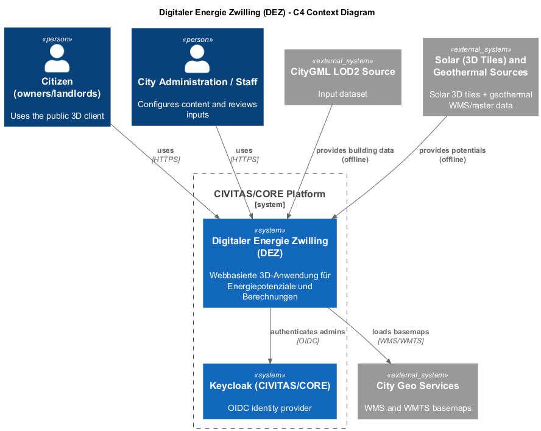

# Architektur - C4 Kontext Diagramm

## Inhaltsverzeichnis

1. [Ziel dieser Sicht](#ziel-dieser-sicht)
2. [Kontextdiagramm](#kontextdiagramm)
3. [Akteure und Systeme](#akteure-und-systeme)
4. [Schnittstellen und Datenflüsse (high level)](#schnittstellen-und-datenfluesse-high-level)
5. [Security-Perspektive auf Kontext-Ebene](#security-perspektive-auf-kontext-ebene)
6. [Abgrenzung zur Container-Sicht](#abgrenzung-zur-container-sicht)

## Ziel dieser Sicht

Dieses Kapitel beschreibt den Digitaler Energie Zwilling (DEZ) auf **Kontext-Ebene (C4 Level 1)**.
Die Kontext-Sicht zeigt das System als Black Box, seine wichtigsten Nutzer und die
relevanten externen Systeme sowie Datenquellen.

Die Sicht dient:
- der gemeinsamen Orientierung mit Fachbereichen und Stakeholdern
- der Abgrenzung des Systems nach außen
- der frühen Klärung von Abhängigkeiten

---

## Kontextdiagramm

Quelle: `raw/c4-context.puml`

---

## Akteure und Systeme

- **Bürger (Eigentümer/Vermieter)**: nutzt den öffentlichen 3D-Client zur Visualisierung und Berechnung.
- **Stadtverwaltung / Fachpersonal**: nutzt den Admin-Bereich zur Konfiguration und QS.
- **Keycloak (CIVITAS/CORE)**: OIDC-Identity-Provider für Admin-Login (Plattformdienst innerhalb von CIVITAS/CORE).
- **MasterPortal**: Externer Einstiegspunkt mit Link-Out auf den öffentlichen DEZ-Client.
- **City Geo Services**: liefert Basemaps via WMS/WMTS.
- **CityGML LOD2 Source**: Gebäudedaten für die Offline-Aufbereitung.
- **Solar and Geothermal Sources**: Potenzialdaten als Raster-/Vektorquellen bzw. 3D Tiles (Solar).

---

## Schnittstellen und Datenflüsse (high level)

- Bürger (Eigentümer/Vermieter) und Stadtverwaltung / Fachpersonal greifen über HTTPS auf den Digitaler Energie Zwilling (DEZ) zu.
- Das MasterPortal verweist per Link-Out auf den öffentlichen DEZ-Client; es gibt keine API-Kopplung für Fachdaten.
- Admin-Authentifizierung erfolgt über OIDC gegen Keycloak (CIVITAS/CORE).
- Basemaps werden zur Laufzeit aus City Geo Services geladen (WMS/WMTS).
- CityGML- und Potenzialdaten werden **offline** in das System importiert.

---

## Security-Perspektive auf Kontext-Ebene

Auf Kontext-Ebene sind drei Sicherheitsgrenzen maßgeblich:

- **Internet zu DEZ**: Externe Zugriffe erfolgen ausschließlich verschlüsselt über den öffentlichen Plattformzugang; Public- und Admin-Pfade sind getrennt.
- **DEZ zu Plattformdiensten**: Administrative Authentifizierung erfolgt nur über den zentralen OIDC-Provider (Keycloak).
- **Offline-Datenzufluss**: CityGML- und Potenzialdaten werden außerhalb der Laufzeit verarbeitet; Laufzeitpfade bleiben schlank und kontrollierbar.

Sicherheitsrelevante Konsequenzen:

- Kein direkter Client-Zugriff auf interne Persistenz.
- Keine direkte öffentliche Exponierung interner Services.
- Öffentliche Schreibzugriffe werden als eigener Schutzpfad behandelt (Challenge, Rate Limiting, Validierung, Verifikation).

Diese Sicht referenziert insbesondere TA-58 bis TA-64 sowie TA-102.

---

## Abgrenzung zur Container-Sicht

Dieses Kapitel enthält **keine internen Container oder Komponenten**.
Die detaillierte Laufzeitstruktur ist in den folgenden C4-Sichten (Container und Component)
beschrieben.
