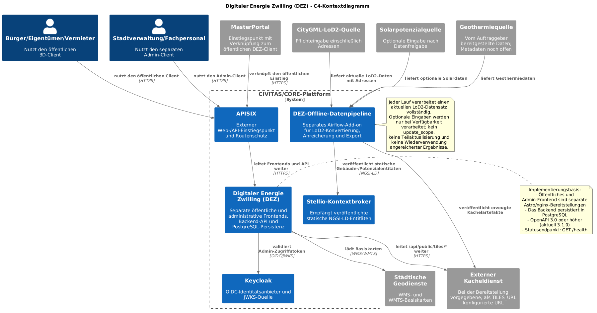

# Architektur - C4 Kontext Diagramm

## Inhaltsverzeichnis

1. [Ziel dieser Sicht](#ziel-dieser-sicht)
2. [Kontextdiagramm](#kontextdiagramm)
3. [Akteure und Systeme](#akteure-und-systeme)
4. [Schnittstellen und Datenflüsse (high level)](#schnittstellen-und-datenfluesse-high-level)
5. [Security-Perspektive auf Kontext-Ebene](#security-perspektive-auf-kontext-ebene)
6. [Abgrenzung zur Container-Sicht](#abgrenzung-zur-container-sicht)

## Ziel dieser Sicht

Dieses Kapitel beschreibt den Digitaler Energie Zwilling (DEZ) auf **Kontext-Ebene (C4 Level 1)**.
Die Kontext-Sicht zeigt das System als Black Box, seine wichtigsten Nutzer und die
relevanten externen Systeme sowie Datenquellen.

Die Sicht dient:
- der gemeinsamen Orientierung mit Fachbereichen und Stakeholdern
- der Abgrenzung des Systems nach außen
- der frühen Klärung von Abhängigkeiten

---

## Kontextdiagramm

Quelle: `raw/c4-context.puml`

---

## Akteure und Systeme

- **Bürger (Eigentümer/Vermieter)**: nutzt den öffentlichen 3D-Client zur Visualisierung und Berechnung.
- **Stadtverwaltung / Fachpersonal**: nutzt den Admin-Bereich zur Konfiguration und QS.
- **APISIX (CIVITAS/CORE)**: zentraler externer Web-/API-Einstiegspunkt und Routenschutz.
- **Keycloak (CIVITAS/CORE)**: OIDC-Identity-Provider für Admin-Login (Plattformdienst innerhalb von CIVITAS/CORE).
- **Stellio Context Broker (CIVITAS/CORE)**: Ziel der freigegebenen statischen NGSI-LD-Entities aus der Offline-Pipeline.
- **DEZ Offline Data Pipeline**: separates Airflow-Add-on für LoD2-Konvertierung, konditionale Anreicherung und Export.
- **MasterPortal**: Externer Einstiegspunkt mit Link-Out auf den öffentlichen DEZ-Client.
- **City Geo Services**: liefert Basemaps via WMS/WMTS.
- **CityGML LoD2 Source**: verpflichtende Gebäudedaten einschließlich Adressen für jeden Pipeline-Lauf.
- **Solar Potential Source**: freigegebene Potenzialdaten; verbindlicher Import- und Darstellungsumfang noch in Abstimmung mit dem Auftraggeber.
- **Geothermal Source**: vom Auftraggeber bereitgestellte und zur Verwendung vorgesehene Daten; Metadaten noch offen.
- **External Tiles Service**: durch die Deployment-Plattform bereitgestellte Ziel-URL für den Backend-Redirect.

---

## Schnittstellen und Datenflüsse (high level)

- Bürger (Eigentümer/Vermieter) und Stadtverwaltung / Fachpersonal greifen über HTTPS und APISIX auf den Digitaler Energie Zwilling (DEZ) zu.
- Das MasterPortal verweist per Link-Out auf den öffentlichen DEZ-Client; es gibt keine API-Kopplung für Fachdaten.
- Admin-Authentifizierung erfolgt über OIDC gegen Keycloak (CIVITAS/CORE). APISIX schützt die Route und prüft OIDC vorgelagert; das Backend validiert das Access Token produktiv und unabhängig davon per RS256/JWKS und erzwingt die Rollenprüfung selbst.
- Basemaps werden zur Laufzeit aus City Geo Services geladen (WMS/WMTS).
- Tile-Anfragen laufen über `/api/public/tiles/*`; das Backend leitet auf die konfigurierte externe Tiles-URL weiter.
- LoD2- und Potenzialdaten werden durch das separate Airflow-Add-on **offline** verarbeitet; statische NGSI-LD-Entities werden an Stellio übergeben.

---

## Security-Perspektive auf Kontext-Ebene

Auf Kontext-Ebene sind drei Sicherheitsgrenzen maßgeblich:

- **Internet zu DEZ**: Externe Zugriffe erfolgen ausschließlich verschlüsselt über den öffentlichen Plattformzugang; Public- und Admin-Pfade sind getrennt.
- **DEZ zu Plattformdiensten**: Administrative Authentifizierung erfolgt nur über den zentralen OIDC-Provider (Keycloak).
- **Offline-Datenzufluss**: CityGML- und Potenzialdaten werden außerhalb der Laufzeit verarbeitet; Laufzeitpfade bleiben schlank und kontrollierbar.

Sicherheitsrelevante Konsequenzen:

- Kein direkter Client-Zugriff auf interne Persistenz.
- Keine direkte öffentliche Exponierung interner Services.
- Öffentliche Schreibzugriffe werden als eigener Schutzpfad behandelt: Die externe Deployment-Plattform betreibt die globale APISIX-Policy für Altcha und Rate Limiting und führt den zugehörigen Betriebsnachweis außerhalb der DEZ-Repositories; das Backend übernimmt fachliche Validierung und Verifikation.

Diese Sicht referenziert insbesondere TA-58 bis TA-64 sowie TA-102.

---

## Abgrenzung zur Container-Sicht

Dieses Kapitel enthält **keine internen Container oder Komponenten**.
Die detaillierte Laufzeitstruktur ist in den folgenden C4-Sichten (Container und Component)
beschrieben.
