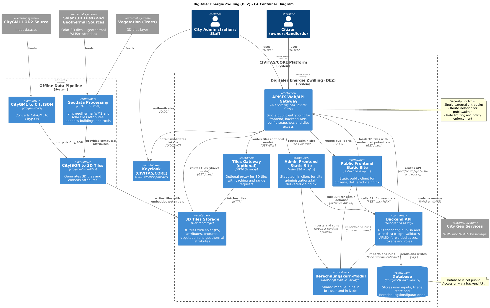

# Architektur – C4 Container Diagramm

## Inhaltsverzeichnis

1. [Ziel dieser Sicht](#ziel-dieser-sicht)
2. [Überblick über die Container](#ueberblick-ueber-die-container)
3. [Beschreibung der Container](#beschreibung-der-container)
4. [Kommunikation zwischen den Containern](#kommunikation-zwischen-den-containern)
5. [Abgrenzung zur Komponenten-Sicht](#abgrenzung-zur-komponenten-sicht)

## Ziel dieser Sicht

Dieses Kapitel beschreibt die Architektur des Digitaler Energie Zwilling (DEZ) auf **Container-Ebene (C4 Level 2)**.  
Die Container-Sicht zeigt, **aus welchen logisch getrennten Laufzeiteinheiten** das System besteht, welche Verantwortung diese tragen und wie sie miteinander interagieren.

Die Container-Sicht dient insbesondere:
- dem Architekturverständnis auf Systemebene
- der Abstimmung mit Betrieb, IT-Security und DevOps
- der Abgrenzung von Verantwortlichkeiten

Details zur internen Struktur der Container werden im **C4 Component Diagramm** behandelt.

---

## Überblick über die Container

Das System besteht aus folgenden zentralen Containern:

- Web Gateway (APISIX)
- Frontend (statische Webanwendung)
- Backend API
- Tiles Gateway (optional)
- 3D Tiles Storage
- Datenbank
- Offline Datenpipeline

Jeder Container erfüllt eine klar abgegrenzte Aufgabe und ist lose mit den anderen Komponenten gekoppelt.

Quelle: `raw/c4-container.puml`

---

## Beschreibung der Container

### Web Gateway

Das Web Gateway fungiert als zentraler Einstiegspunkt für alle Client-Anfragen.

Aufgaben:
- Routing von HTTP-Anfragen zu den jeweiligen Zielsystemen
- Trennung von Public-, Admin-, API- und Tile-Zugriffen
- Entkopplung des Backends von hohem statischem Traffic
- Erzwingung des Zugriffs über APISIX für externe Datenzugriffe

Typische Routen:
- `/` → Public Frontend
- `/admin` → Admin Frontend (geschützt)
- `/api/*` → Backend API
- `/tiles/*` → optional Tiles Gateway oder direkter Zugriff auf 3D Tiles Storage

Das Gateway enthält keine fachliche Logik.

---

### Frontend – Statische Webanwendung

Das Frontend wird vollständig als **statische Webanwendung** erzeugt.

Aufgaben:
- Bereitstellung der Benutzeroberflächen
- Visualisierung des 3D-Stadtmodells
- Durchführung der Simulationen im Browser
- Darstellung von Ergebnissen und Potenzialen

Das Frontend besteht fachlich aus:
- einem öffentlichen Client für Bürger (Eigentümer/Vermieter)
- einem administrativen Bereich für Stadtverwaltung / Fachpersonal

Die Generierung erfolgt zur Build-Zeit, zur Laufzeit existiert keine serverseitige Renderlogik.

---

### Backend API

Das Backend stellt alle serverseitigen Funktionen bereit, die nicht sinnvoll clientseitig umgesetzt werden können.

Aufgaben:
- Authentifizierung und Autorisierung
- Verwaltung und Veröffentlichung von Simulationskonfigurationen
- Persistenz von Nutzereingaben
- Administrative Triage-Funktionen
- Optionale serverseitige Simulation

Das Backend ist **nicht** für die Auslieferung großer statischer Datenmengen wie 3D Tiles verantwortlich.

---

### Tiles Gateway (optional)

Das Tiles Gateway ist ein optionaler Container für die Bereitstellung der 3D Tiles.

Aufgaben:
- Auslieferung der 3D Tiles an den Public Client
- Weiterleitung an das zugrunde liegende Storage-System
- Unterstützung von Caching und Range Requests

Wenn der externe S3-kompatible Datendienst den direkten HTTPS-Lesezugriff unterstützt, kann die
Tiles-Auslieferung auch ohne Tiles Gateway erfolgen.

---

### 3D Tiles Storage

Das 3D Tiles Storage enthält die vorverarbeiteten 3D Tiles.

Eigenschaften:
- Statische Datenhaltung
- Enthält Gebäudestrukturen, Adressen aus LOD2, Solarpotenzial-Attribute (inkl. Textur) sowie Vegetation (Bäume)
- Geothermiepotenziale werden ergänzt, sobald eine belastbare Quelle verfügbar ist; die Abfrage erfolgt priorisiert über Grundwasser, Erdreich, Luft (MVP-Klärung noch offen)
- Keine Laufzeitänderungen

Die Daten im Storage werden ausschließlich durch die Offline-Datenpipeline erzeugt.

---

### Datenbank

Die Datenbank dient als persistente Datenhaltung für dynamische und nutzerspezifische Informationen.

Enthält:
- Nutzereingaben aus Simulationen
- Triage- und Statusinformationen
- Simulationskonfigurationen und Versionen

Die Datenbank enthält **keine statischen Potenzialdaten**.

---

### Offline Datenpipeline

Die Offline Datenpipeline ist ein eigenständiger Verarbeitungspfad außerhalb des Laufzeitsystems.

Aufgaben:
- Verarbeitung von CityGML-Daten
- Integration von Solarpotenzialen (PV) und Geothermiedaten
- Anreicherung der Gebäudedaten mit Potenzialattributen
- Erzeugung der finalen 3D Tiles

Die Pipeline wird unabhängig vom Betrieb des Live-Systems ausgeführt.

---

## Kommunikation zwischen den Containern

- Der Public Client (Bürgerbereich) kommuniziert direkt mit:
  - dem Web Gateway (APISIX)
  - optional dem Tiles Gateway oder direkt dem 3D Tiles Storage (über APISIX)
  - optional dem Backend (z.B. zur Speicherung von Nutzereingaben)

- Der Admin-Bereich (Stadtverwaltung / Fachpersonal) kommuniziert ausschließlich über das Backend.

- Das Backend greift auf:
  - die Datenbank
  - die veröffentlichte Konfiguration
  - optional den Simulationskern

- Die Offline-Datenpipeline schreibt ausschließlich in das 3D Tiles Storage.

---

## Abgrenzung zur Komponenten-Sicht

Dieses Kapitel beschreibt **nur die Container-Ebene**.  
Die interne Struktur von Frontend und Backend, einschließlich:
- Authentifizierungslogik
- Simulationskern
- Konfigurations- und Triage-Services

wird im folgenden Kapitel **C4 Component Diagramm** detailliert beschrieben.
