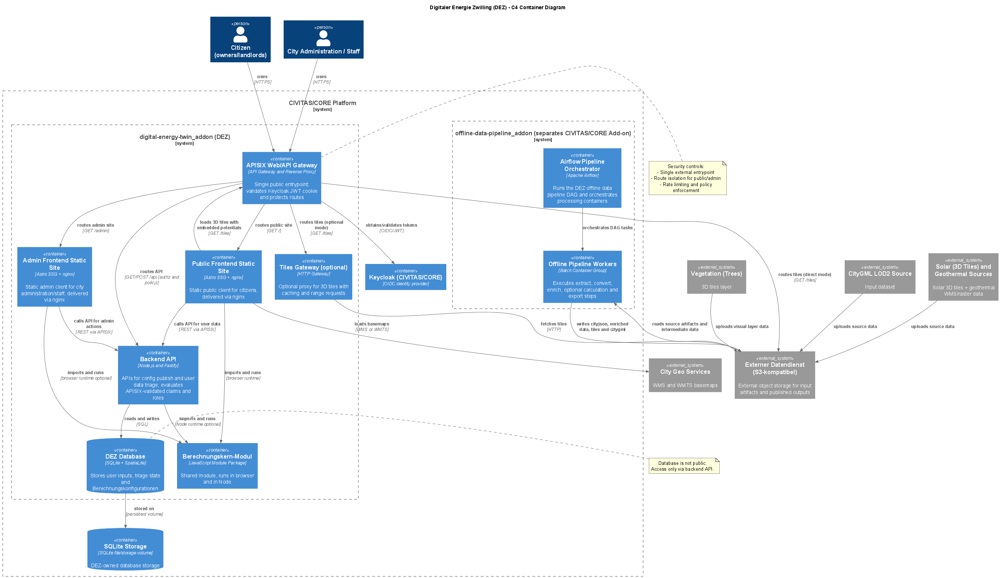

# Architektur – C4 Container Diagramm

## Inhaltsverzeichnis

1. [Ziel dieser Sicht](#ziel-dieser-sicht)
2. [Überblick über die Container](#ueberblick-ueber-die-container)
3. [Beschreibung der Container](#beschreibung-der-container)
4. [Security-Verantwortung pro Container](#security-verantwortung-pro-container)
5. [Kommunikation zwischen den Containern](#kommunikation-zwischen-den-containern)
6. [Abgrenzung zur Komponenten-Sicht](#abgrenzung-zur-komponenten-sicht)

## Ziel dieser Sicht

Dieses Kapitel beschreibt die Architektur des Digitaler Energie Zwilling (DEZ) auf **Container-Ebene (C4 Level 2)**.  
Die Container-Sicht zeigt, **aus welchen logisch getrennten Laufzeiteinheiten** das System besteht, welche Verantwortung diese tragen und wie sie miteinander interagieren.

Die Container-Sicht dient insbesondere:
- dem Architekturverständnis auf Systemebene
- der Abstimmung mit Betrieb, IT-Security und DevOps
- der Abgrenzung von Verantwortlichkeiten

Details zur internen Struktur der Container werden im **C4 Component Diagramm** behandelt.

---

## Überblick über die Container

Das System besteht aus folgenden zentralen Containern:

- Web Gateway (APISIX)
- Public Frontend (statische Webanwendung)
- Admin Frontend (statische Webanwendung)
- Backend API
- Tiles Gateway (optional)
- Datenbank
- Airflow Offline Datenpipeline (separates CIVITAS/CORE-Add-on)

Externer angebundener Dienst:

- 3D Tiles Storage (S3)

Jeder Container erfüllt eine klar abgegrenzte Aufgabe und ist lose mit den anderen Komponenten gekoppelt.

Quelle: `raw/c4-container.puml`

---

## Beschreibung der Container

### Web Gateway

Das Web Gateway fungiert als zentraler Einstiegspunkt für alle Client-Anfragen.

Aufgaben:
- Routing von HTTP-Anfragen zu den jeweiligen Zielsystemen
- Trennung von Public-, Admin-, API- und Tile-Zugriffen
- Entkopplung des Backends von hohem statischem Traffic
- Erzwingung des Zugriffs über APISIX für externe Datenzugriffe

Typische Routen:
- `/` → Public Frontend
- `/admin` → Admin Frontend (geschützt)
- `/api/*` → Backend API
- `/tiles/*` → optional Tiles Gateway oder direkter Zugriff auf 3D Tiles Storage

Das Gateway enthält keine fachliche Logik.

---

### Public Frontend – Statische Webanwendung

Das Public Frontend wird vollständig als **statische Webanwendung** erzeugt und über **nginx** ausgeliefert.

Aufgaben:
- Bereitstellung der öffentlichen Benutzeroberfläche für die Hauptzielgruppe (Bürger/Eigentümer/Vermieter)
- Visualisierung des 3D-Stadtmodells
- Durchführung der Berechnungen im Browser
- Darstellung von Ergebnissen und Potenzialen

Die Generierung erfolgt zur Build-Zeit mit **Astro SSG**, zur Laufzeit existiert keine serverseitige Renderlogik.
Das Laufzeit-Logging erfolgt über den nginx-Standard-Logger auf `stdout`/`stderr`; Requests auf nicht-HTML-Assets werden dabei nicht protokolliert.

---

### Admin Frontend – Statische Webanwendung

Das Admin Frontend wird vollständig als **statische Webanwendung** erzeugt und über **nginx** ausgeliefert.

Aufgaben:
- Bereitstellung der administrativen Benutzeroberfläche für die Nebenzielgruppe (Stadtverwaltung/Fachpersonal)
- Pflege und Veröffentlichung von Berechnungskonfigurationen
- Triage und Qualitätssicherung von Nutzereingaben

Die Generierung erfolgt zur Build-Zeit mit **Astro SSG**, zur Laufzeit existiert keine serverseitige Renderlogik.
Das Laufzeit-Logging erfolgt über den nginx-Standard-Logger auf `stdout`/`stderr`; Requests auf nicht-HTML-Assets werden dabei nicht protokolliert.

---

### Backend API

Das Backend stellt alle serverseitigen Funktionen bereit, die nicht sinnvoll clientseitig umgesetzt werden können.

Aufgaben:
- Entgegennahme des vom APISIX Gateway bereitgestellten Access-Tokens
- Authentifizierung und Autorisierung auf Basis von Token-Claims und Rollen (z.B. `admin`)
- Verwaltung und Veröffentlichung von Berechnungskonfigurationen
- Persistenz von Nutzereingaben
- Strukturiertes Logging über Pino/Fastify auf `stdout`/`stderr`
- Administrative Triage-Funktionen
- Optionale serverseitige Berechnung

Das Backend ist **nicht** für die Auslieferung großer statischer Datenmengen wie 3D Tiles verantwortlich.

---

### Tiles Gateway (optional)

Das Tiles Gateway ist ein optionaler Container für die Bereitstellung der 3D Tiles.

Aufgaben:
- Auslieferung der 3D Tiles an den Public Client
- Weiterleitung an das zugrunde liegende Storage-System
- Unterstützung von Caching und Range Requests

Wenn der externe S3-kompatible Datendienst den direkten HTTPS-Lesezugriff unterstützt, kann die
Tiles-Auslieferung auch ohne Tiles Gateway erfolgen.

---

### 3D Tiles Storage

Das 3D Tiles Storage ist ein externer S3-kompatibler Datendienst und **kein** Bestandteil des `digital-energy-twin_addon` oder von CIVITAS/CORE.

Eigenschaften:
- Statische Datenhaltung
- Enthält Gebäudestrukturen, Adressen aus LOD2 sowie Solarpotenzial-Attribute (inkl. Textur)
- Geothermiepotenziale werden ergänzt, sobald eine belastbare Quelle verfügbar ist; die Abfrage erfolgt priorisiert über Grundwasser, Erdreich, Luft (MVP-Klärung noch offen)
- Keine Laufzeitänderungen

Die Daten im Storage werden ausschließlich durch die Offline-Datenpipeline erzeugt.

Vegetationsdaten (Bäume) werden nicht in der Offline-Datenpipeline verarbeitet, sondern im Public Client ausschließlich als visuelle Ebene genutzt.

---

### Datenbank

Die DEZ-Datenbank dient als persistente Datenhaltung für dynamische und nutzerspezifische Informationen.
Sie ist logisch Teil des `digital-energy-twin_addon` (eigene Schemata/Objekte), läuft physisch jedoch auf dem PostgreSQL-Server der CIVITAS/CORE-Plattform.

Enthält:
- Nutzereingaben aus Berechnungen
- Triage- und Statusinformationen
- Berechnungskonfigurationen und Versionen

Die Datenbank enthält **keine statischen Potenzialdaten**.

---

### Airflow Offline Datenpipeline (separates Add-on)

Die Offline Datenpipeline läuft in CIVITAS/CORE, wird jedoch **nicht** durch das `digital-energy-twin_addon` ausgerollt, sondern durch ein separates Add-on.

Aufgaben:
- Verarbeitung von CityGML-Daten
- Integration von Solarpotenzialen (PV) und Geothermiedaten
- Anreicherung der Gebäudedaten mit Potenzialattributen
- Erzeugung der finalen 3D Tiles

Die Pipeline wird als Airflow-DAG unabhängig vom Betrieb des Live-Systems ausgeführt.

---

## Security-Verantwortung pro Container

Die Container-Sicht verankert Security by Design als konkrete Zuständigkeit:

| Container | Security-Kernpunkte |
| --- | --- |
| APISIX Web Gateway | Erzwingt den externen Eintrittspunkt, trennt Public/Admin-Pfade, setzt Transportschutz und Richtlinien für öffentliche Schreibzugriffe durch. |
| Public Frontend | Führt Berechnungen standardmäßig lokal aus; übermittelt Nutzerdaten nur optional und explizit ausgelöst. |
| Admin Frontend | Statischer Admin-Client ohne eigene Serverlogik; sensible Aktionen erfolgen ausschließlich über geschützte Backend-APIs. |
| Backend API | Führt AuthN/AuthZ auf Basis des von APISIX bereitgestellten Access-Tokens und Rollen durch, validiert Eingaben serverseitig, prüft/verifiziert Public-Write-Payloads und protokolliert sicherheitsrelevante Ereignisse. |
| Datenbank | Logische DEZ-Datenhaltung auf dem Plattform-PostgreSQL; nicht öffentlich erreichbar, Zugriffe ausschließlich über das Backend mit rollenbasierten Rechten. |
| 3D Tiles Storage / Tiles Gateway | Dient nur der Auslieferung statischer Artefakte; der Storage ist extern angebunden, keine fachliche Schreiblogik aus Public-Laufzeitpfaden. |
| Offline-Datenpipeline | Läuft getrennt vom Laufzeitsystem, nutzt dedizierte Job-Kontexte und arbeitet mit minimalen Datendienst-Berechtigungen. |

Diese Verantwortungsverteilung deckt insbesondere TA-58 bis TA-64, TA-102 sowie den BSI-Bezug aus TA-96 ab.

---

## Kommunikation zwischen den Containern

- Der Public Frontend-Client (Hauptzielgruppe) kommuniziert direkt mit:
  - dem Web Gateway (APISIX)
  - optional dem Tiles Gateway oder direkt dem 3D Tiles Storage (über APISIX)
  - der externen Vegetationsquelle (nur visuelle Darstellung)
  - optional dem Backend (z.B. zur Speicherung von Nutzereingaben)

- Der Admin Frontend-Client (Nebenzielgruppe) kommuniziert ausschließlich über das Backend (über APISIX).

- Das Backend greift auf:
  - die Datenbank
  - die veröffentlichte Konfiguration
  - optional den Berechnungskern

- Die Offline-Datenpipeline schreibt ausschließlich in das 3D Tiles Storage und wird über Airflow im separaten Pipeline-Add-on orchestriert.

---

## Abgrenzung zur Komponenten-Sicht

Dieses Kapitel beschreibt **nur die Container-Ebene**.  
Die interne Struktur von Frontend und Backend, einschließlich:
- Authentifizierungslogik
- Berechnungskern
- Konfigurations- und Triage-Services

wird im folgenden Kapitel **C4 Component Diagramm** detailliert beschrieben.
