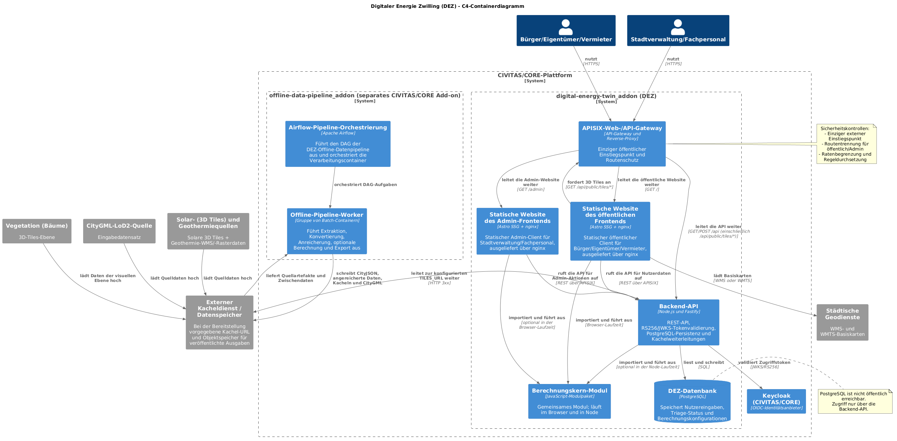

# Architektur – C4 Container Diagramm

## Inhaltsverzeichnis

1. [Ziel dieser Sicht](#ziel-dieser-sicht)
2. [Überblick über die Container](#ueberblick-ueber-die-container)
3. [Beschreibung der Container](#beschreibung-der-container)
4. [Security-Verantwortung pro Container](#security-verantwortung-pro-container)
5. [Kommunikation zwischen den Containern](#kommunikation-zwischen-den-containern)
6. [Abgrenzung zur Komponenten-Sicht](#abgrenzung-zur-komponenten-sicht)

## Ziel dieser Sicht

Dieses Kapitel beschreibt die Architektur des Digitaler Energie Zwilling (DEZ) auf **Container-Ebene (C4 Level 2)**.  
Die Container-Sicht zeigt, **aus welchen logisch getrennten Laufzeiteinheiten** das System besteht, welche Verantwortung diese tragen und wie sie miteinander interagieren.

Die Container-Sicht dient insbesondere:
- dem Architekturverständnis auf Systemebene
- der Abstimmung mit Betrieb, IT-Security und DevOps
- der Abgrenzung von Verantwortlichkeiten

Details zur internen Struktur der Container werden im **C4 Component Diagramm** behandelt.

---

## Überblick über die Container

Das System besteht aus folgenden zentralen Containern:

- Web Gateway (APISIX)
- Public Frontend (statische Webanwendung)
- Admin Frontend (statische Webanwendung)
- Backend API
- Datenbank
- Airflow Offline Datenpipeline (separates CIVITAS/CORE-Add-on)

Externer angebundener Dienst:

- externer Tiles-Dienst bzw. 3D Tiles Storage

CIVITAS/CORE-Plattformdienst:

- Stellio Context Broker (NGSI-LD)

Jeder Container erfüllt eine klar abgegrenzte Aufgabe und ist lose mit den anderen Komponenten gekoppelt.

Quelle: `raw/c4-container.puml`

---

## Beschreibung der Container

### Web Gateway

Das Web Gateway fungiert als zentraler Einstiegspunkt für alle Client-Anfragen.

Aufgaben:
- Routing von HTTP-Anfragen zu den jeweiligen Zielsystemen
- Trennung von Public-, Admin-, API- und Tile-Zugriffen
- vorgelagerte JWT/OIDC-Prüfung über das von Keycloak gesetzte geschützte Browser-Cookie und Schutz administrativer Routen; die unabhängige Backend-Prüfung bleibt zwingend
- Entkopplung des Backends von hohem statischem Traffic
- Erzwingung des Zugriffs über APISIX für externe Datenzugriffe

Typische Routen:
- `/` → Public Frontend
- `/admin` → Admin Frontend (geschützt)
- `/api/*` → Backend API
- `/api/public/tiles/*` → Backend API; von dort Redirect auf die konfigurierte externe Tiles-URL

Das Gateway enthält keine fachliche Logik.

---

### Public Frontend – Statische Webanwendung

Das Public Frontend wird vollständig als **statische Webanwendung** erzeugt und über **nginx** ausgeliefert.

Aufgaben:
- Bereitstellung der öffentlichen Benutzeroberfläche für die Hauptzielgruppe (Bürger/Eigentümer/Vermieter)
- Visualisierung des 3D-Stadtmodells
- Durchführung der Berechnungen im Browser
- Darstellung von Ergebnissen und Potenzialen

Die Generierung erfolgt zur Build-Zeit mit **Astro SSG**, zur Laufzeit existiert keine serverseitige Renderlogik.
Das Laufzeit-Logging erfolgt über den nginx-Standard-Logger auf `stdout`/`stderr`; Requests auf nicht-HTML-Assets werden dabei nicht protokolliert.

---

### Admin Frontend – Statische Webanwendung

Das Admin Frontend wird vollständig als **statische Webanwendung** erzeugt und über **nginx** ausgeliefert.

Aufgaben:
- Bereitstellung der administrativen Benutzeroberfläche für die Nebenzielgruppe (Stadtverwaltung/Fachpersonal)
- Pflege und Veröffentlichung von Berechnungskonfigurationen
- Triage und Qualitätssicherung von Nutzereingaben

Die Generierung erfolgt zur Build-Zeit mit **Astro SSG**, zur Laufzeit existiert keine serverseitige Renderlogik.
Das Laufzeit-Logging erfolgt über den nginx-Standard-Logger auf `stdout`/`stderr`; Requests auf nicht-HTML-Assets werden dabei nicht protokolliert.

---

### Backend API

Das Backend stellt alle serverseitigen Funktionen bereit, die nicht sinnvoll clientseitig umgesetzt werden können.

Aufgaben:
- Produktive, von der APISIX-Prüfung unabhängige Validierung weitergeleiteter Access Tokens per RS256/JWKS
- Eigenständige fachliche Autorisierung auf Basis der Rollen `manager`, `maintainer` und `admin`
- Verwaltung und Veröffentlichung von Berechnungskonfigurationen
- Persistenz von Nutzereingaben
- Strukturiertes Logging über Pino/Fastify auf `stdout`/`stderr`
- Administrative Triage-Funktionen
- Optionale serverseitige Berechnung

Das Backend liefert große statische Datenmengen wie 3D Tiles nicht selbst aus. Die Route `GET /api/public/tiles/*` erzeugt lediglich einen Redirect auf die über `TILES_URL` konfigurierte externe Tiles-URL.

---

### Externer Tiles-Dienst

Der DEZ setzt eine von der Deployment-Plattform bereitgestellte externe Tiles-URL voraus. Das `digital-energy-twin_addon` stellt keinen eigenen Tiles-Gateway-Container bereit. Das Backend bildet angeforderte Restpfade unter `/api/public/tiles/*` auf die konfigurierte Umgebungsvariable `TILES_URL` ab und antwortet mit einem HTTP-Redirect.

---

### 3D Tiles Storage

Der 3D Tiles Storage beziehungsweise Tiles-Dienst ist extern angebunden und **kein** Bestandteil des `digital-energy-twin_addon`.

Eigenschaften:
- Statische Datenhaltung
- Enthält Gebäudestrukturen und Adressen aus LOD2; die PV-Datenfreigabe liegt vor, Solarpotenzial-Attribute inklusive Textur werden nach Festlegung des verbindlichen Detailumfangs übernommen
- Geothermiepotenziale werden ausschließlich anhand der tatsächlich vom Auftraggeber bereitgestellten Datensatzmerkmale ergänzt; nicht gelieferte Varianten werden nicht hergeleitet, während die Metadaten noch zu klären sind
- Keine Laufzeitänderungen

Die Daten im Storage werden ausschließlich durch die Offline-Datenpipeline erzeugt.

Vegetationsdaten (Bäume) werden nicht in der Offline-Datenpipeline verarbeitet, sondern im Public Client ausschließlich als visuelle Ebene genutzt.

---

### Datenbank

Die DEZ-Datenbank dient als persistente Datenhaltung für dynamische und nutzerspezifische Informationen.
Sie ist logisch Teil des `digital-energy-twin_addon` und wird durch das Backend als PostgreSQL-Datenbank verwendet. SQLite und SpatiaLite werden ausschließlich in der Offline-Datenverarbeitung beziehungsweise für daraus erzeugte lokale Hilfsdatenbanken eingesetzt.

Enthält:
- Nutzereingaben aus Berechnungen
- Triage- und Statusinformationen
- Berechnungskonfigurationen und Versionen

Die Datenbank enthält **keine statischen Potenzialdaten**.

---

### Airflow Offline Datenpipeline (separates Add-on)

Die Offline Datenpipeline läuft in CIVITAS/CORE, wird jedoch **nicht** durch das `digital-energy-twin_addon` ausgerollt, sondern durch ein separates Add-on.

Aufgaben:
- Verarbeitung von CityGML-Daten
- konditionale Integration der freigegebenen Solarpotenziale (PV) nach Festlegung des Detailumfangs sowie Integration der vom Auftraggeber bereitgestellten Geothermiedaten
- Anreicherung der Gebäudedaten mit Potenzialattributen
- Erzeugung der finalen 3D Tiles, CityGML-Ausgaben und NGSI-LD-Entities
- Übergabe der NGSI-LD-Entities an Stellio innerhalb von CIVITAS/CORE

Die Pipeline wird als Airflow-DAG unabhängig vom Betrieb des Live-Systems ausgeführt.

---

## Security-Verantwortung pro Container

Die Container-Sicht verankert Security by Design als konkrete Zuständigkeit:

| Container | Security-Kernpunkte |
| --- | --- |
| APISIX Web Gateway | Erzwingt den externen Eintrittspunkt, schützt Routen, trennt Public/Admin-Pfade und setzt Transportschutz sowie Richtlinien für öffentliche Schreibzugriffe durch. |
| Public Frontend | Führt Berechnungen standardmäßig lokal aus; übermittelt Nutzerdaten nur optional und explizit ausgelöst. |
| Admin Frontend | Statischer Admin-Client ohne eigene Serverlogik; sensible Aktionen erfolgen ausschließlich über geschützte Backend-APIs. |
| Backend API | Validiert produktiv Access Tokens unabhängig vom Gateway per RS256/JWKS, wertet Claims/Rollen aus und erzwingt Berechtigungen selbst; validiert Eingaben serverseitig, prüft/verifiziert Public-Write-Payloads und protokolliert sicherheitsrelevante Ereignisse. |
| Datenbank | PostgreSQL-Datenhaltung des Backends; nicht öffentlich erreichbar, Zugriffe ausschließlich über das Backend mit rollenbasierten Rechten. |
| Externer Tiles-Dienst / 3D Tiles Storage | Dient nur der Auslieferung statischer Artefakte; die Ziel-URL wird über `TILES_URL` konfiguriert, das Backend stellt lediglich einen Redirect bereit. |
| Stellio Context Broker | Nimmt nur freigegebene statische NGSI-LD-Entities aus der Offline-Pipeline entgegen; keine Übergabe personenbezogener Nutzereingaben. |
| Offline-Datenpipeline | Läuft getrennt vom Laufzeitsystem, nutzt dedizierte Job-Kontexte und arbeitet mit minimalen Datendienst- und Stellio-Berechtigungen. |

Diese Verantwortungsverteilung deckt insbesondere TA-58 bis TA-64, TA-102 sowie den BSI-Bezug aus TA-96 ab.

---

## Kommunikation zwischen den Containern

- Der Public Frontend-Client (Hauptzielgruppe) kommuniziert direkt mit:
  - dem Web Gateway (APISIX)
  - der Backend-Route `/api/public/tiles/*`, die auf den externen Tiles-Dienst weiterleitet
  - der externen Vegetationsquelle (nur visuelle Darstellung)
  - optional dem Backend (z.B. zur Speicherung von Nutzereingaben)

- Der Admin Frontend-Client (Nebenzielgruppe) kommuniziert ausschließlich über das Backend (über APISIX).

- Das Backend greift auf:
  - die Datenbank
  - die veröffentlichte Konfiguration
  - optional den Berechnungskern

- Die Offline-Datenpipeline schreibt statische Artefakte in das 3D Tiles Storage, erzeugt NGSI-LD-Entities und übergibt diese intern an Stellio; sie wird über Airflow im separaten Pipeline-Add-on orchestriert.

---

## Abgrenzung zur Komponenten-Sicht

Dieses Kapitel beschreibt **nur die Container-Ebene**.  
Die interne Struktur von Frontend und Backend, einschließlich:
- Authentifizierungslogik
- Berechnungskern
- Konfigurations- und Triage-Services

wird im folgenden Kapitel **C4 Component Diagramm** detailliert beschrieben.
