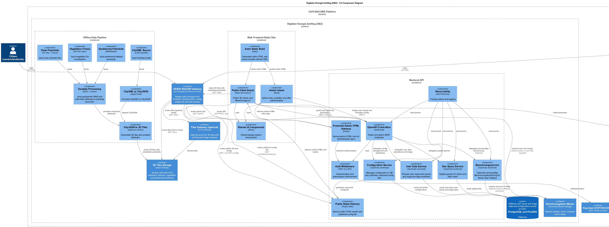

# Architektur – C4 Component Diagramm

## Ziel dieser Sicht

Dieses Kapitel beschreibt die Architektur des Digitaler Energy Zwilling (DEZ) auf **Komponenten-Ebene (C4 Level 3)**.  
Die Komponenten-Sicht zeigt die **interne Struktur der zentralen Container**, deren Verantwortlichkeiten sowie die wichtigsten Kommunikations- und Datenflüsse.

Die Komponenten-Sicht richtet sich primär an:
- Entwicklerinnen und Entwickler
- Architektinnen und Architekten
- Personen, die das System warten oder erweitern

Sie baut auf der Container-Sicht auf und ergänzt diese um technische Details.

---

## Überblick

Das C4 Component Diagramm stellt die folgenden Aspekte dar:

- den Aufbau des statischen Frontends mit Public- und Admin-Bereich
- die internen Komponenten des Backends
- den Simulationskern als geteiltes Modul
- die Entkopplung von 3D Tiles, Backend und Datenhaltung
- die Offline-Datenpipeline zur Erzeugung der 3D Tiles

Quelle: `raw/c4-components.puml`

---

## Frontend-Komponenten

### Astro Static Build

Der Astro Build-Prozess erzeugt das vollständige statische Frontend.

Aufgaben:
- Generierung der HTML-Struktur
- Bündelung der JavaScript-Module
- Vorbereitung der interaktiven Islands

Zur Laufzeit ist Astro nicht beteiligt.

---

### Public Client Island

Der Public Client ist die zentrale Benutzeroberfläche für Bürger (Eigentümer/Vermieter).

Aufgaben:
- Darstellung des 3D-Stadtmodells
- Anzeige von Solarpotenzialen (PV) und Geothermiepotenzialen aus den 3D Tiles
- Durchführung der energetischen Simulation
- Darstellung der Simulationsergebnisse
Hinweis: Die Solarpotenzial-Textur und Vegetationsobjekte (Bäume) werden für die visuelle Orientierung genutzt.

Die Simulation wird standardmäßig vollständig im Browser ausgeführt.

---

### Admin Island (Stadtverwaltung / Fachpersonal)

Die Admin Island stellt die administrative Benutzeroberfläche für Stadtverwaltung / Fachpersonal bereit.

Aufgaben:
- Pflege und Veröffentlichung von Simulationskonfigurationen
- Sichtung und Triage von Nutzereingaben
- Qualitätssicherung

Der HTML-Code dieser Komponente wird erst nach erfolgreicher Authentifizierung ausgeliefert.

---

### Shared UI Components

Diese Komponente enthält gemeinsam genutzte UI-Bausteine.

Aufgaben:
- Sicherstellung eines konsistenten Erscheinungsbildes
- Wiederverwendung von UI-Elementen
- Reduktion von Redundanzen im Frontend

---

## Backend-Komponenten

### Public Static Delivery

Diese Komponente liefert:
- das öffentliche Frontend
- veröffentlichte Konfigurationsdateien

Sie enthält keine fachliche Logik.

---

### Protected Admin HTML Gateway (Stadtverwaltung / Fachpersonal)

Diese Komponente stellt den Admin-Bereich bereit.

Aufgaben:
- Prüfung der Authentifizierung
- Auslieferung des Admin-HTMLs
- Durchsetzung von Zugriffsbeschränkungen

---

### OpenAPI Controllers

Die API Controller bilden den Einstiegspunkt für alle Backend-Funktionalitäten.

Aufgaben:
- Bereitstellung öffentlicher und administrativer Endpunkte
- Validierung eingehender Anfragen
- Weiterleitung an fachliche Services
- Bereitstellung des OpenAPI-3.0-Vertrags als Grundlage für die Client-Generierung

---

### Auth Middleware

Die Auth Middleware ist für Authentifizierung und Autorisierung zuständig.

Aufgaben:
- Validierung von OIDC Tokens
- Durchsetzung von Rollen- und Zugriffskonzepten
- Schutz administrativer Endpunkte

---

### Configuration Service

Der Configuration Service verwaltet die Simulationskonfigurationen.

Aufgaben:
- Pflege von Parametern
- Versionierung und zeitliche Gültigkeit
- Veröffentlichung versionierter Konfigurationsdateien

Er fungiert als zentrale Quelle für Simulationsparameter.

---

### Simulation Service

Der Simulation Service stellt eine optionale serverseitige Ausführung der Simulation bereit.

Aufgaben:
- Laden der aktiven Konfiguration
- Aufruf des Simulationskerns
- Rückgabe von Simulationsergebnissen

Im Regelfall wird dieser Service nur für administrative oder zukünftige Erweiterungen genutzt.

---

### User Data Service

Der User Data Service verwaltet persistente Nutzerdaten.

Aufgaben:
- Speicherung von Nutzereingaben
- Verwaltung von Triage-Informationen
- Unterstützung administrativer Auswertungen

---

### Geo Query Service

Diese Komponente stellt räumliche Abfragen für administrative Funktionen bereit.

Aufgaben:
- Zugriff auf PostGIS
- Unterstützung fachlicher Auswertungen
- Bereitstellung von Gebäudekontexten

---

### Observability

Diese Komponente sorgt für die technische Beobachtbarkeit des Systems.

Aufgaben:
- Logging
- Metriken
- Tracing

---

## Simulationskern

Der Simulationskern ist als **eigenständiges JavaScript-Modul** umgesetzt.

Eigenschaften:
- identischer Code für Frontend und Backend
- deterministisches Verhalten bei gleicher Konfiguration
- Übergabe von Konfiguration und Nutzereingaben als Parameter

Der Simulationskern ist bewusst frei von Infrastrukturabhängigkeiten.

---

## Offline-Datenpipeline

Die Offline-Datenpipeline ist als eigenständiger Verarbeitungspfad modelliert.

Aufgaben:
- Verarbeitung von CityGML-Daten
- Integration von Solarpotenzialen (PV) und Geothermiepotenzialen
- Anreicherung der Gebäudedaten
- Erzeugung der finalen 3D Tiles

Die Pipeline erzeugt ausschließlich statische Artefakte und hat keinen Zugriff auf Laufzeitdaten.

---

## Datenflüsse (zusammengefasst)

- Statische Potenziale:  
  Offline-Datenpipeline → 3D Tiles → Public Client

- Simulation:  
  Public Client → Simulationskern → Ergebnisanzeige  
  Optional: Backend → Simulationskern → Ergebnis

- Konfiguration:  
  Admin (Stadtverwaltung / Fachpersonal) → Backend → Konfigurationsdatei → Public Client

- Nutzerdaten:  
  Public Client → Backend → Datenbank → Admin-Triage (Stadtverwaltung / Fachpersonal)

---

## Abgrenzung

Dieses Kapitel beschreibt die **interne Struktur der Container**, nicht deren Deployment.  
Details zu Betrieb, Skalierung und Infrastruktur werden im Kapitel **Betrieb und Deployment** behandelt.
