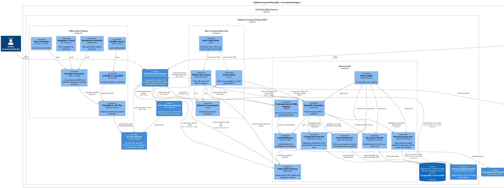
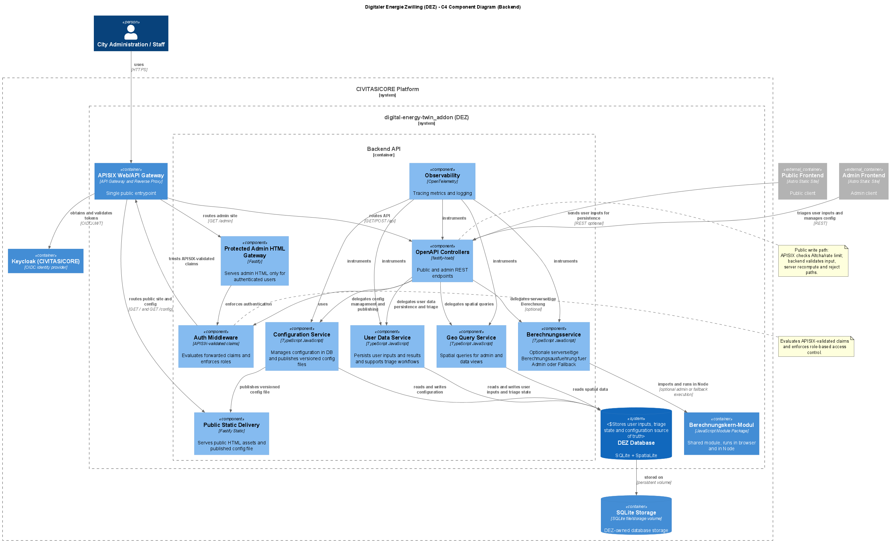
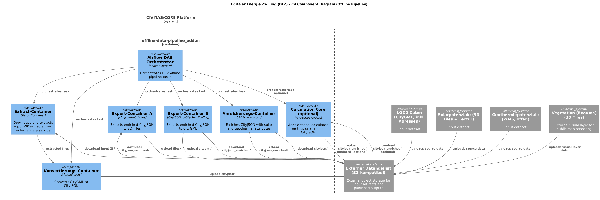

# Architektur – C4 Component Diagramm

## Inhaltsverzeichnis

1. [Ziel dieser Sicht](#ziel-dieser-sicht)
2. [Überblick](#ueberblick)
3. [Frontend-Komponenten](#frontend-komponenten)
4. [Backend-Komponenten](#backend-komponenten)
5. [Berechnungskern](#berechnungskern)
6. [Security-Kontrollpunkte](#security-kontrollpunkte)
7. [Offline-Datenpipeline](#offline-datenpipeline)
8. [Datenflüsse (zusammengefasst)](#datenfluesse-zusammengefasst)
9. [Abgrenzung](#abgrenzung)

## Ziel dieser Sicht

Dieses Kapitel beschreibt die Architektur des Digitaler Energie Zwilling (DEZ) auf **Komponenten-Ebene (C4 Level 3)**.  
Die Komponenten-Sicht zeigt die **interne Struktur der zentralen Container**, deren Verantwortlichkeiten sowie die wichtigsten Kommunikations- und Datenflüsse.

Die Komponenten-Sicht richtet sich primär an:
- Entwicklerinnen und Entwickler
- Architektinnen und Architekten
- Personen, die das System warten oder erweitern

Sie baut auf der Container-Sicht auf und ergänzt diese um technische Details.

---

## Überblick

Die C4 Component Sichten stellen die folgenden Aspekte dar:

- den Aufbau des statischen Frontends mit Public- und Admin-Bereich
- die internen Komponenten des Backends
- den Berechnungskern als geteiltes Modul
- die Entkopplung von 3D Tiles, Backend und Datenhaltung (3D Tiles Storage als externer S3-Dienst)
- die Airflow-basierte Offline-Datenpipeline als separates CIVITAS/CORE-Add-on zur Erzeugung der 3D Tiles

### Frontend View

Quelle: `raw/c4-components.puml` (Frontend View)

### Backend View

Quelle: `raw/c4-components-backend.puml` (Backend View)

---

## Frontend-Komponenten

### Astro Static Build

Der Astro Build-Prozess erzeugt das vollständige statische Frontend.

Aufgaben:
- Generierung der HTML-Struktur
- Bündelung der JavaScript-Module
- Vorbereitung der interaktiven Islands

Zur Laufzeit ist Astro nicht beteiligt.

---

### Public Client Island

Der Public Client ist die zentrale Benutzeroberfläche für Bürger (Eigentümer/Vermieter).

Aufgaben:
- Darstellung des 3D-Stadtmodells
- Anzeige von Solarpotenzialen (PV) und Geothermiepotenzialen aus den 3D Tiles
- Durchführung der energetischen Berechnung
- Darstellung der Berechnungsergebnisse
> ⚠️ **Hinweis:** Die Solarpotenzial-Textur und Vegetationsobjekte (Bäume) werden für die visuelle Orientierung genutzt.

Die Berechnung wird standardmäßig vollständig im Browser ausgeführt.

---

### Admin Island (Stadtverwaltung / Fachpersonal)

Die Admin Island stellt die administrative Benutzeroberfläche für Stadtverwaltung / Fachpersonal bereit.

Aufgaben:
- Pflege und Veröffentlichung von Berechnungskonfigurationen
- Sichtung und Triage von Nutzereingaben
- Qualitätssicherung

Der HTML-Code dieser Komponente wird erst nach erfolgreicher Authentifizierung ausgeliefert.

---

### Shared UI Components

Diese Komponente enthält gemeinsam genutzte UI-Bausteine.

Aufgaben:
- Sicherstellung eines konsistenten Erscheinungsbildes
- Wiederverwendung von UI-Elementen
- Reduktion von Redundanzen im Frontend

---

## Backend-Komponenten

### Public Static Delivery

Diese Komponente liefert:
- das öffentliche Frontend
- veröffentlichte Konfigurationsdateien

Sie enthält keine fachliche Logik.

---

### Protected Admin HTML Gateway (Stadtverwaltung / Fachpersonal)

Diese Komponente stellt den Admin-Bereich bereit.

Aufgaben:
- Prüfung der Authentifizierung
- Auslieferung des Admin-HTMLs
- Durchsetzung von Zugriffsbeschränkungen

---

### OpenAPI Controllers

Die API Controller bilden den Einstiegspunkt für alle Backend-Funktionalitäten.

Aufgaben:
- Bereitstellung öffentlicher und administrativer Endpunkte
- Validierung eingehender Anfragen
- Weiterleitung an fachliche Services
- Bereitstellung des OpenAPI-3.0-Vertrags als Grundlage für die Client-Generierung

---

### Auth Middleware

Die Auth Middleware ist für Authentifizierung und Autorisierung zuständig.

Aufgaben:
- Validierung des von APISIX mitgesendeten Standard-Tokens
- Durchsetzung von Rollen- und Zugriffskonzepten
- Schutz administrativer Endpunkte

---

### Configuration Service

Der Configuration Service verwaltet die Berechnungskonfigurationen.

Aufgaben:
- Pflege von Parametern
- Versionierung und zeitliche Gültigkeit
- Veröffentlichung versionierter Konfigurationsdateien

Er fungiert als zentrale Quelle für Berechnungsparameter.

---

### Berechnungsservice

Der Berechnungsservice stellt eine optionale serverseitige Ausführung der Berechnung bereit.

Aufgaben:
- Laden der aktiven Konfiguration
- Aufruf des Berechnungskerns
- Rückgabe von Berechnungsergebnissen

Im Regelfall wird dieser Service nur für administrative oder zukünftige Erweiterungen genutzt.

---

### User Data Service

Der User Data Service verwaltet persistente Nutzerdaten.

Aufgaben:
- Speicherung von Nutzereingaben
- Verwaltung von Triage-Informationen
- Unterstützung administrativer Auswertungen

---

### Geo Query Service

Diese Komponente stellt räumliche Abfragen für administrative Funktionen bereit.

Aufgaben:
- Zugriff auf PostGIS
- Unterstützung fachlicher Auswertungen
- Bereitstellung von Gebäudekontexten

---

### Observability

Diese Komponente sorgt für die technische Beobachtbarkeit des Systems.

Aufgaben:
- Logging
- Metriken
- Tracing

---

## Berechnungskern

Der Berechnungskern ist als **eigenständiges JavaScript-Modul** umgesetzt.

Eigenschaften:
- identischer Code für Frontend und Backend
- deterministisches Verhalten bei gleicher Konfiguration
- Übergabe von Konfiguration und Nutzereingaben als Parameter

Der Berechnungskern ist bewusst frei von Infrastrukturabhängigkeiten.

---

## Security-Kontrollpunkte

Auf Komponentenebene werden Sicherheitsanforderungen als konkrete Kontrollpunkte umgesetzt:

- **Protected Admin HTML Gateway + Auth Middleware**: Erzwingen APISIX-gestützte Authentifizierung und rollenbasierte Autorisierung vor Auslieferung administrativer Inhalte.
- **OpenAPI Controllers**: Trennen öffentliche und administrative Endpunkte, validieren Anfragen und leiten nur validierte Daten an Fachservices weiter.
- **User Data Service**: Verarbeitet öffentliche Schreibzugriffe nur nach Schutzkette aus Challenge/Rate-Limit/Validierung/Verifikation.
- **Configuration Service + Snapshot Exporter**: Erzwingen versionierte, unveränderliche Veröffentlichungen statt in-place-Änderungen.
- **Triage/Reporting-Pfad**: Statuswechsel werden nachvollziehbar geführt und für Audit-Zwecke protokolliert.
- **Observability**: Erfasst sicherheitsrelevante Ereignisse (Auth, Zugriffsentscheidungen, Fehlerpfade) als Grundlage für Incident-Analyse.

Damit sind die Security-by-Design-Prinzipien aus TA-58 bis TA-64 in den Kernkomponenten technisch verankert.

---

## Offline-Datenpipeline

Die Offline-Datenpipeline ist als eigenständiger Verarbeitungspfad in CIVITAS/CORE modelliert, wird jedoch nicht über das `digital-energy-twin_addon` bereitgestellt.

Aufgaben:
- Verarbeitung von CityGML-Daten
- Integration von Solarpotenzialen (PV) und Geothermiepotenzialen
- Anreicherung der Gebäudedaten
- Erzeugung der finalen 3D Tiles

Die Pipeline erzeugt ausschließlich statische Artefakte und hat keinen Zugriff auf Laufzeitdaten.
Vegetationsdaten werden nicht durch die Pipeline verarbeitet, sondern im Public Client als reine Visualisierungsebene eingebunden.

### Offline Pipeline View

Quelle: `raw/c4-components-pipeline.puml` (Offline Pipeline View)

---

## Datenflüsse (zusammengefasst)

- Statische Potenziale:  
  Offline-Datenpipeline → 3D Tiles → Public Client

- Berechnung:  
  Public Client → Berechnungskern → Ergebnisanzeige  
  Optional: Backend → Berechnungskern → Ergebnis

- Konfiguration:  
  Admin (Stadtverwaltung / Fachpersonal) → Backend → Konfigurationsdatei → Public Client

- Nutzerdaten:  
  Public Client → Backend → DEZ-Datenbank (logisch im Add-on, physisch auf Plattform-PostgreSQL) → Admin-Triage (Stadtverwaltung / Fachpersonal)

---

## Abgrenzung

Dieses Kapitel beschreibt die **interne Struktur der Container**, nicht deren Deployment.  
Details zu Betrieb, Skalierung und Infrastruktur werden im Kapitel **Betrieb und Deployment** behandelt.
