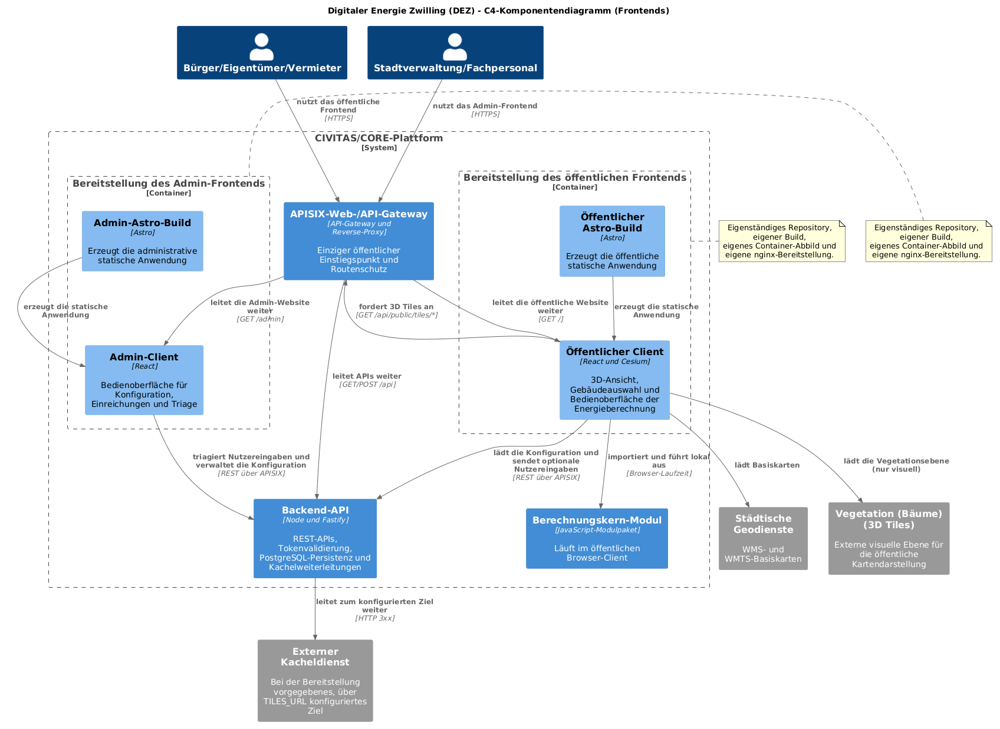
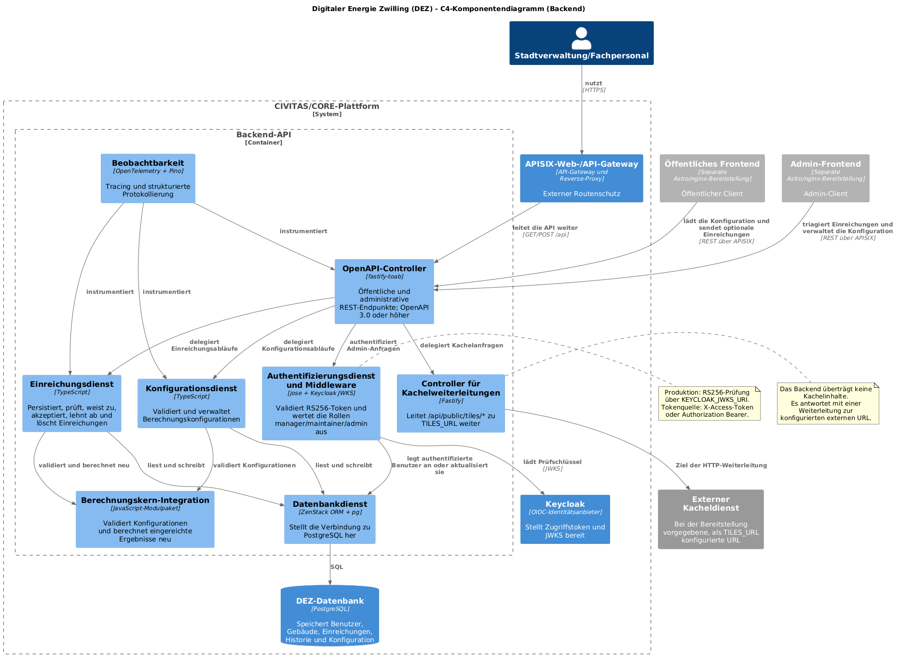
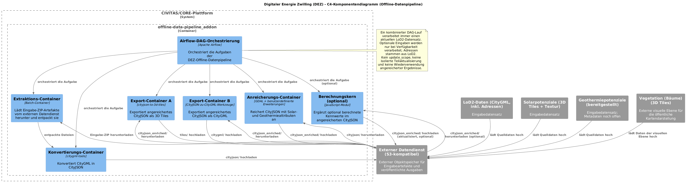

# Architektur – C4 Component Diagramm

## Inhaltsverzeichnis

1. [Ziel dieser Sicht](#ziel-dieser-sicht)
2. [Überblick](#ueberblick)
3. [Frontend-Komponenten](#frontend-komponenten)
4. [Backend-Komponenten](#backend-komponenten)
5. [Berechnungskern](#berechnungskern)
6. [Security-Kontrollpunkte](#security-kontrollpunkte)
7. [Offline-Datenpipeline](#offline-datenpipeline)
8. [Datenflüsse (zusammengefasst)](#datenfluesse-zusammengefasst)
9. [Abgrenzung](#abgrenzung)

## Ziel dieser Sicht

Dieses Kapitel beschreibt die Architektur des Digitaler Energie Zwilling (DEZ) auf **Komponenten-Ebene (C4 Level 3)**.  
Die Komponenten-Sicht zeigt die **interne Struktur der zentralen Container**, deren Verantwortlichkeiten sowie die wichtigsten Kommunikations- und Datenflüsse.

Die Komponenten-Sicht richtet sich primär an:
- Entwicklerinnen und Entwickler
- Architektinnen und Architekten
- Personen, die das System warten oder erweitern

Sie baut auf der Container-Sicht auf und ergänzt diese um technische Details.

---

## Überblick

Die C4 Component Sichten stellen die folgenden Aspekte dar:

- den Aufbau des statischen Frontends mit Public- und Admin-Bereich
- die internen Komponenten des Backends
- den Berechnungskern als geteiltes Modul
- die Entkopplung von 3D Tiles, Backend und Datenhaltung (3D Tiles Storage als externer S3-Dienst)
- die Airflow-basierte Offline-Datenpipeline als separates CIVITAS/CORE-Add-on zur Erzeugung der 3D Tiles, CityGML-Ausgaben und NGSI-LD-Entities für Stellio

### Frontend View

Quelle: `raw/c4-components.puml` (Frontend View)

### Backend View

Quelle: `raw/c4-components-backend.puml` (Backend View)

---

## Frontend-Komponenten

### Getrennte Astro Static Builds

Public Frontend und Admin Frontend sind eigenständige Anwendungen in getrennten Repositories. Jede Anwendung besitzt einen eigenen Astro-Build und wird als eigener nginx-Container ausgeliefert.

Aufgaben:
- Generierung der HTML-Struktur
- Bündelung der JavaScript-Module
- Vorbereitung der interaktiven Islands

Zur Laufzeit ist Astro nicht beteiligt.

---

### Public Frontend

Der Public Client ist die zentrale Benutzeroberfläche für Bürger (Eigentümer/Vermieter).

Aufgaben:
- Darstellung des 3D-Stadtmodells
- Anzeige der freigegebenen Solarpotenziale (PV) nach Festlegung des verbindlichen Detailumfangs und der Geothermiepotenziale aus den vom Auftraggeber bereitgestellten Daten
- Durchführung der energetischen Berechnung
- Darstellung der Berechnungsergebnisse
> ⚠️ **Hinweis:** Vegetationsobjekte (Bäume) werden für die visuelle Orientierung genutzt. Die PV-Datenfreigabe liegt vor; die Solarpotenzial-Textur wird nach Festlegung des verbindlichen Darstellungsumfangs übernommen.

Die Berechnung wird standardmäßig vollständig im Browser ausgeführt.

---

### Admin Frontend (Stadtverwaltung / Fachpersonal)

Das eigenständig gebaute Admin Frontend stellt die administrative Benutzeroberfläche für Stadtverwaltung / Fachpersonal bereit.

Aufgaben:
- Pflege und Veröffentlichung von Berechnungskonfigurationen
- Sichtung und Triage von Nutzereingaben
- Qualitätssicherung

Die statischen Assets werden über den eigenen nginx-Container ausgeliefert; administrative API-Aktionen erfordern eine erfolgreiche Authentifizierung und Autorisierung.

---

### Gemeinsame UI-Konventionen

Public Frontend und Admin Frontend folgen gemeinsamen UI- und Designkonventionen, bleiben aber getrennte Builds und Deployments.

Aufgaben:
- Sicherstellung eines konsistenten Erscheinungsbildes
- Wiederverwendung von UI-Elementen
- Reduktion von Redundanzen im Frontend

---

## Backend-Komponenten

### OpenAPI Controllers

Die API Controller bilden den Einstiegspunkt für alle Backend-Funktionalitäten.

Aufgaben:
- Bereitstellung öffentlicher und administrativer Endpunkte
- Validierung eingehender Anfragen
- Weiterleitung an fachliche Services
- Bereitstellung eines Vertrags nach OpenAPI 3.0 oder höher als Grundlage für die Client-Generierung

---

### Auth Middleware

Die Auth Middleware validiert produktiv das RS256-signierte Access Token unabhängig von der vorgelagerten APISIX-Prüfung gegen die über `KEYCLOAK_JWKS_URI` konfigurierte JWKS-Quelle und wertet die Rollen aus dem konfigurierten Resource-Access-Client aus. Im Code werden die Rollen `manager`, `maintainer` und `admin` verwendet.

Aufgaben:
- Annahme des Tokens aus `X-Access-Token` oder `Authorization: Bearer`
- produktive Prüfung von Signatur und Gültigkeit gegen Keycloak-JWKS
- Durchsetzung fachlicher Rollen- und Zugriffskonzepte
- Trennung von Triage-Zugriff (`manager`, `admin`) und Systempflege (`maintainer`, `manager`, `admin`) entsprechend den Berechtigungen

---

### Configuration Service

Der Configuration Service verwaltet die Berechnungskonfigurationen.

Aufgaben:
- Pflege von Parametern
- Versionierung und zeitliche Gültigkeit
- Veröffentlichung versionierter Konfigurationsdateien

Er fungiert als zentrale Quelle für Berechnungsparameter.

---

### Berechnungsservice

Der Berechnungsservice stellt eine optionale serverseitige Ausführung der Berechnung bereit.

Aufgaben:
- Laden der aktiven Konfiguration
- Aufruf des Berechnungskerns
- Rückgabe von Berechnungsergebnissen

Im Regelfall wird dieser Service nur für administrative oder zukünftige Erweiterungen genutzt.

---

### User Data Service

Der User Data Service verwaltet persistente Nutzerdaten.

Aufgaben:
- Speicherung von Nutzereingaben
- Verwaltung von Triage-Informationen
- Gezielte Löschung einzelner Einreichungen sowie gebündelte Löschung einer Gebäudegruppe ausschließlich bei durchgängig abgelehntem Status
- Unterstützung administrativer Auswertungen

---

### Observability

Diese Komponente sorgt für die technische Beobachtbarkeit des Systems.

Aufgaben:
- Logging
- Metriken
- Tracing
- Einsammeln von Container-Logs aus `stdout`/`stderr` über die Kubernetes-Logging-Pipeline

---

## Berechnungskern

Der Berechnungskern ist als **eigenständiges JavaScript-Modul** umgesetzt.

Eigenschaften:
- identischer Code für Frontend und Backend
- deterministisches Verhalten bei gleicher Konfiguration
- Übergabe von Konfiguration und Nutzereingaben als Parameter

Der Berechnungskern ist bewusst frei von Infrastrukturabhängigkeiten.

---

## Security-Kontrollpunkte

Auf Komponentenebene werden Sicherheitsanforderungen als konkrete Kontrollpunkte umgesetzt:

- **APISIX + Auth Middleware**: APISIX schützt die administrativen Routen und prüft OIDC vorgelagert. Das Backend betrachtet dies nicht als alleinige Freigabe, sondern validiert Access Tokens unabhängig per RS256/JWKS und wertet Claims/Rollen für die eigene fachliche Autorisierung aus.
- **OpenAPI Controllers**: Trennen öffentliche und administrative Endpunkte, validieren Anfragen und leiten nur validierte Daten an Fachservices weiter.
- **User Data Service**: Verarbeitet öffentliche Schreibzugriffe erst nach der globalen Altcha-/Rate-Limit-Policy, die durch die externe Deployment-Plattform in APISIX betrieben wird, und führt anschließend fachliche Validierung und Verifikation aus.
- **Configuration Service + Snapshot Exporter**: Erzwingen versionierte, unveränderliche Veröffentlichungen statt in-place-Änderungen.
- **Triage/Reporting-Pfad**: Statuswechsel werden nachvollziehbar geführt und für Audit-Zwecke protokolliert.
- **Observability**: Erfasst sicherheitsrelevante Ereignisse (Auth, Zugriffsentscheidungen, Fehlerpfade) als Grundlage für Incident-Analyse.

Damit sind die Security-by-Design-Prinzipien aus TA-58 bis TA-64 in den Kernkomponenten technisch verankert.

---

## Offline-Datenpipeline

Die Offline-Datenpipeline ist als eigenständiger Verarbeitungspfad in CIVITAS/CORE modelliert, wird jedoch nicht über das `digital-energy-twin_addon` bereitgestellt.

Aufgaben:
- Verarbeitung von CityGML-Daten
- konditionale Integration der freigegebenen Solarpotenziale (PV) nach Festlegung des Detailumfangs sowie Integration der vom Auftraggeber bereitgestellten Geothermiedaten
- Anreicherung der Gebäudedaten
- Erzeugung der finalen 3D Tiles, CityGML-Ausgaben und NGSI-LD-Entities
- Übergabe freigegebener NGSI-LD-Entities an Stellio innerhalb von CIVITAS/CORE

Die Pipeline erzeugt ausschließlich statische Artefakte bzw. statische NGSI-LD-Entities und hat keinen Zugriff auf Laufzeitdaten.
Vegetationsdaten werden nicht durch die Pipeline verarbeitet, sondern im Public Client als reine Visualisierungsebene eingebunden.

### Offline Pipeline View

Das Diagramm zeigt die dateibasierten Kernschritte der Offline-Pipeline; der zusätzliche NGSI-LD/Stellio-Publish-Pfad ist im Text und im Pipeline-Vertrag beschrieben.

Quelle: `raw/c4-components-pipeline.puml` (Offline Pipeline View)

---

## Datenflüsse (zusammengefasst)

- Statische Potenziale:  
  Offline-Datenpipeline → 3D Tiles → Public Client

- Statische Nachnutzung in CIVITAS/CORE:
  Offline-Datenpipeline → NGSI-LD → Stellio

- Berechnung:  
  Public Client → Berechnungskern → Ergebnisanzeige  
  Optional: Backend → Berechnungskern → Ergebnis

- Konfiguration:  
  Admin (Stadtverwaltung / Fachpersonal) → Backend → Konfigurationsdatei → Public Client

- Nutzerdaten:  
  Public Client → Backend → PostgreSQL-Datenbank → Admin-Triage (Stadtverwaltung / Fachpersonal)

---

## Abgrenzung

Dieses Kapitel beschreibt die **interne Struktur der Container**, nicht deren Deployment.  
Details zu Betrieb, Skalierung und Infrastruktur werden im Kapitel **Betrieb und Deployment** behandelt.
