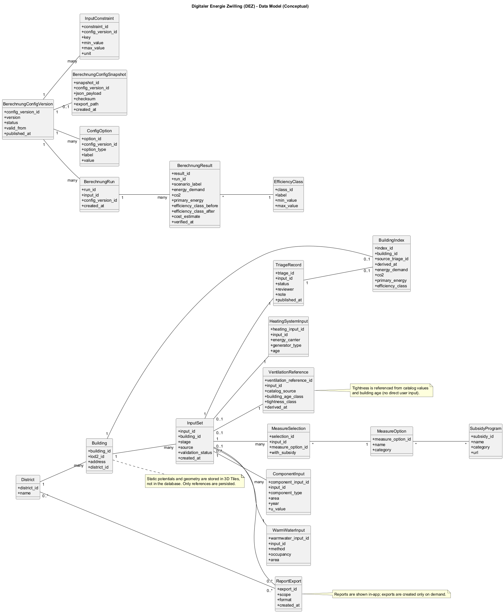
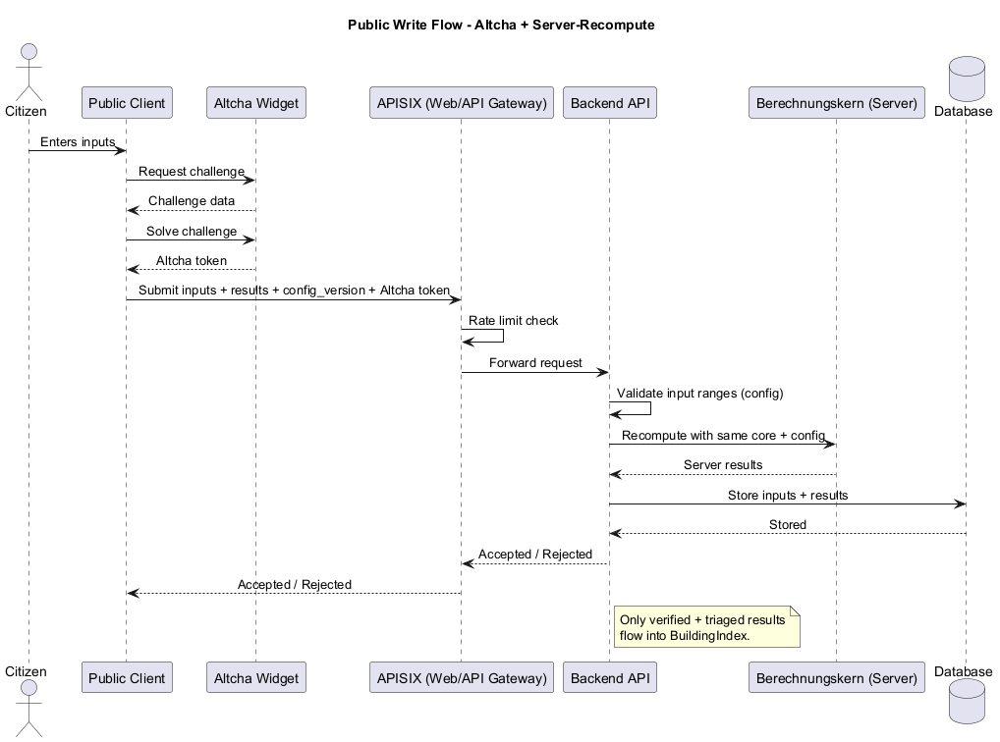

# Datenmodell und API-Sicht

## Ziel dieser Sicht

Dieses Kapitel beschreibt das fachliche Datenmodell und die API-Schnittstellen des
Digitaler Energy Zwilling (DEZ). Es ergänzt die Container- und Komponenten-Sichten um die
strukturelle Daten- und Vertrags-Ebene.

---

## Datenmodell (abgeleitet)

Das Datenmodell wurde aus den fachlichen Anforderungen und den Nutzerzielen
abgeleitet. Es trennt **statische Potenzialdaten** (3D Tiles, offline) von
**dynamischen Nutzereingaben** und **administrativen Daten** (Datenbank).

### Kernobjekte

- **Gebäude** (Referenz auf LOD2/3D Tiles) und **Quartiere** (Aggregationen)
- **Eingabesets** (Eingabetiefe/Detailgrad, Quelle, Zeitstempel)
- **Bauteil- und Systemeingaben** (Hülle, Lüftung, Warmwasser, Anlagentechnik)
- **Maßnahmenkatalog** und **Maßnahmenselektion** (inkl. Förderprogramme)
- **Simulationskonfiguration (versioniert)** und **Konfigurationsoptionen**
- **Simulationen & Ergebnisse** (Energiebedarf, CO₂, Primärenergie, Kosten, Effizienzklassen)
- **Triage/Status** für administrative Prüfung und Veröffentlichung
- **Audit-Log** (Änderungen, Freigaben, Zeitstempel, Benutzerkennung)
- **Reports** (Anzeige in der Anwendung) und **optionale Exporte** (z.B. PDF für Bürger, Quartiersberichte für Verwaltung)

### Beziehungen (vereinfacht)

- Ein **Gebäude** hat mehrere **Eingabesets** (Szenarien, Eingabetiefe/Detailgrad).
- Ein **Eingabeset** hat **Bauteil- und Systemeingaben** sowie **Maßnahmen**.
- Jede **Simulation** referenziert eine **Konfigurationsversion** und erzeugt **Ergebnisse**.
- **Triage** ist pro Eingabeset geführt; veröffentlichte Daten werden exportierbar.
- **Quartiere** erlauben Aggregationen und Reporting auf Planungsebene.

### Eingabekategorien (Auszug)

- **Grunddaten**: Baujahr/Baualtersklasse, Gebäudetyp, Wohnfläche, Wohneinheiten, Personenanzahl.
- **Gebäudehülle**: Dach, Außenwand, Fenster, Kellerdecke inkl. Zustand/Sanierungsjahr und Dämmung.
- **Lüftung**: Luftdichtheit als referenzierter Parameter aus Katalogwerten und Baualter (keine direkte Nutzereingabe).
- **Warmwasser & Nutzung**: pauschal vs. personenbasiert.
- **Anlagentechnik**: Energieträger, Erzeugerart, Heizflächenart, Anlagenalter, Regelungsart; optional Vorlauftemperatur, Erzeugerleistung, Umwälzpumpe, Regelprinzip, technische Ausführung.
- **Kosten/Preise**: Energiepreis, Stromart, Jahresverbrauch (optional).
- **Erneuerbare**: PV (zwei Darstellungen), Solarthermie (Warmwasser-Unterstützung), Geothermie, Energiespeicher (optional).

### Eingabespektrum-Enden (Grobkonzept-Arbeitsmappe)

Quelle: `30-01-26_-Übersicht Berechnung Grobkonzept.xlsx`

- Datenstufe 1 entspricht im Datenmodell dem Fall ohne Nutzereingabe (automatisch befüllte Felder aus LOD2/Katalogen).
- Datenstufe 2 entspricht dem Fall maximaler Nutzereingabe (manuelle Überschreibung und Detaillierung pro Domäne).
- Beide Extreme verwenden dieselben Entitäten; entscheidend ist die Herkunftskennzeichnung je Feld (`automatisch`, `manuell`, `geschätzt`).

| Domäne | Typische Felder im unteren Spektrum-Ende | Typische Felder im oberen Spektrum-Ende |
| ----- | ----- | ----- |
| Dach/Dachfenster | Dachfläche, Dachfensterfläche, U-Werte aus Baualter/Kat. 1 | Manuelle Flächen, U-Werte, Konstruktion/Schichtbezug |
| OGD/AW/UGD | Flächen und U-Werte aus LOD2 + Baualtersklasse | Überschriebene Flächen/U-Werte, Konstruktionsdetails |
| Fenster/Türen | Standardanteile und Katalog-U-Werte | Rahmen-/Verglasungsdetails und manuelle U-Werte |
| Heizung | Katalogbasierte Vorbelegung aus Baujahr/Erzeugertyp | System-, Regelungs- und Zusatzparameter inkl. Zusatzheizung |

### Datenhaltung

- **3D Tiles**: Geometrie und statische Potenziale (keine DB-Persistenz).
- **Datenbank**: Eingaben, Konfigurationen, Ergebnisse, Triage, Kataloge, Exporte (nur bei explizitem Export).
- **Konfigurations-Snapshot**: JSON wird aus der DB-Version erzeugt und als Datei exportiert.

### Status-Lifecycle (Triage)

- `neu` → `in_pruefung`
- `in_pruefung` → `freigegeben` oder `unplausibel`
- Statuswechsel werden im Audit-Log mit Zeitstempel und Benutzerkennung protokolliert.

### Statische Tile-Attribute (Auszug)

- **Adressen** stammen aus LOD2 und werden direkt im Tile geführt (`address_full`, `street`, `house_number`, `postal_code`, `city`).
- **Solarpotenziale** liegen als Attribute in 3D Tiles vor. Relevante Felder u.a.:
  `solarArea`, `Fläche`, `Dachneigung`, `Dachorientierung`, `SVF_min`, `SVF_avg`, `SVF_med`, `SVF_max`,
  `Z_MIN`, `Z_MAX`, `Z_MIN_ASL`, `Z_MAX_ASL`, `creationDate`,
  `globalRadMonths_1..12`, `directRadMonths_1..12`, `diffuseRadMonths_1..12`.
- **Einheiten** werden aus der Datenquelle übernommen; es erfolgt keine DB-Normalisierung.
- **Geothermiepotenziale** werden über eine priorisierte Datensatzabfrage ermittelt (Grundwasser, dann Erdreich, dann Luft) und als statische Attribute ergänzt.
- **Datenstand Geothermie**: Ein belastbarer Datensatz liegt aktuell noch nicht vor; die konkrete Ausprägung für den MVP bleibt in Klärung.
- **Vegetation (Bäume)** wird als eigener 3D Tiles Layer für die Visualisierung ausgeliefert.

### Abgeleitete Gebäudeparameter (LOD2)

Aus LOD2 werden u.a. folgende Kenngrößen abgeleitet und im Simulationskontext genutzt:
- Nutzfläche, Wohnfläche, Nettoraumvolumen
- Hüllflächen (Außenwände, Dachflächen)
- Ausrichtung der Wände / Himmelsrichtungen
- Anzahl Geschosse / Vollgeschosse
- Dachform und Dachausrichtung
- Anzahl Wohneinheiten und angrenzende Gebäude (Kontext)

### Konfigurations-Publishing

- **Source of Truth**: Konfigurationen werden in der Datenbank gepflegt und versioniert.
- **Snapshot**: Beim Veröffentlichen wird ein JSON-Snapshot erzeugt, gespeichert und exportiert.
- **Konsistenz**: Simulationen referenzieren eine Config-Version und deren Checksumme.

### Ergebnis-Publishing und Indexierung

- **Public Write**: Der öffentliche Bereich darf Simulationsergebnisse schreiben (inkl. Eingaben und Config-Version).
- **Server-Recompute**: Beim Speichern werden die Ergebnisse serverseitig mit dem gleichen Simulationskern
  neu berechnet.
- **Input-Validation**: Eingangsgrößen werden gegen konfigurierte Grenzen geprüft
  (z.B. Wertebereiche wie 100–2000).
- **Triage**: Stadtverwaltung / Fachpersonal prüft, markiert und veröffentlicht Ergebnisse.
- **Indexierung**: Aus verifizierten und triagierten Ergebnissen werden abgeleitete Basisdaten pro Gebäude erzeugt
  (z.B. für Vergleiche, Quartiersanalysen und Reports).

### Offene Datenmodell-Punkte aus dem Grobkonzept

- Kostenfelder für Hülle-Maßnahmen sind aktuell als Platzhalter markiert und noch nicht als belastbares Schema beschrieben.
- Teilweise enthalten Tabellenwerte reine Template-Inhalte (`0`, `#`) und dürfen nicht als produktive Defaultwerte in API/DB übernommen werden.
- Korrekturfaktoren je Bauteil sind nicht vollständig als konfigurierbare Regelstruktur ausdefiniert.
- Für Teile der Heizungslogik liegt noch keine ausreichend formalisierte Regelbasis für maschinenlesbare Empfehlungen vor.

### Diagramm

Quelle: `raw/data-model.puml`

### Public Write Flow (Altcha + Verifikation)

Quelle: `raw/public-write-flow.puml`

---

## API-Sicht (erste Ableitung)

- **API-Grenzen**: Bürgerbereich vs. Admin-Bereich (Stadtverwaltung / Fachpersonal)
- **Ressourcen**: Gebäude, Eingaben, Simulationen, Konfigurationen, Kataloge, Triage, Reports
- **Auth/Session**: OIDC für Admin; öffentliche APIs ohne Auth, aber mit Schreibzugriff für Simulationsergebnisse
- **Validation**: Public Write prüft Eingaben (Range/Schema)
- **Abuse-Schutz**: Öffentliche Schreibzugriffe sind durch Altcha-Challenges und Rate Limiting geschützt
- **Altcha kurz erklärt**: Altcha ist eine selbsthostbare, datenschutzfreundliche Challenge; der Client löst eine kleine Rechenaufgabe und sendet ein Token, das serverseitig geprüft wird.
- **Enforcement**: Altcha-Token wird im Backend validiert; Rate Limiting wird im Web Gateway und zusätzlich im Backend durchgesetzt.
- **Publish-Flow**: Admin veröffentlicht Konfiguration → JSON-Snapshot wird erzeugt → Public Client liest JSON
- **Versionierung**: Konfigurations- und API-Versionen klar trennen
- **Fehlerformate**: Standardisierte Fehlercodes und Validierungsdetails

---

## Abgleich und Entscheidungen

### Abgleich mit technischen Anforderungen

- Die Trennung von öffentlichen und administrativen APIs entspricht TA-02, TA-03 und TA-35.
- Public Write mit Altcha und Rate Limiting entspricht TA-47 bis TA-51.
- Konfigurations-Publishing mit Snapshot entspricht TA-27 bis TA-46.
- Offline-Pipeline und 3D Tiles Prinzipien entsprechen TA-10 bis TA-18.

### Mapping zu Backend-Services

- **Configuration Service**: Konfigurationen, Versionierung, Publishing (TA-27 bis TA-46).
- **Config Snapshot Exporter**: Export der JSON-Snapshots (TA-44 bis TA-45).
- **User Data Service**: Public Write, Persistenz der Eingaben und Ergebnisse (TA-33, TA-36).
- **Triage/Reporting Service**: Triage, Freigabe, Reporting-Views (TA-34, TA-50).
- **Simulation Service**: Server-Recompute für Verifikation (TA-49).
- **Geo Query Service**: räumliche Abfragen für Admin-Views (TA-37).
- **Auth Middleware**: OIDC/JWT für Admin-Endpoints (TA-04).

### Entscheidung Reports

- Reports werden **nicht** als eigene dauerhafte Objekte gespeichert.
- Reports werden in der Anwendung **dynamisch aus der Datenbank** aggregiert.
- Exporte sind optional und werden als **ReportExport** mit Metadaten (Zeitpunkt, Scope, Format) persistiert.
