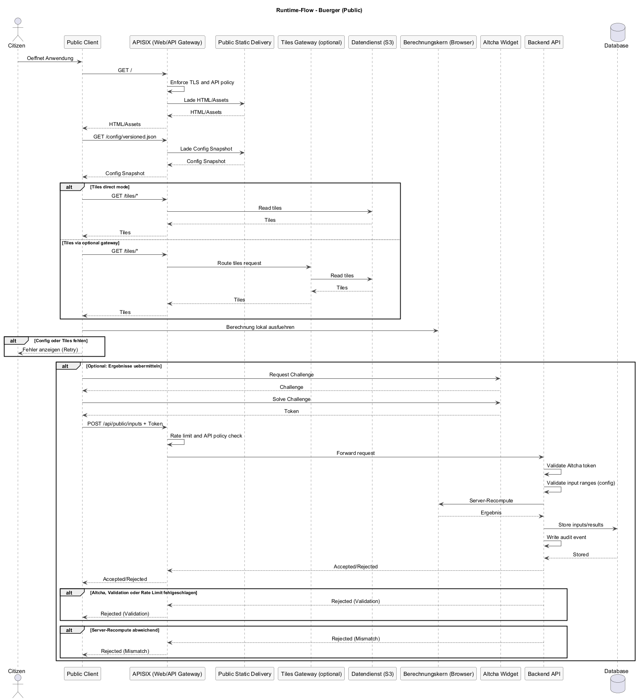
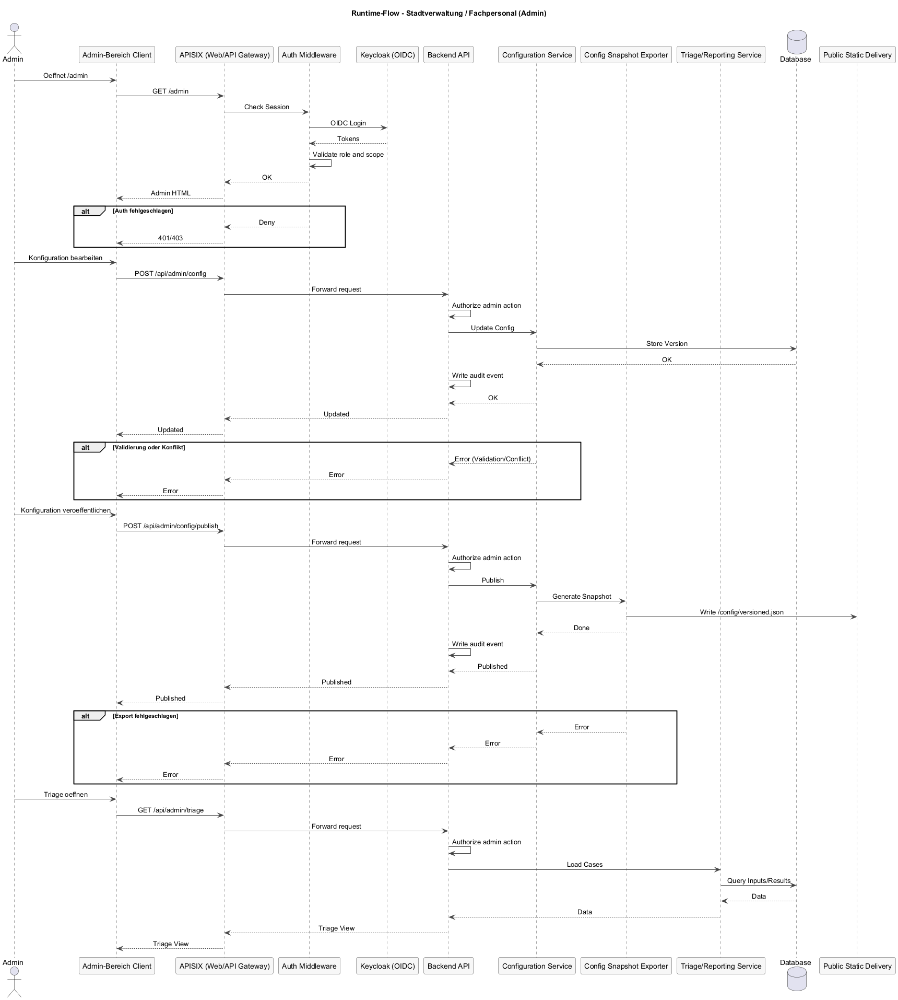
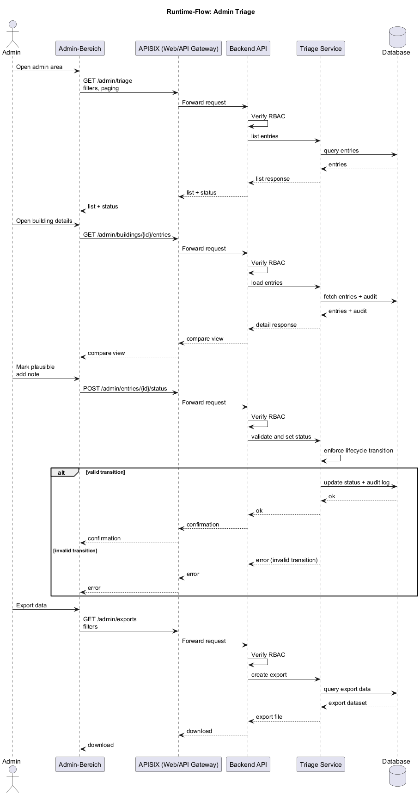
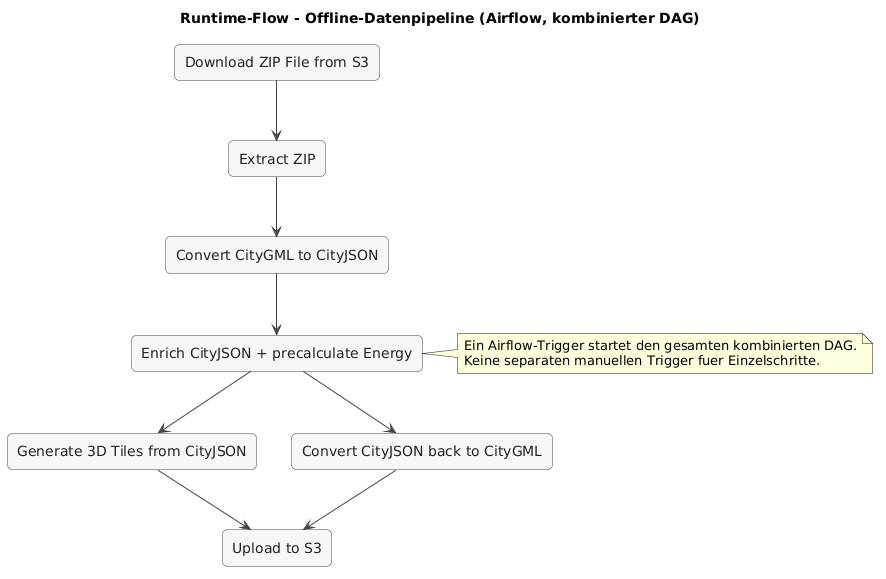
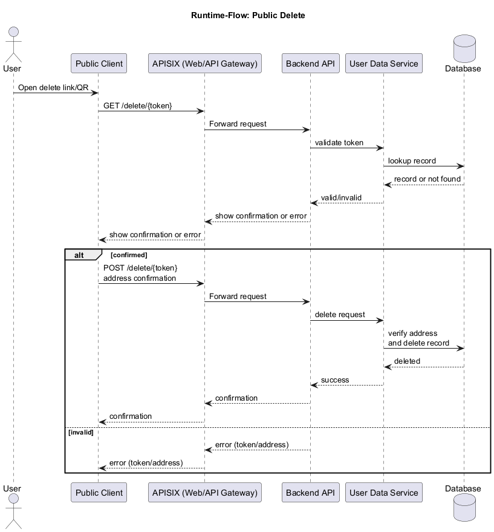

# Runtime-Flows und Ops-Sicht

## Ziel dieser Sicht

Dieses Kapitel beschreibt die zentralen Laufzeitabläufe (Runtime-Flows) sowie
operative Aspekte wie Monitoring, Logging und Betrieb.

---

## Runtime-Flows

**Bürger (Eigentümer/Vermieter)-Flow**  
Der öffentliche Client lädt statische Inhalte, die veröffentlichte Konfiguration und 3D Tiles. Nutzer wählen ein Gebäude, führen Simulationen clientseitig aus und übermitteln Ergebnisse optional an das Backend (Altcha + Rate Limiting). Der Bearbeitungszustand wird über einen notwendigen Cookie für Wiederbesuche wiederhergestellt; bei expliziter Speicherung ist zusätzlich eine Wiederherstellung vom Server möglich.  
Beteiligte Komponenten: APISIX (Web/API-Gateway), Public Client, optional Tiles Gateway oder direkter Datendienstzugriff, Config Snapshot, Backend API (optional).  
Fehlerpfade: fehlende Tiles/Config, ungültige Eingaben, Altcha-Validierung fehlgeschlagen, Server-Recompute abweichend.

Quelle: `raw/runtime-flow-public.puml`

**Stadtverwaltung / Fachpersonal-Flow**  
Admins authentifizieren sich via OIDC, bearbeiten Konfigurationen, veröffentlichen Versionen und triagieren eingegangene Nutzereingaben.  
Beteiligte Komponenten: APISIX (Web/API-Gateway), Admin-Bereich, Auth Middleware, Configuration Service, Triage/Reporting Service, Database.  
Fehlerpfade: Auth fehlgeschlagen, Konflikte bei Konfigurationsversionen, Validierungsfehler, fehlende Berechtigungen.

Quelle: `raw/runtime-flow-admin.puml`

**Admin Triage-Flow (Detail)**  
Admins sehen gruppierte Eingaben je Gebäude, vergleichen Datensätze, markieren plausible Einträge und exportieren Daten für die Wärmeplanung.  
Beteiligte Komponenten: Admin-Bereich, Backend API, Triage Service, Database.  
Fehlerpfade: ungültige Filter, fehlende Berechtigung, konkurrierende Status-Updates.

Quelle: `raw/runtime-flow-admin-triage.puml`

**Datenpipeline-Flow**  
Airflow-Run wird manuell gestartet, Rohdaten werden geladen, Konvertierung und Anreicherung laufen in separaten Containern, Ergebnisse werden in den Datendienst hochgeladen und im Manifest dokumentiert.  
Beteiligte Komponenten: Civitas Core (Airflow), Datendienst (S3), Konvertierungs-Container, Anreicherungs-Container.  
Fehlerpfade: fehlende Eingaben, Konvertierungsfehler, S3-Fehler, Abbruch → Laufstatus `failed` und kompletter Neustart.

Quelle: `raw/runtime-flow-pipeline.puml`

**Lösch-Flow (Public)**  
Wenn ein Nutzer Ergebnisse gespeichert hat, kann er eine Löschung aus dem PDF (Link/QR) anstoßen.  
Beteiligte Komponenten: Public Client, Backend API, User Data Service, Datenbank.  
Schritte: Löschlink öffnen → Adresse/Token prüfen → Bestätigung → Löschjob → Audit-Log.  
Fehlerpfade: ungültiger Token, Adresse stimmt nicht, Datensatz nicht gefunden, Rate Limit.

Quelle: `raw/runtime-flow-delete.puml`

---

## Ops-Sicht

- **Observability**: strukturierte Logs, Metriken und verteilte Traces.  
  Pflichtmetriken: Request-Rate, Fehlerquote, Latenzen (p50/p95/p99), Queue-Längen, Pipeline-Stage-Dauer, Erfolgsrate je `job_id`.
- **Backup/Recovery**:  
  Datenbank-Backup täglich, Aufbewahrung 30 Tage.  
  Konfigurations-Snapshots im Objekt-Storage versioniert durch Pfad/Job-Ordner.  
  3D Tiles werden im Datendienst gesichert, Lifecycle-Regeln nach Speicherbedarf.
- **Runbooks**:  
  API-Ausfall, Auth/OIDC-Probleme, Pipeline-Fehler, Datenkorruption, Rollback einer Konfigurationsversion, Wiederanlauf nach Teilfehlern.

---

## Sicherheit (Betrieb)

- Secrets ausschließlich über Secrets-Management, keine Tokens im Code.
- Zugriff auf den Datendienst nur mit minimalen Rechten (Least Privilege, Bucket-Policies).
- TLS für externe Verbindungen (z.B. S3, OIDC, API).
- Log-Redaction: keine Credentials oder personenbezogenen Daten in Logs.
- Regelmäßige Rotation von Zugangs- und Service-Credentials.

---

## Daten-Governance

- Aufbewahrung der Job-Ordner erfolgt nach Bedarf; Löschung erfolgt manuell durch Betrieb.
- Logs und `manifest.json` gehören zum Job-Ordner und werden gemeinsam gelöscht.
- Zugriff auf Job-Ordner ist auf Betrieb und Pipeline-Container beschränkt.
- Veröffentlichung von 3D Tiles erfolgt erst nach erfolgreicher Pipeline und Validierung.

---

## Teststrategie (Minimal)

- **Smoke-Test Pipeline**: Ein kleiner CityGML-Datensatz wird manuell über Airflow verarbeitet.
- **Regression**: Vergleich der erzeugten 3D Tiles gegen Referenz-Run (Dateistruktur, Count, Metadatenfelder).
- **Contract-Checks**: Validierung von `manifest.json` und Progress-Logs nach Schema.

---

## Zuständigkeiten und Betriebsprozesse

- Betrieb und Orchestrierung liegen beim Civitas-Core-Betriebsteam.  
  Verantwortung: Airflow, Datendienstzugriff, Deployments, Monitoring.
- Fachlicher Betrieb (Konfiguration/Triage) liegt bei Stadtverwaltung / Fachpersonal.
- Notfallprozess: Incident-Owner wird benannt, Runbooks definieren Wiederanlauf und Kommunikationswege.
- Wartungsprozess: geplante Wartungsfenster, Rollbacks über vorherige Konfigurationsversionen.
