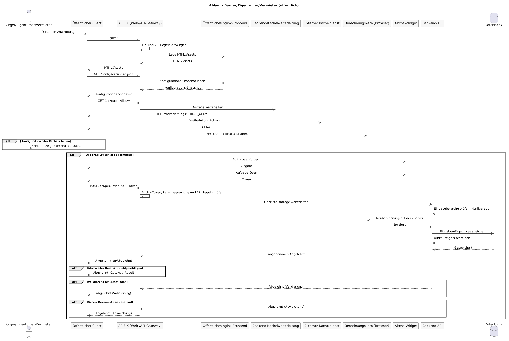
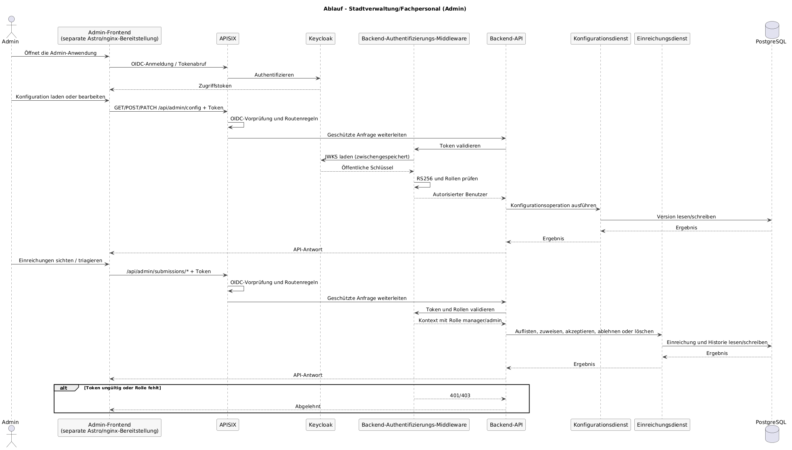
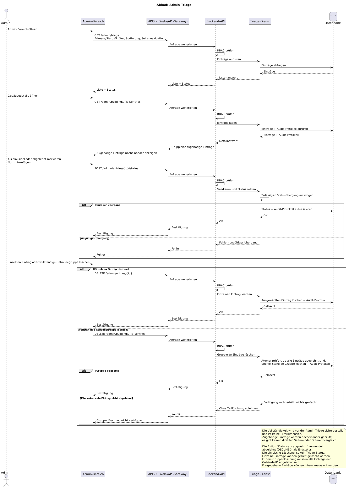
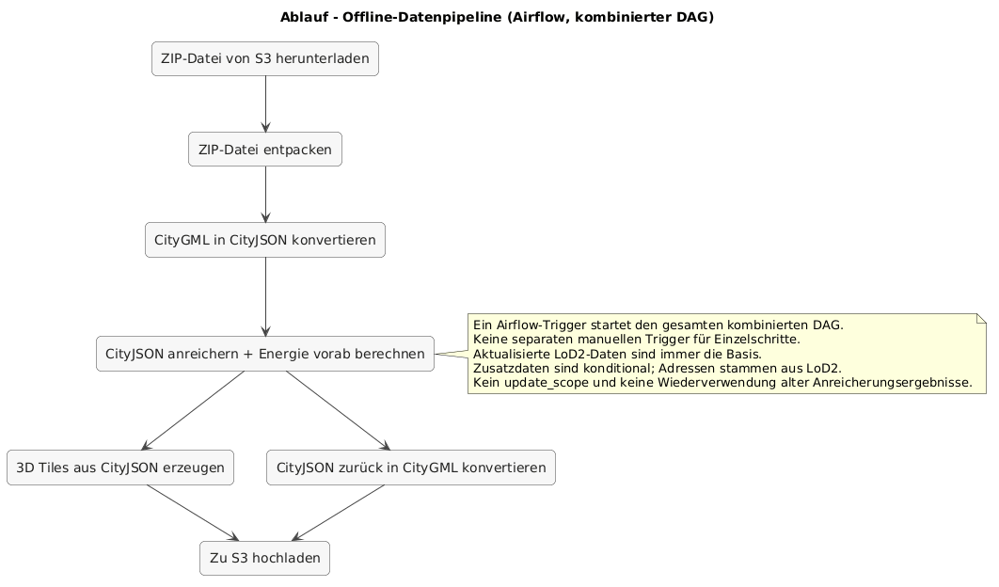
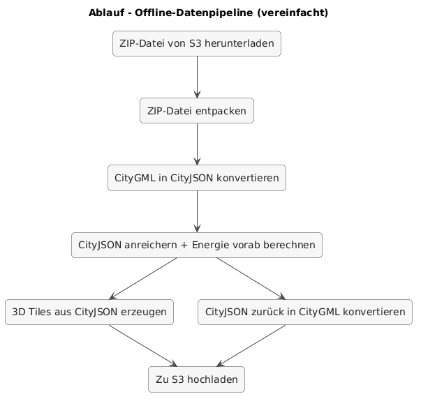
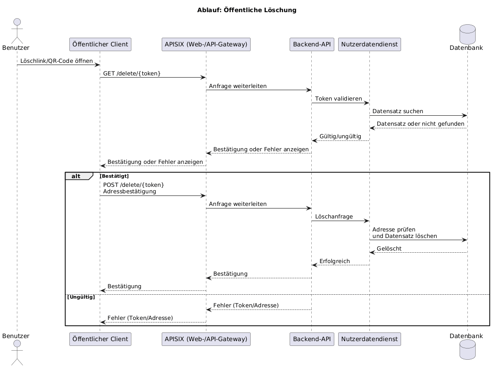

# Runtime-Flows und Ops-Sicht

## Inhaltsverzeichnis

1. [Ziel dieser Sicht](#ziel-dieser-sicht)
2. [Runtime-Flows](#runtime-flows)
3. [Security by Design in Runtime-Flows](#security-by-design-in-runtime-flows)
4. [Ops-Sicht](#ops-sicht)
5. [Sicherheit (Betrieb)](#sicherheit-betrieb)
6. [Daten-Governance](#daten-governance)
7. [Teststrategie (Minimal)](#teststrategie-minimal)
8. [Zuständigkeiten und Betriebsprozesse](#zustaendigkeiten-und-betriebsprozesse)

## Ziel dieser Sicht

Dieses Kapitel beschreibt die zentralen Laufzeitabläufe (Runtime-Flows) sowie
operative Aspekte wie Monitoring, Logging und Betrieb.

---

## Runtime-Flows

**Bürger (Eigentümer/Vermieter)-Flow**  
Der öffentliche Client lädt statische Inhalte, die veröffentlichte Konfiguration und 3D Tiles. Tile-Anfragen laufen über `GET /api/public/tiles/*`; das Backend leitet sie per Redirect an die über `TILES_URL` konfigurierte externe Tiles-URL weiter. Nutzer wählen ein Gebäude, führen Berechnungen clientseitig aus und übermitteln Ergebnisse optional über APISIX an das Backend; Altcha und Rate Limiting werden dabei durch die globale Policy der externen Deployment-Plattform geprüft. Der Bearbeitungszustand wird über Local Storage für Wiederbesuche wiederhergestellt; bei expliziter Speicherung ist zusätzlich eine Wiederherstellung vom Server möglich.
Beteiligte Komponenten: APISIX (Web/API-Gateway), Public Client, externer Tiles-Dienst, Config Snapshot, Backend API.  
Fehlerpfade: fehlende Tiles/Config, ungültige Eingaben, APISIX-Altcha-/Rate-Limit-Prüfung fehlgeschlagen, Server-Recompute abweichend.

Quelle: `raw/runtime-flow-public.puml`

**Stadtverwaltung / Fachpersonal-Flow**  
Admins authentifizieren sich via OIDC über Keycloak. APISIX schützt die Admin-Routen, prüft OIDC vorgelagert und leitet das Access Token weiter. Das Backend vertraut dieser Prüfung nicht allein, sondern validiert das Token produktiv und unabhängig per RS256 gegen die konfigurierte Keycloak-JWKS-Quelle und wertet anschließend Claims und Rollen für die eigene Autorisierungsentscheidung aus. Danach bearbeiten Admins Konfigurationen, veröffentlichen Versionen und triagieren eingegangene Nutzereingaben.
Beteiligte Komponenten: APISIX (Web/API-Gateway), Admin-Bereich, Auth Middleware, Configuration Service, Triage/Reporting Service, Database.  
Fehlerpfade: Auth fehlgeschlagen, Konflikte bei Konfigurationsversionen, Validierungsfehler, fehlende Berechtigungen.

Quelle: `raw/runtime-flow-admin.puml`

**Admin Triage-Flow (Detail)**  
Admins sehen Eingaben je Gebäude gruppiert und navigieren zur Prüfung nacheinander zwischen den Geschwistereinreichungen; eine Side-by-side- oder Delta-Ansicht ist nicht vorgesehen. Die technische Vollständigkeit der in die Triage übernommenen Datensätze ist gewährleistet und daher kein Filterkriterium. Admins geben plausible Einträge frei und setzen über die Aktion „Datensatz abgelehnt“ den Endstatus `abgelehnt` (im Code `DECLINED`). Eine tatsächliche Löschung ist kein Triage-Status: Einzelne Einreichungen können gezielt gelöscht werden; die gebündelte Löschung aller Einreichungen einer Gebäude-ID wird nur ausgeführt, wenn sämtliche Einreichungen der Gruppe abgelehnt sind. Freigegebene Datensätze können für interne Auswertungen genutzt werden.
Beteiligte Komponenten: Admin-Bereich, Backend API, Triage Service, Database.  
Fehlerpfade: ungültige Filter, fehlende Berechtigung, konkurrierende Status-Updates, gebündelte Löschung bei mindestens einer nicht abgelehnten Einreichung.

Quelle: `raw/runtime-flow-admin-triage.puml`

**Datenpipeline-Flow**  
Ein Airflow-Run wird manuell als **ein kombinierter DAG-Lauf** gestartet und verarbeitet stets einen aktualisierten LoD2-GML-Datensatz vollständig. Zusätzliche Eingaben werden konditional einbezogen; Adressen stammen aus LoD2 und sind immer enthalten. Rohdaten werden geladen und entpackt, CityGML nach CityJSON konvertiert, CityJSON mit den im Lauf bereitgestellten Zusatzdaten angereichert, optional durch den Calculation Core ergänzt und danach parallel in 3D Tiles, CityGML und NGSI-LD exportiert. 3D Tiles und CityGML werden in den Datendienst hochgeladen, NGSI-LD-Entities werden innerhalb von CIVITAS/CORE an Stellio übergeben und alles wird im Manifest dokumentiert. Separate Teilupdates sowie die Übernahme von Attributen aus einem bereits angereicherten Ergebnisdatensatz sind nicht vorgesehen.
Beteiligte Komponenten: CIVITAS/CORE (Airflow), Datendienst (S3), Stellio Context Broker, Extract-Container, Konvertierungs-Container, Anreicherungs-Container, Calculation Core (optional), Export-Container (3D Tiles/CityGML/NGSI-LD).
Fehlerpfade: fehlende Eingaben, Extraktions-/Konvertierungs-/Enrichment-/Exportfehler, S3-Fehler, Stellio-Publish-Fehler, Abbruch → Laufstatus `failed` und kompletter Neustart.

Das Diagramm zeigt die dateibasierten Kernschritte der Pipeline; der zusätzliche NGSI-LD/Stellio-Publish-Pfad ist im Text und im Pipeline-Vertrag beschrieben.

Quelle: `raw/runtime-flow-pipeline.puml`

**Datenpipeline-Flow (vereinfacht)**  
Reduzierte Darstellung ohne zusätzliche Hinweise und Abhängigkeiten.

Quelle: `raw/runtime-flow-pipeline-simple.puml`

**Lösch-Flow (Public)**  
Wenn ein Nutzer Ergebnisse gespeichert hat, kann er eine Löschung aus dem PDF (Link/QR) anstoßen.  
Beteiligte Komponenten: Public Client, Backend API, User Data Service, Datenbank.  
Schritte: Löschlink öffnen → Adresse/Token prüfen → Bestätigung → Löschjob → Audit-Log.  
Fehlerpfade: ungültiger Token, Adresse stimmt nicht, Datensatz nicht gefunden, Rate Limit.

Quelle: `raw/runtime-flow-delete.puml`

---

## Security by Design in Runtime-Flows

Die Laufzeitpfade enthalten explizite Sicherheitskontrollen:

- **Public Flow**: Die externe Deployment-Plattform betreibt die globale APISIX-Policy zur Prüfung von Challenge-Token und Rate Limiting; das Backend führt Eingabevalidierung und Recompute-Verifikation vor Persistenz aus.
- **Admin Flow**: APISIX schützt die administrativen Routen und prüft OIDC vorgelagert; das Backend validiert das weitergeleitete Access Token unabhängig per RS256/JWKS und setzt die Rollen `manager`, `maintainer` und `admin` selbst für fachliche Zugriffsentscheidungen ein.
- **Admin Triage Flow**: Berechtigte Statusänderungen, Lifecycle-gebundene Übergänge und Audit-Log je Änderung; die Aktion „Datensatz abgelehnt“ endet im fachlichen Status `abgelehnt`. Die physische Löschung ist eine separate Operation und kein Statusübergang. Einzelne Einreichungen werden gezielt gelöscht; vor einer gebündelten Löschung prüft das Backend atomar, dass alle Einreichungen der Gebäude-ID abgelehnt sind.
- **Pipeline Flow**: Getrennte Offline-Ausführung, kontrollierte Artefakt- und Publish-Pfade je `job_id`, kein partieller Erfolgsstatus bei Teilfehlern.
- **Delete Flow**: Zweistufige Verifikation (Token + Bestätigung/Abgleich) vor Löschung.

Übergreifende Invariante: Jeder Flow besitzt einen klaren Reject-Pfad mit nachvollziehbarer Protokollierung.

---

## Ops-Sicht

- **Observability**: strukturierte Logs, Metriken und verteilte Traces.  
  Pflichtmetriken: Request-Rate, Fehlerquote, Latenzen (p50/p95/p99), Queue-Längen, Pipeline-Stage-Dauer, Erfolgsrate je `job_id`.
- **Log-Erfassung**: Container schreiben standardmäßig auf `stdout`/`stderr`; Promtail oder Grafana Alloy können diese Streams direkt von der Kubernetes-Plattform einsammeln.
- **Backup/Recovery**:  
  Datenbank-Backup täglich, Aufbewahrung 30 Tage.  
  Konfigurations-Snapshots im Objekt-Storage versioniert durch Pfad/Job-Ordner.  
  3D Tiles werden im Datendienst gesichert, Lifecycle-Regeln nach Speicherbedarf.
- **Runbooks**:  
  API-Ausfall, Auth/OIDC-Probleme, Pipeline-Fehler, Datenkorruption, Rollback einer Konfigurationsversion, Wiederanlauf nach Teilfehlern.
- **Wiederanlauf**: Fällt ein Container bei Liveness- oder Readiness-Problemen aus dem Regelbetrieb, übernimmt Kubernetes den automatischen Neustart; Runbooks behandeln die Fehleranalyse und die Wiederaufnahme fachlicher Prozesse.

---

## Sicherheit (Betrieb)

- Secrets ausschließlich über Secrets-Management, keine Tokens im Code.
- Zugriff auf den Datendienst nur mit minimalen Rechten (Least Privilege, Bucket-Policies).
- TLS für externe Verbindungen (z.B. S3, OIDC, API).
- Log-Redaction: keine Credentials oder personenbezogenen Daten in Logs.
- Regelmäßige Rotation von Zugangs- und Service-Credentials.

---

## Daten-Governance

- Aufbewahrung der Job-Ordner erfolgt nach Bedarf; Löschung erfolgt manuell durch Betrieb.
- Logs und `manifest.json` gehören zum Job-Ordner und werden gemeinsam gelöscht.
- Zugriff auf Job-Ordner ist auf Betrieb und Pipeline-Container beschränkt.
- Veröffentlichung von 3D Tiles erfolgt erst nach erfolgreicher Pipeline und Validierung.

---

## Teststrategie (Minimal)

- **Smoke-Test Pipeline**: Ein kleiner CityGML-Datensatz wird manuell über Airflow verarbeitet.
- **Regression**: Vergleich der erzeugten 3D Tiles gegen Referenz-Run (Dateistruktur, Count, Metadatenfelder).
- **Contract-Checks**: Validierung von `manifest.json`, Progress-Logs und NGSI-LD-Entity-Schema nach Schema.

---

## Zuständigkeiten und Betriebsprozesse

- Betrieb und Orchestrierung liegen beim CIVITAS/CORE-Betriebsteam.  
  Verantwortung: Airflow, Datendienstzugriff, Deployments, Monitoring.
- Fachlicher Betrieb (Konfiguration/Triage) liegt bei Stadtverwaltung / Fachpersonal.
- Notfallprozess: Incident-Owner wird benannt, Runbooks definieren Wiederanlauf und Kommunikationswege.
- Wartungsprozess: geplante Wartungsfenster, Rollbacks über vorherige Konfigurationsversionen.
