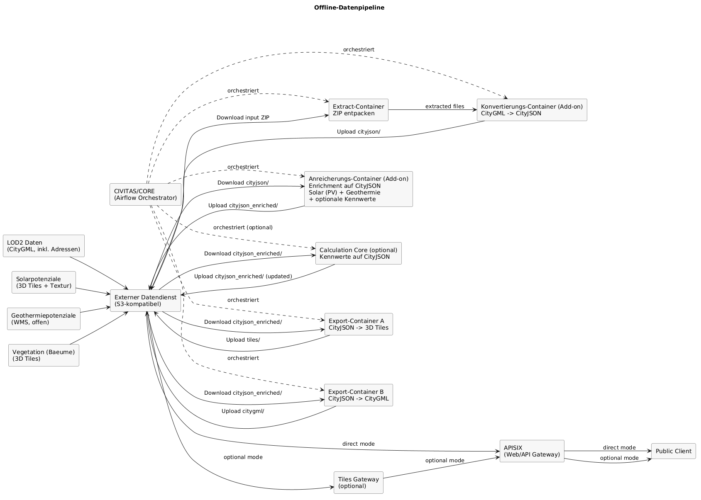

# Architektur – Offline-Datenpipeline

## Ziel dieser Sicht

Dieses Kapitel beschreibt die **Offline-Datenpipeline**, mit der Geodaten und Potenziale
in einen angereicherten 3D-Tiles-Datensatz überführt werden. Ziel ist es, alle
statischen Informationen **vorab** zu berechnen und in den Tiles zu persistieren,
damit zur Laufzeit keine Datenbankzugriffe für Potenziale nötig sind.

---

## Datenquellen

- **Geothermiepotenziale** (WMS)
- **Solarpotenziale** (CityGML)
- **LOD2-Daten** (CityGML)

---

## Verarbeitungsschritte

1. **CityGML → CityJSON**  
   Umwandlung der CityGML-Quellen mit `citygml-tools`  
   <https://github.com/citygml4j/citygml-tools>

2. **CityJSON → 3D Tiles**  
   Konvertierung der CityJSON-Daten mit `cityjson-to-3d-tiles`  
   <https://github.com/csi-FOXBYTE/cityjson-to-3d-tiles>

3. **Anreicherung der Tiles**  
   Ein Transformator schreibt Solarpotenziale, Geothermiepotenziale sowie
   abgeleitete Kennwerte (z.B. Hüllfläche, Dachfläche, Volumen) in die jeweiligen
   3D-Tile-Objekte. Dadurch werden Laufzeit-DB-Zugriffe minimiert.

4. **Optionale visuelle Ableitungen**  
   Weitere visuelle Attribute oder Aggregationen können in diesem Schritt verknüpft oder generiert werden, z.B.:
   - Solarpotenzial als Farbgradient je Dachfläche
   - Geothermiepotenzial als Gebäude-Overlay (Skala/Klassifizierung)
   - Energieeffizienzklasse als Label oder Icon am Gebäude

5. **Bereitstellung**  
   Der fertig angereicherte Datensatz wird im 3D-Tiles-Storage bereitgestellt
   und über das Tiles Gateway ausgeliefert.

---

## Pipeline-Diagramm

Quelle: `raw/offline-data-pipeline.puml`

---

## Warum keine Datenbankzugriffe zur Laufzeit

- **Performance**: Potenziale sind direkt in den Tiles; keine zusätzlichen Roundtrips pro Gebäude.
- **Skalierung**: Statische Assets lassen sich effizient über CDN/Cache ausliefern.
- **Stabilität**: Das Laufzeitsystem ist weniger abhängig von Datenbanklast und -verfügbarkeit.
- **Kosten**: Geringere DB-Last reduziert Betriebs- und Infrastrukturkosten.

---

## Ergebnis

- Statische Potenziale sind direkt in den 3D Tiles eingebettet.
- Laufzeitlogik bleibt schlank; Datenbankzugriffe beschränken sich auf dynamische Inhalte.
