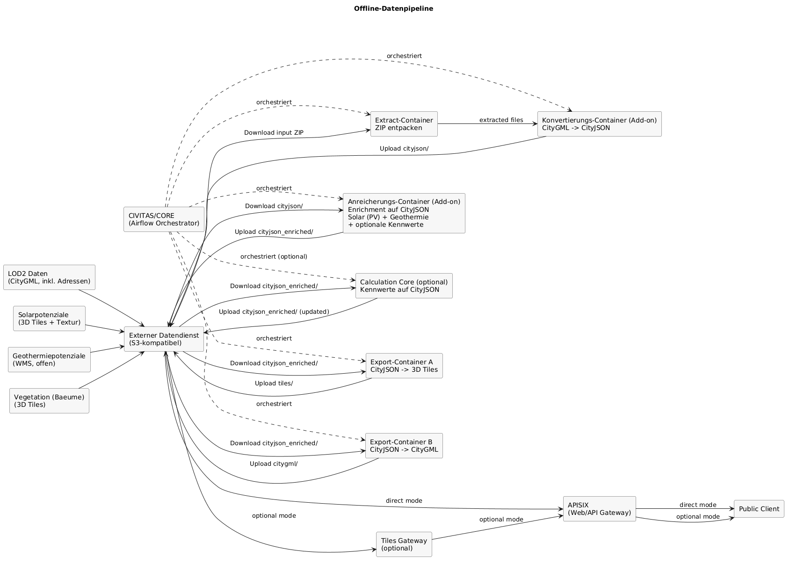

# Architektur – Offline-Datenpipeline

## Inhaltsverzeichnis

1. [Ziel dieser Sicht](#ziel-dieser-sicht)
2. [Datenquellen](#datenquellen)
3. [Aktualisierungsstrategie der Basisdaten](#aktualisierungsstrategie-der-basisdaten)
4. [Betriebs- und Orchestrierungsmodell](#betriebs-und-orchestrierungsmodell)
5. [Zugriffsmuster auf den Datendienst (intern/extern)](#zugriffsmuster-auf-den-datendienst-internextern)
6. [Verarbeitungsschritte](#verarbeitungsschritte)
7. [DAG-Ablauf (vereinfachte Sicht)](#dag-ablauf-vereinfachte-sicht)
8. [Spezifikation (Pipeline-Vertrag)](#spezifikation-pipeline-vertrag)
9. [Security by Design (Pipeline)](#security-by-design-pipeline)
10. [Manifest-Schema (manifest.json)](#manifest-schema-manifest-json)
11. [Container-Parameter & Validierung](#container-parameter-validierung)
12. [Airflow Task-Beispiel (DockerOperator)](#airflow-task-beispiel-dockeroperator)
13. [Anreicherungs-Container (Spezifikation)](#anreicherungs-container-spezifikation)
14. [Pipeline-Diagramm](#pipeline-diagramm)
15. [Warum keine Datenbankzugriffe zur Laufzeit](#warum-keine-datenbankzugriffe-zur-laufzeit)
16. [Ergebnis](#ergebnis)

<a id="ziel-dieser-sicht"></a>

## Ziel dieser Sicht

Dieses Kapitel beschreibt die **Offline-Datenpipeline**, mit der Geodaten und Potenziale
in einen angereicherten 3D Tiles Datensatz überführt werden. Ziel ist es, alle
statischen Informationen **vorab** zu berechnen und in den Tiles zu persistieren,
damit zur Laufzeit keine Datenbankzugriffe für Potenziale nötig sind.

---

<a id="datenquellen"></a>

## Datenquellen

- **Geothermiepotenziale** (Datensatzabfrage in Reihenfolge Grundwasser, Erdreich, Luft; Quelle noch offen)
- **Solarpotenziale** (3D Tiles mit Attributen + Textur)
- **LOD2-Daten** (CityGML, inkl. Adressen)
- **Vegetation (Bäume)** (separater Visualisierungs-Layer)
- **Externer Datendienst** (S3-kompatibler Object Storage) als Austausch- und Ablageort

Verpflichtende Metadaten je Datenquelle:

- `dct:title`: fachlicher Titel des Datensatzes
- `dct:description`: fachliche Beschreibung des Datensatzes
- `dct:publisher`: veröffentlichende bzw. verantwortliche Stelle
- `dct:license`: Lizenz- bzw. Nutzungsrechtshinweis; kann auf Dataset- und/oder Distribution-Ebene geführt werden
- `dct:accrualPeriodicity`: Aktualisierungsintervall bzw. Turnus der Quelle
- `dcat:distribution`: Klasse zur Beschreibung der Bereitstellung; die konkreten Attribute hängen von der Bereitstellungsform ab (z.B. API oder Datei)

Diese Metadaten sind für alle in DEZ verwendeten Quellen verbindlich zu führen (siehe TA-139 bis TA-141).
Die Auswahl ist auf DCAT-AP.de gemappt, bildet den Standard jedoch bewusst nicht vollständig ab.
Die Veröffentlichung gegenüber Nutzern erfolgt über die Datenschutzhinweise der DEZ-Webseite.
Die Bereitstellung und Pflege liegt beim jeweiligen Betreiber der DEZ-Plattform.

Hinweis: Solarthermie ist aktuell nicht Teil des vorgesehenen Rechenwegs im Berechnungskern und daher kein belastbar spezifizierter MVP-Baustein.

Beispiele für Datenherkünfte und Referenzen:

- Städtische Daten (Stadtpläne/Basiskarten, Orthofotos, Solarpotenzialdaten)
- Open Data (LOD2)
- Behördenspezifische Lizenzen (oberflächennahe Geothermie)
- Externe Quellen für Referenzwerte/Typologien (IWU/TABULA, BKI, co2online, DIN/VDI)

---

<a id="aktualisierungsstrategie-der-basisdaten"></a>

## Aktualisierungsstrategie der Basisdaten

- Der LOD2-Basisdatensatz wird im Regelfall in einem Zyklus von **2 Jahren** aktualisiert.
- Solarpotenzial- und Geothermie-Basisdaten können abweichende Aktualisierungszeiträume haben; ein gemeinsamer, fester Gesamtzyklus ist nicht erforderlich.
- Aktualisierungen müssen je Datendomäne vollständig optional und separat durchführbar sein (z.B. nur LOD2, nur Solar, nur Geothermie).
- Eine Aktualisierung einer Datendomäne darf keine obligatorische Neuberechnung anderer Datendomänen erzwingen.
- Für die Nachnutzung durch andere Kommunen muss die Pipeline entkoppelte Aktualisierungspfade je Datenquelle unterstützen.

---

<a id="betriebs-und-orchestrierungsmodell"></a>

## Betriebs- und Orchestrierungsmodell

- Die Offline-Datenpipeline (Wandlungspipeline) läuft als **separater Docker-Container**.
- Die **Orchestrierung erfolgt in CIVITAS/CORE über Airflow** als **kombinierter DAG**.
- Ein **externer Datendienst** (z.B. S3) dient als Quelle und Ziel für Rohdaten und erzeugte 3D Tiles.
- Die Verarbeitung erfolgt als Schrittkette mit optionalem Rechenkern:
  **Download → ZIP-Extraktion → CityGML→CityJSON → Enrichment auf CityJSON → (Calculation Core) → paralleler Export nach 3D Tiles und CityGML → Upload**.
- Nach dem Enrichment wird in zwei Artefaktpfade verzweigt: **CityJSON→3D Tiles** und **CityJSON→CityGML** (parallel).
- Der Schritt **CityGML → CityJSON** wird als eigenständiges, CIVITAS/CORE-fähiges Add-on betrieben.
- Teilschritte werden innerhalb desselben DAG-Runs orchestriert und **nicht** separat manuell gestartet.
- Add-ons unterstützen die konfigurationsbasierte Aktivierung/Deaktivierung einzelner Teilkomponenten, sofern fachlich sinnvoll entkoppelbar.
  > ⚠️ **Hinweis:** Der **externe Datendienst** entspricht dem in den Architekturdiagrammen referenzierten **3D Tiles Storage**.

---

<a id="zugriffsmuster-auf-den-datendienst-internextern"></a>

## Zugriffsmuster auf den Datendienst (intern/extern)

### Interner Zugriff (innerhalb UDP/CIVITAS/CORE)

- Die beteiligten Pipeline-Container (Extraktion, Konvertierung, Enrichment, Export) greifen direkt auf den S3-kompatiblen Datendienst zu (Download/Upload je `job_id`).
- Optional greift ein Tiles Gateway intern auf denselben Datendienst zu, wenn der externe Read-Pfad nicht direkt aus APISIX bedient wird.
- Die Authentifizierung erfolgt mit technischen Service-Credentials aus dem Secrets-Management (keine statischen Credentials im Code oder in Container-Images).
- Berechtigungen sind strikt auf Bucket/Prefix-Ebene zu begrenzen (Least Privilege), mindestens:
  - Lesen: `jobs/{job_id}/input/`
  - Schreiben: `jobs/{job_id}/cityjson/`, `jobs/{job_id}/cityjson_enriched/`, `jobs/{job_id}/tiles/`, `jobs/{job_id}/citygml/`, `jobs/{job_id}/logs/`, `jobs/{job_id}/manifest.json`

### Externer Zugriff (außerhalb UDP/CIVITAS/CORE)

- Direkter externer Zugriff auf den Datendienst ist nicht vorgesehen.
- Externe Zugriffe auf 3D Tiles erfolgen ausschließlich über APISIX (TA-102):
  - entweder APISIX -> Datendienst (direct mode)
  - oder APISIX -> Tiles Gateway -> Datendienst (optional mode)
- Externe Zugriffe sind auf veröffentlichte Read-Pfade zu begrenzen; Schreibzugriffe auf den Datendienst bleiben interne Betriebsfunktionen.

### Keycloak-Bezug für Authentifizierung

- Keycloak (OIDC) ist der Standard für Benutzer- und Client-Authentifizierung auf API-/Admin-Ebene (z.B. APISIX, Backend).
- Für direkte S3-Protokollzugriffe der Pipeline-Container werden technische Datendienst-Credentials verwendet; OIDC-Tokens werden dort nicht direkt als S3-Schreibberechtigung genutzt.
- Falls der Datendienst OIDC-Föderation/STS unterstützt, kann Keycloak optional zur Ausgabe kurzlebiger Datendienst-Credentials eingebunden werden.

---

<a id="verarbeitungsschritte"></a>

## Verarbeitungsschritte

1. **Download + ZIP-Extraktion**  
   Rohdaten werden aus S3 geladen und in ein Job-Staging-Verzeichnis entpackt.

2. **CityGML → CityJSON**  
   Umwandlung der CityGML-Quellen mit `citygml-tools`  
   <https://github.com/citygml4j/citygml-tools>

3. **Anreicherung der Metadaten auf CityJSON (separater Schritt)**  
   Solarpotenziale liegen als 3D Tiles mit Attributen und Textur vor und werden
   in einem separaten Verarbeitungsschritt mit den CityJSON-Gebäuden zusammengeführt.
   Geothermiepotenziale werden (sobald verfügbar) über eine priorisierte Datensatzabfrage ergänzt:
   Grundwasser → Erdreich → Luft.
   Optional werden abgeleitete Kennwerte (z.B. Hüllfläche, Dachfläche, Volumen) ergänzt.
   Dadurch werden Laufzeit-DB-Zugriffe minimiert.

4. **Optionaler Calculation-Core-Schritt**  
   Der Rechenkern kann auf dem angereicherten CityJSON ausgeführt werden, um weitere Kennwerte zu ergänzen.

5. **Parallele Artefakterzeugung ab angereichertem CityJSON**  
   - **CityJSON → 3D Tiles** mit `cityjson-to-3d-tiles`  
     <https://github.com/csi-FOXBYTE/cityjson-to-3d-tiles>
   - **CityJSON → CityGML** für den parallelen Exportpfad.

6. **Bereitstellung**  
   Die erzeugten Artefakte (3D Tiles und CityGML) werden im Datendienst bereitgestellt.
   3D Tiles werden über APISIX ausgeliefert:
   - entweder direkt aus dem externen Datendienst
   - oder über ein optionales Tiles Gateway.

---

<a id="dag-ablauf-vereinfachte-sicht"></a>

## DAG-Ablauf (vereinfachte Sicht)

1. **Download** der Rohdaten aus dem externen Datendienst (z.B. S3) in ein Staging-Verzeichnis.
2. **ZIP-Extraktion** der Eingabedaten.
3. **Konvertierung** CityGML → CityJSON.
4. **Anreicherung** des CityJSON (Solar/Geothermie + optionale Kennwerte).
5. **Optionaler Calculation-Core-Schritt** auf dem angereicherten CityJSON.
6. **Paralleler Export** in zwei Branches:
   - CityJSON → 3D Tiles
   - CityJSON → CityGML
7. **Upload** der erzeugten Artefakte in den externen Datendienst.

---

<a id="spezifikation-pipeline-vertrag"></a>

## Spezifikation (Pipeline-Vertrag)

### Trigger & Orchestrierung

- Start erfolgt **manuell über die Airflow-Oberfläche**.
- Die `job_id` wird von Airflow vorgegeben und **als deterministischer Ordnername** genutzt.
- Pro `job_id` wird exakt **ein Pipeline-Lauf** erzeugt; Wiederholung erfolgt über neue `job_id`.
- Der manuelle Trigger startet immer den **gesamten kombinierten DAG**; einzelne Tasks/Container sind kein eigenständiger Trigger-Endpunkt.

### Airflow DAG (konkret)

- DAG-ID: `dez_offline_pipeline`.
- Jeder Lauf definiert einen `update_scope` (z.B. `lod2`, `solar`, `geothermie`, `full`), damit Basisdaten unabhängig voneinander aktualisiert werden können.
- Teil-Updates sind zulässig; nur die vom `update_scope` betroffenen Pipeline-Schritte werden ausgeführt.
- Auch bei Teil-Updates bleibt die Ausführung ein einzelner DAG-Run; nur nicht benötigte Schritte werden innerhalb des DAG übersprungen.

### Kommunenprofil und Mapping-Profil

- **SoT-Hinweis (Basisdaten):** Als Single Point of Truth gilt die Kombination aus Quell-Datensatzversion, `mapping_profile_version` und veröffentlichtem Release-Manifest.
- Jeder Pipeline-Lauf verwendet zusätzlich ein `municipality_profile` (z.B. `regensburg`) und ein `mapping_profile_version`.
- Das `municipality_profile` ist deployment-spezifisch festgelegt; es dient nicht zur parallelen Mehrkommunen-Nutzung innerhalb derselben Instanz.
- Das `municipality_profile` kapselt kommunenspezifische Einstellungen (Datenquellen, Klassifikationen, optionale Branding-/Textreferenzen für Exporte).
- Das `mapping_profile_version` definiert die Transformation in das kanonische Zielschema (Feldmapping, Einheiten, Fallbacks, Herkunftskennzeichnung).
- Regensburg-spezifische Annahmen dürfen nicht implizit in der Kernpipeline verankert sein, sondern müssen über das jeweilige Profil eingebracht werden.
- Mapping-Profile sind versioniert und unabhängig von der Pipeline-Kernlogik austauschbar.

Task-Reihenfolge je `job_id`:

1. `init_job` – erstellt `manifest.json`, Status `running`.
2. `download_inputs` – lädt `jobs/{job_id}/input/` in ein Staging-Verzeichnis.
3. `extract_inputs` – entpackt ZIP-Dateien in das Job-Staging-Verzeichnis.
4. `convert_citygml_to_cityjson` – Konvertierung CityGML → CityJSON.
5. `enrich_cityjson` – Anreicherungs-Container (Solar/Geothermie + optionale Kennwerte).
6. `run_calculation_core` *(optional)* – ergänzt weitere Kennwerte auf CityJSON.
7. `convert_cityjson_to_tiles` – Exportpfad 1: CityJSON → 3D Tiles.
8. `convert_cityjson_to_citygml` – Exportpfad 2: CityJSON → CityGML.
9. `upload_outputs` – lädt `jobs/{job_id}/tiles/` und `jobs/{job_id}/citygml/` in den Datendienst.
10. `finalize_job` – aktualisiert `manifest.json` (Status, Zeiten, Exit-Code).

### Storage-Layout (S3-kompatibel)

- `jobs/{job_id}/input/`  
  Eingabedaten (CityGML-Dateien, Solarpotenzial-3D Tiles, Vegetationsdaten; Struktur beliebig).
- `jobs/{job_id}/cityjson/`  
  Ausgabe der Konvertierung (CityJSON vor Anreicherung).
- `jobs/{job_id}/cityjson_enriched/`  
  Ausgabe nach Anreicherung und optionalem Calculation-Core-Schritt.
- `jobs/{job_id}/tiles/`  
  Ausgabe des Exportpfads CityJSON → 3D Tiles.
- `jobs/{job_id}/citygml/`  
  Ausgabe des Exportpfads CityJSON → CityGML.
- `jobs/{job_id}/logs/`  
  Laufzeit-Logs (inkl. Fortschritt).
- `jobs/{job_id}/manifest.json`  
  Metadaten zum Lauf (Status, Zeitstempel, Eingabeparameter).
- `releases/{municipality_profile}/active.json`  
  Veröffentlichtes Release-Manifest mit Referenzen auf die aktive Quell-Datensatzversion, `mapping_profile_version` und die auszuliefernden Artefaktpfade.

> ⚠️ **Hinweis:** Es gibt **keine Versionierung** im Datendienst; alte Daten müssen manuell entfernt werden.
> Persistenz wird in der Datenbank umgesetzt; der Datendienst dient als Artefaktablage.
> Backup/Restore von Datenbank und Datendienst erfolgt durch den Betreiber der DEZ-Plattform.
> Sicherheitsprinzip: Zugriff auf den Datendienst erfolgt ausschließlich über Secrets-Management; keine Tokens im Code oder in Logs.

### Eingaben

- Ein Ordner mit **CityGML-Dateien** (LOD2, inkl. Adressen; Dateistruktur innerhalb des Ordners ist beliebig).
- Solarpotenzial-**3D Tiles** (Attribute + Textur) als zusätzliche Eingabe.
- Vegetationsdaten (Bäume) als eigener Layer (3D Tiles oder vergleichbares Format).
- Optional ZIP-Container als Eingabeformat (muss in `extract_inputs` entpackbar sein).
- **EPSG-Code** muss explizit übergeben werden (Coordinate Reference System kann nicht zuverlässig ausgelesen werden).
- `appearance` (String) wählt **genau eine** Texture/Theme aus der CityGML-Quelle.
- `hasAlphaChannel` (Boolean) gibt an, ob die Texture-Daten einen **Alpha-Kanal** enthalten.
  > ⚠️ **Hinweis:** Für die Verarbeitung wird ein **Job-Ordner gemountet**; der Container arbeitet ausschließlich in diesem Ordner bis Abschluss.

Hinweis zu Teil-Updates:

- Für `update_scope = full` gelten alle oben aufgeführten Eingaben.
- Für Teil-Updates (`lod2`, `solar`, `geothermie`) sind nur die jeweils scope-relevanten Eingaben verpflichtend.
- Ein Teil-Update darf nicht an fehlenden Eingaben nicht betroffener Datendomänen scheitern.
- Der Lauf muss ohne CityGML Energy ADE über definierte Fallback-Pfade (LOD2 + externe Potenzialdaten + Konfigurationswerte) vollständig ausführbar bleiben.

### Ausgaben

- **3D Tiles** und **CityGML** werden als getrennte Ausgaben erzeugt und in den dedizierten Bucket hochgeladen.
- Zwischenstände (`cityjson/`, `cityjson_enriched/`) liegen getrennt von den finalen Exportpfaden.
  > ⚠️ **Hinweis:** Der Ziel-Bucket ist der dedizierte **3D Tiles Storage** im externen Datendienst.

### Exit-Codes

- `0` Erfolgreich abgeschlossen
- `10` Eingabefehler (z.B. keine CityGML-Dateien, fehlender EPSG-Code)
- `20` Fehler in der Konvertierung (CityGML → CityJSON)
- `30` Fehler in der Anreicherung
- `40` Fehler in der Artefakterzeugung (CityJSON → 3D Tiles / CityGML)
- `50` Infrastrukturfehler (S3/Netzwerk/Filesystem)

### Fortschritt & Logging

- Logs werden **ausschließlich** über `stdout`/`stderr` ausgegeben und zusätzlich unter `jobs/{job_id}/logs/` persistiert.
- Logs dürfen **keine Zugangsdaten** oder Secrets enthalten.
- Fortschritt wird als JSON-Lines geloggt, z.B.:

```json
{
  "event": "progress",
  "stage": "convert_cityjson",
  "percent": 35,
  "message": "Converted 120/340 files"
}
```

- Stufen (mindestens): `download`, `extract`, `convert_cityjson`, `enrich_cityjson`, `calculation_core`, `export_tiles`, `export_citygml`, `upload`.

### Fehlerbehandlung & Wiederanlauf

- Ein Retry ist zulässig (Airflow).
- Bei Teilfehlern wird der gesamte Lauf **neu gestartet**.
- Als gültig gelten ausschließlich vollständig erfolgreich abgeschlossene Läufe.

---

<a id="security-by-design-pipeline"></a>

## Security by Design (Pipeline)

- Zugriff auf den Datendienst ausschließlich via Secrets-Management.
- Keine Credentials in Code, Konfiguration oder Logs.
- Logs enthalten nur technische Fehler- und Fortschrittsinformationen.
- Job-Ordner ist der einzige Schreibbereich der Container.
- Empfehlung: Verschlüsselung **at rest** im Datendienst (z.B. serverseitige Verschlüsselung des Buckets) zur Erhöhung der Sicherheit.

---

<a id="manifest-schema-manifest-json"></a>

## Manifest-Schema (manifest.json)

Pflichtfelder: `job_id`, `status`, `stage`, `epsg`, `appearance`, `hasAlphaChannel`, `created_at`, `output_prefix`.
Statuswerte: `pending`, `running`, `failed`, `succeeded`.
Stage-Werte: `download`, `extract`, `convert_cityjson`, `enrich_cityjson`, `calculation_core`, `export_tiles`, `export_citygml`, `upload`.

```json
{
  "job_id": "dez-2026-02-04-001",
  "status": "running",
  "stage": "enrich_cityjson",
  "epsg": "EPSG:25832",
  "appearance": "main-texture",
  "hasAlphaChannel": true,
  "input_file_count": 340,
  "created_at": "2026-02-04T12:00:00Z",
  "started_at": "2026-02-04T12:05:00Z",
  "completed_at": null,
  "output_prefix": "jobs/dez-2026-02-04-001/",
  "exit_code": null,
  "error": null
}
```

> ⚠️ **Hinweis:** `error` ist nur bei `status = failed` gefüllt und enthält einen technischen Fehlertext.

---

<a id="container-parameter-validierung"></a>

## Container-Parameter & Validierung

### Parameter-Mapping (Environment)

- `JOB_ID` (String) – von Airflow vorgegeben.
- `JOB_DIR` (Pfad) – gemounteter Job-Ordner (z.B. `/job`).
- `EPSG` (String) – z.B. `EPSG:25832`.
- `APPEARANCE` (String) – gewünschtes Theme/Texture-Set in CityGML.
- `HAS_ALPHA_CHANNEL` (Boolean, `true|false`).
  > ⚠️ **Hinweis:** Airflow-Parameter `hasAlphaChannel` wird auf `HAS_ALPHA_CHANNEL` gemappt.
  > Sicherheitsprinzip: Secrets (z.B. S3-Credentials) werden ausschließlich über Secrets-Management bereitgestellt.

### Validierungsregeln

- `JOB_DIR` muss existieren und beschreibbar sein.
- `EPSG` darf nicht leer sein und muss dem Format `EPSG:<code>` entsprechen.
- `APPEARANCE` darf nicht leer sein und muss in den CityGML-Quellen vorhanden sein.
- `HAS_ALPHA_CHANNEL` muss explizit `true` oder `false` sein.

---

<a id="airflow-task-beispiel-dockeroperator"></a>

## Airflow Task-Beispiel (DockerOperator)

```python
DockerOperator(
    task_id="convert_citygml_to_cityjson",
    image="dez/citygml-cityjson-converter:latest",
    api_version="auto",
    auto_remove=True,
    environment={
        "JOB_ID": "{{ dag_run.conf['job_id'] }}",
        "JOB_DIR": "/job",
        "EPSG": "{{ dag_run.conf['epsg'] }}",
        "APPEARANCE": "{{ dag_run.conf['appearance'] }}",
        "HAS_ALPHA_CHANNEL": "{{ dag_run.conf['hasAlphaChannel'] }}"
    },
    mounts=[
        Mount(
            source="/mnt/jobs/{{ dag_run.conf['job_id'] }}",
            target="/job",
            type="bind"
        )
    ]
)
```

> ⚠️ **Hinweis:** `job_id`, `epsg`, `appearance` und `hasAlphaChannel` werden als DAG-Run-Parameter übergeben.

---

<a id="anreicherungs-container-spezifikation"></a>

## Anreicherungs-Container (Spezifikation)

### Zweck

- Ergänzung von CityJSON um Solarpotenziale (PV) und Geothermiepotenziale.
- Optionale Berechnung abgeleiteter Kennwerte (z.B. Hüllfläche, Dachfläche, Volumen).

### Erwartete Eingaben

- Pfad zu konvertiertem CityJSON (`jobs/{job_id}/cityjson/`).
- Geothermiepotenziale über Datensatzabfrage (Priorität: Grundwasser, Erdreich, Luft; EPSG wird für die Abfrage verwendet, Quelle noch offen).
- Solarpotenzial-3D Tiles (Attribute + Textur) als Eingabe für das Attribut-Mapping.
- Konfigurationsparameter für Mapping und Einheiten (siehe Schema).

### Erwartete Ausgaben

- Angereichertes CityJSON (`jobs/{job_id}/cityjson_enriched/`).
- Laufprotokolle und Fortschrittslogs (`jobs/{job_id}/logs/`).

### Mapping-Regeln

- **Gebäudezuordnung** erfolgt über `gml:id` der CityGML-Gebäudeobjekte.
- **Solarpotenziale** werden aus den gelieferten Attributen in 3D Tiles übernommen; eine Aufsummierung je Gebäude ist optional.
- **Geothermiepotenziale** werden über die Gebäudegrundfläche aus dem Datensatz gemittelt; die Abfrage folgt der Reihenfolge Grundwasser → Erdreich → Luft. Falls keine Abdeckung vorliegt, wird der Wert als `null` gesetzt.
- **Adresse** wird aus den CityGML-Adressobjekten übernommen; wenn nur ein Freitext vorhanden ist, wird dieser als `address_full` gesetzt. Die Ausgabe der Adresse aus LOD2 ist zwingend sicherzustellen (Fehler im bisherigen Wandler beheben).
- **Nebengebäude** werden nicht mit Hauptgebäuden zusammengeführt; jedes CityGML-Gebäude wird separat verarbeitet.

### Metadaten-Schema (Tiles-Attribute)

- `address_full` (String)
- `street` (String, optional)
- `house_number` (String, optional)
- `postal_code` (String, optional)
- `city` (String, optional)
- `roof_area_m2` (Number)
- `solar_potential_kwh_a` (Number)
- `solar_yield_kwh_m2a` (Number)
- `geothermal_potential_w_m2` (Number)

Zusätzliche Rohattribute aus den Solarpotenzial-3D Tiles (unverändert übernommen):

- `solarArea` (Number)
- `Fläche` (String)
- `Dachneigung` (String)
- `Dachorientierung` (String)
- `SVF_min` (Number)
- `SVF_avg` (Number)
- `SVF_med` (Number)
- `SVF_max` (Number)
- `Z_MIN` (String)
- `Z_MAX` (String)
- `Z_MIN_ASL` (String)
- `Z_MAX_ASL` (String)
- `creationDate` (String, ISO-Datum)
- `globalRadMonths_1..12` (Number)
- `directRadMonths_1..12` (Number)
- `diffuseRadMonths_1..12` (Number)

> ⚠️ **Hinweis:** Einheiten und Skalierungen stammen aus der Datenlieferung; es erfolgt keine automatische Normalisierung.

> ⚠️ **Hinweis MVP:** Da derzeit noch kein belastbarer Geothermie-Datensatz vorliegt, bleiben Bewertungslogik und konkrete Ausgabefelder für die MVP-Phase in diesem Punkt offen.

### Validierungsregeln

- `address_full` muss gesetzt sein.
- Potenzialwerte müssen numerisch sein; fehlende Werte werden als `null` gespeichert.
- Einheiten sind fix: `m2`, `kWh/a`, `kWh/m2a`, `W/m2`.

---

---

<a id="pipeline-diagramm"></a>

## Pipeline-Diagramm

Das Diagramm zeigt die Verarbeitungsschritte; Orchestrierung und Datenaustausch über Airflow sind im Abschnitt oben beschrieben.

> ⚠️ **Hinweis:** Die Solarpotenziale sind aktuell bereits als 3D Tiles verfügbar und werden in der Anreicherung übernommen.



Quelle: `raw/offline-data-pipeline.puml`

---

<a id="warum-keine-datenbankzugriffe-zur-laufzeit"></a>

## Warum keine Datenbankzugriffe zur Laufzeit

- **Performance**: Potenziale sind direkt in den Tiles; keine zusätzlichen Roundtrips pro Gebäude.
- **Skalierung**: Statische Assets lassen sich effizient über CDN/Cache ausliefern.
- **Stabilität**: Das Laufzeitsystem ist weniger abhängig von Datenbanklast und -verfügbarkeit.
- **Kosten**: Geringere DB-Last reduziert Betriebs- und Infrastrukturkosten.

---

<a id="ergebnis"></a>

## Ergebnis

- Statische Potenziale sind direkt in den 3D Tiles eingebettet.
- Laufzeitlogik bleibt schlank; Datenbankzugriffe beschränken sich auf dynamische Inhalte.
