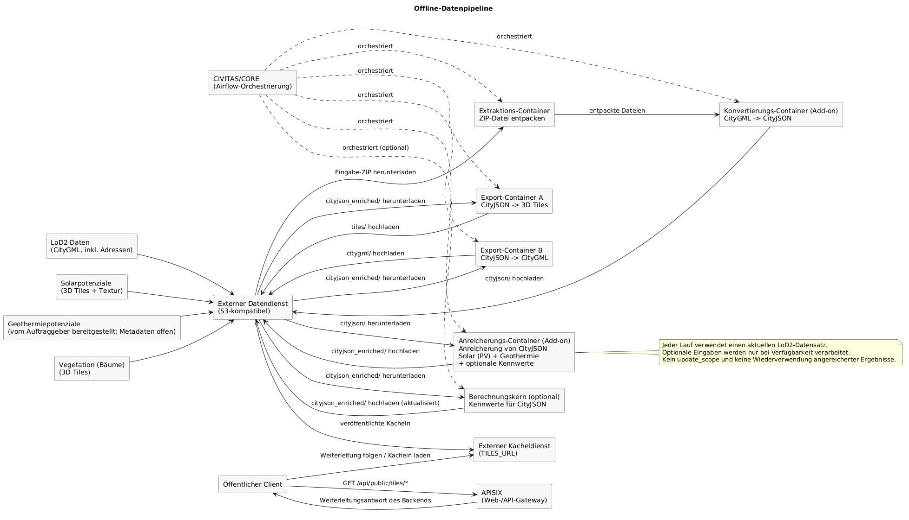

# Architektur – Offline-Datenpipeline

## Inhaltsverzeichnis

1. [Ziel dieser Sicht](#ziel-dieser-sicht)
2. [Datenquellen](#datenquellen)
3. [Aktualisierungsstrategie der Basisdaten](#aktualisierungsstrategie-der-basisdaten)
4. [Betriebs- und Orchestrierungsmodell](#betriebs-und-orchestrierungsmodell)
5. [Zugriffsmuster auf den Datendienst (intern/extern)](#zugriffsmuster-auf-den-datendienst-internextern)
6. [Verarbeitungsschritte](#verarbeitungsschritte)
7. [DAG-Ablauf (vereinfachte Sicht)](#dag-ablauf-vereinfachte-sicht)
8. [Spezifikation (Pipeline-Vertrag)](#spezifikation-pipeline-vertrag)
9. [Security by Design (Pipeline)](#security-by-design-pipeline)
10. [Manifest-Schema (manifest.json)](#manifest-schema-manifest-json)
11. [Container-Parameter & Validierung](#container-parameter-validierung)
12. [Airflow Task-Beispiel (DockerOperator)](#airflow-task-beispiel-dockeroperator)
13. [Anreicherungs-Container (Spezifikation)](#anreicherungs-container-spezifikation)
14. [Pipeline-Diagramm](#pipeline-diagramm)
15. [Warum keine Datenbankzugriffe zur Laufzeit](#warum-keine-datenbankzugriffe-zur-laufzeit)
16. [Ergebnis](#ergebnis)

<a id="ziel-dieser-sicht"></a>

## Ziel dieser Sicht

Dieses Kapitel beschreibt die **Offline-Datenpipeline**, mit der Geodaten und Potenziale
in einen angereicherten 3D Tiles Datensatz überführt werden. Ziel ist es, alle
statischen Informationen **vorab** zu berechnen und in den Tiles zu persistieren,
damit zur Laufzeit keine Datenbankzugriffe für Potenziale nötig sind.

---

<a id="datenquellen"></a>

## Datenquellen

- **LoD2-Gebäudedaten** (amtliche CityGML-Quelldaten für Gemeinde `09362000`; intern nach CityJSON 2.0.1 konvertiert; Pflichtquelle)
- **DGM1-Geländemodell** (amtliche GeoTIFF-Kacheln für die dokumentierte Regensburger Polygonauswahl; Terrain-Bereitstellung noch zu konfigurieren)
- **TopPlusOpen-Light-Terrain-Textur** (externer Tile-Dienst über `https://intergeo38.bayernwolke.de/betty/g_topopluslight/{z}/{x}/{y}`; fachlich und lizenzrechtlich vom DGM1 getrennte Darstellungsquelle; BKG-Quellenvermerk gemäß `dl-de/by-2-0` verwenden; Proxy-Betreiber und Jahr des letzten Datenbezugs noch zu bestätigen)
- **Baualtersklassen** (GeoPackage, optional; Integration im Anreicherungswerkzeug implementiert)
- **Geothermiepotenziale** (vom Auftraggeber bereitgestellte Lieferung; nach verzögerter Datenfreigabe in Sprint 17 technisch integriert; Auswertung ausschließlich anhand der tatsächlich gelieferten Merkmale; Herkunfts-, Lizenz-, Turnus- und Schemametadaten noch offen)
- **Solarpotenziale** (separat bereitgestellte Lieferung; Umfang und Detailgrad noch in Klärung, aktuell nicht integriert; eine Umsetzung in Sprint 18 oder 19 ist fraglich; 3D Tiles mit Attributen und Textur sind als Zielbild vorgesehen)
- **Kostendaten** (noch nicht vorliegend)
- **Postleitzahl-Referenz** (noch nicht vorliegend; Adressobjekte aus LoD2/CityJSON sind davon zu unterscheiden)
- **Vegetation (Bäume)** (separater Visualisierungs-Layer)
- **Externer Datendienst** (S3-kompatibler Object Storage) als Austausch- und Ablageort

Verpflichtende Metadaten je Datenquelle:

- `dct:title`: fachlicher Titel des Datensatzes
- `dct:description`: fachliche Beschreibung des Datensatzes
- `dct:publisher`: veröffentlichende bzw. verantwortliche Stelle
- `dct:license`: Lizenz- bzw. Nutzungsrechtshinweis; kann auf Dataset- und/oder Distribution-Ebene geführt werden
- `dct:accrualPeriodicity`: Aktualisierungsintervall bzw. Turnus der Quelle
- `dcat:distribution`: Klasse zur Beschreibung der Bereitstellung; die konkreten Attribute hängen von der Bereitstellungsform ab (z.B. API oder Datei)

Diese Metadaten sind für alle in DEZ verwendeten Quellen verbindlich zu führen (siehe TA-139 bis TA-141).
Die Auswahl ist auf DCAT-AP.de gemappt, bildet den Standard jedoch bewusst nicht vollständig ab.
Die Veröffentlichung gegenüber Nutzern erfolgt über die Datenschutzhinweise der DEZ-Webseite.
Die Bereitstellung und Pflege liegt beim jeweiligen Betreiber der DEZ-Plattform.
Die kanonische Übersicht, die offenen Metadatenfelder und die Verknüpfung mit dem
Piveau-Katalog in CIVITAS/CORE sind im
[Datenquellenkatalog und der Piveau-Anbindung](16-data-sources-dcat-piveau.md)
festgelegt.

Hinweis: Solarthermie ist aktuell nicht Teil des vorgesehenen Rechenwegs im Berechnungskern und daher kein belastbar spezifizierter MVP-Baustein.

Beispiele für Datenherkünfte und Referenzen:

- Städtische Daten (Stadtpläne/Basiskarten, Orthofotos, freigegebene Solarpotenzialdaten; Detailumfang noch in Abstimmung)
- Open Data (LOD2)
- Behördenspezifische Lizenzen (oberflächennahe Geothermie)
- Externe Quellen für Referenzwerte/Typologien (IWU/TABULA, BKI, co2online, DIN/VDI)

---

<a id="aktualisierungsstrategie-der-basisdaten"></a>

## Aktualisierungsstrategie der Basisdaten

- Die amtliche LoD2-Quelldistribution wird **wöchentlich** aktualisiert. Der davon unabhängige Übernahmezyklus in den DEZ-Datendienst wird durch den Betreiber festgelegt und pro Release protokolliert.
- Solarpotenzial- und Geothermie-Basisdaten können abweichende Aktualisierungszeiträume haben. Ihre Verarbeitung erfolgt dennoch nur innerhalb eines kombinierten Laufs mit einem aktualisierten LoD2-GML-Datensatz.
- Jeder Lauf verarbeitet den aktualisierten LoD2-GML-Datensatz vollständig; ein separater `update_scope` wird nicht verwendet.
- Zusätzliche Quellen wie Solar, Geothermie oder Baualtersklassen werden konditional verarbeitet, wenn sie im betreffenden Lauf bereitgestellt sind. Adressdaten stammen aus LoD2 und sind immer enthalten.
- Bereits angereicherte Ergebnisdatensätze werden nicht erneut eingereicht. Attribute unveränderter Zusatzdaten werden daher nicht aus einem früheren Ergebnisdatensatz übernommen.
- Für die Nachnutzung durch andere Kommunen muss die Pipeline klar beschreiben, welche Zusatzquellen aktiviert werden können und welche Eingaben je kombiniertem Lauf erforderlich sind.

---

<a id="betriebs-und-orchestrierungsmodell"></a>

## Betriebs- und Orchestrierungsmodell

> **Umsetzungsstand:** Die Geothermie-Anreicherung wurde nach der erst spät möglichen Datenfreigabe in Sprint 17 implementiert; die zugehörigen Metadaten bleiben offen. Umfang und Detailgrad der Solarverarbeitung sind noch zu klären, sodass eine Umsetzung in Sprint 18 oder 19 derzeit nicht belastbar geplant ist. Der NGSI-LD-Pfad ist technisch vorbereitet, die konkrete Schnittstelle zur Kundeninstanz jedoch noch nicht geklärt. Aussagen zu Solar und produktiver Stellio-Übergabe in diesem Kapitel beschreiben daher das Zielbild. Laufbezogene Artefakte und Nachweise werden nicht in einem dedizierten S3-Job-Ordner veröffentlicht; der Job-Arbeitsbereich liegt lokal unter `${CITYJSON_WORK_DIR}/jobs/{job_id}`.

- Die Offline-Datenpipeline (Wandlungspipeline) läuft als **separater Docker-Container**.
- Die **Orchestrierung erfolgt in CIVITAS/CORE über Airflow** als **kombinierter DAG**.
- Ein **externer Datendienst** (z.B. S3) dient als Quelle für Rohdaten und als Ziel für die vorgesehenen Ausgaben, insbesondere 3D Tiles und CityGML.
- **Stellio** ist innerhalb von CIVITAS/CORE als Ziel für eine künftig abgestimmte NGSI-LD-Übergabe vorgesehen.
- Die Verarbeitung erfolgt als Schrittkette mit optionalem Rechenkern:
  **Download → ZIP-Extraktion → CityGML→CityJSON → Enrichment auf CityJSON → (Calculation Core) → paralleler Export nach 3D Tiles, CityGML und NGSI-LD → Übertragung der vorgesehenen Zielausgaben**.
- Nach dem Enrichment wird in drei Pfade verzweigt: **CityJSON→3D Tiles**, **CityJSON→CityGML** und **CityJSON→NGSI-LD→Stellio** (parallel).
- Der Schritt **CityGML → CityJSON** wird als eigenständiges, CIVITAS/CORE-fähiges Add-on betrieben.
- Teilschritte werden innerhalb desselben DAG-Runs orchestriert und **nicht** separat manuell gestartet.
- Add-ons unterstützen die konfigurationsbasierte Aktivierung/Deaktivierung einzelner Teilkomponenten, sofern fachlich sinnvoll entkoppelbar.
  > ⚠️ **Hinweis:** Der **externe Datendienst** entspricht dem in den Architekturdiagrammen referenzierten **3D Tiles Storage**.

---

<a id="zugriffsmuster-auf-den-datendienst-internextern"></a>

## Zugriffsmuster auf den Datendienst (intern/extern)

### Interner Zugriff (innerhalb UDP/CIVITAS/CORE)

- Airflow lädt die konfigurierten Eingaben aus dem S3-kompatiblen Datendienst in den lokalen Job-Arbeitsbereich `${CITYJSON_WORK_DIR}/jobs/{job_id}`.
- Die beteiligten Pipeline-Container arbeiten über einen gemeinsamen Mount ausschließlich in diesem lokalen Job-Arbeitsbereich.
- Nach erfolgreicher Verarbeitung werden nur die vorgesehenen Zielausgaben in die jeweils konfigurierten Output-Buckets übertragen. Die Objektpfade der Zielausgaben sind nicht an ein Präfix `jobs/{job_id}` gebunden.
- Manifest, Zwischenstände, Laufzeit-Logs und Nachweise einer späteren NGSI-LD-Übergabe werden nicht zusätzlich in einem S3-Job-Ordner abgelegt oder veröffentlicht.
- Die künftig abzustimmende NGSI-LD-Übergabe erfolgt direkt über die interne Stellio-API; dafür ist keine parallele Veröffentlichung eines Übergabenachweises im Datendienst vorgesehen.
- Die Authentifizierung gegenüber Datendienst und Stellio erfolgt mit technischen Service-Credentials aus dem Secrets-Management (keine statischen Credentials im Code oder in Container-Images).
- Berechtigungen sind nach dem Least-Privilege-Prinzip auf die konfigurierten Eingabe- und Ziel-Buckets beziehungsweise erforderlichen Objektpräfixe zu begrenzen.

### Externer Zugriff (außerhalb UDP/CIVITAS/CORE)

- Direkter externer Zugriff auf den Datendienst ist nicht vorgesehen.
- Der Public Client ruft 3D Tiles über `GET /api/public/tiles/*` auf. APISIX leitet die Anfrage an das Backend; das Backend antwortet mit einem Redirect auf die über `TILES_URL` konfigurierte externe Tiles-URL.
- Externe Zugriffe sind auf die für die Auslieferung vorgesehenen Read-Pfade zu begrenzen; Schreibzugriffe auf den Datendienst bleiben interne Betriebsfunktionen.

### Keycloak-Bezug für Authentifizierung

- Keycloak (OIDC) ist der Standard für Benutzer- und Client-Authentifizierung auf API-/Admin-Ebene. APISIX prüft JWT/OIDC vorgelagert und schützt die Routen; für administrative Backend-Endpunkte wird das weitergeleitete Access Token zusätzlich und unabhängig im Backend per RS256/JWKS validiert. Claims, Rollen und Berechtigungen werden dort erneut ausgewertet.
- Für die S3-Zugriffe der Airflow-Tasks werden technische Datendienst-Credentials verwendet; OIDC-Tokens werden dort nicht direkt als S3-Schreibberechtigung genutzt.
- Falls der Datendienst OIDC-Föderation/STS unterstützt, kann Keycloak optional zur Ausgabe kurzlebiger Datendienst-Credentials eingebunden werden.

---

<a id="verarbeitungsschritte"></a>

## Verarbeitungsschritte

1. **Download + ZIP-Extraktion**  
   Rohdaten werden aus S3 geladen und in ein Job-Staging-Verzeichnis entpackt.

2. **CityGML → CityJSON**  
   Umwandlung der CityGML-Quellen mit `citygml-tools`  
   <https://github.com/citygml4j/citygml-tools>

3. **Anreicherung der Metadaten auf CityJSON (separater Schritt)**  
   Der aktuelle Anreicherungsstand berechnet Gebäudegeometrie und Nachbarschaften,
   übernimmt Adressen aus CityJSON und kann Baualtersklassen aus einem GeoPackage
   räumlich als `constructionYear` zuordnen.
   Solarpotenziale werden erst nach Daten- und Metadatenfreigabe als 3D Tiles mit
   Attributen und Textur in einem separaten Verarbeitungsschritt mit den
   CityJSON-Gebäuden zusammengeführt. Die vom Auftraggeber bereitgestellten
   Geothermiepotenziale werden ausschließlich anhand der im gelieferten Datensatz
   vorhandenen Merkmale ergänzt. Kollektor und Sonde sind dort nicht geführt und
   werden nicht ersatzweise hergeleitet.
   Die erforderlichen Herkunfts-, Lizenz-, Turnus- und Schemametadaten sind noch zu klären.
   Ein zusätzlicher Fallback nach dem Vorbild der LfU-/TUM-Studie ist gemäß Projektentscheidung nicht vorgesehen.
   Optional werden abgeleitete Kennwerte (z.B. Hüllfläche, Dachfläche, Volumen) ergänzt.
   Dadurch werden Laufzeit-DB-Zugriffe minimiert.

4. **Optionaler Calculation-Core-Schritt**  
   Der Rechenkern kann auf dem angereicherten CityJSON ausgeführt werden, um weitere Kennwerte zu ergänzen.

5. **Parallele Artefakterzeugung ab angereichertem CityJSON**  
   - **CityJSON → 3D Tiles** mit `cityjson-to-3d-tiles`  
     <https://github.com/csi-FOXBYTE/cityjson-to-3d-tiles>
   - **CityJSON → CityGML** für den parallelen Exportpfad.
   - **CityJSON → NGSI-LD** für die Übergabe an Stellio.

6. **Bereitstellung**  
   Die erzeugten Artefakte (3D Tiles und CityGML) werden im Datendienst bereitgestellt; NGSI-LD-Entities werden an Stellio übergeben.
   Der Public Client fordert 3D Tiles über APISIX und die Backend-Route
   `/api/public/tiles/*` an. Das Backend leitet per Redirect auf die über
   `TILES_URL` konfigurierte externe Tiles-URL weiter.

---

<a id="dag-ablauf-vereinfachte-sicht"></a>

## DAG-Ablauf (vereinfachte Sicht)

1. **Download** der Rohdaten aus dem externen Datendienst (z.B. S3) in ein Staging-Verzeichnis.
2. **ZIP-Extraktion** der Eingabedaten.
3. **Konvertierung** CityGML → CityJSON.
4. **Anreicherung** des CityJSON (Solar/Geothermie + optionale Kennwerte).
5. **Optionaler Calculation-Core-Schritt** auf dem angereicherten CityJSON.
6. **Paralleler Export** in drei Branches:
   - CityJSON → 3D Tiles
   - CityJSON → CityGML
   - CityJSON → NGSI-LD
7. **Übertragung** der vorgesehenen Zielausgaben in die konfigurierten Output-Buckets; eine spätere NGSI-LD-Übergabe erfolgt nach gesonderter Abstimmung direkt an Stellio.

---

<a id="spezifikation-pipeline-vertrag"></a>

## Spezifikation (Pipeline-Vertrag)

### Trigger & Orchestrierung

- Start erfolgt **manuell über die Airflow-Oberfläche**.
- Die `job_id` wird von Airflow vorgegeben und **als deterministischer Ordnername** genutzt.
- Pro `job_id` wird exakt **ein Pipeline-Lauf** erzeugt; Wiederholung erfolgt über neue `job_id`.
- Der manuelle Trigger startet immer den **gesamten kombinierten DAG**; einzelne Tasks/Container sind kein eigenständiger Trigger-Endpunkt.

### Airflow DAG (konkret)

- DAG-ID: `dez_offline_pipeline`.
- Jeder Lauf verarbeitet einen aktualisierten LoD2-GML-Datensatz als verpflichtende Basiseingabe vollständig.
- Solar-, Geothermie- und andere Zusatzdaten sind konditionale Eingaben desselben DAG-Laufs. Adressdaten stammen aus LoD2 und sind immer enthalten.
- Ein `update_scope` sowie isolierte Teilupdates einzelner Zusatzquellen sind nicht vorgesehen.
- Jeder Ergebnisdatensatz wird vollständig neu erzeugt; ein zuvor angereicherter Datensatz wird weder erneut eingereicht noch zum Übernehmen unveränderter Attribute verwendet.

### Kommunenprofil und Mapping-Profil

- **SoT-Hinweis (Basisdaten):** Als Single Point of Truth gilt die Kombination aus Quell-Datensatzversion, `mapping_profile_version` und veröffentlichtem Release-Manifest.
- Jeder Pipeline-Lauf verwendet zusätzlich ein `municipality_profile` (z.B. `regensburg`) und ein `mapping_profile_version`.
- Das `municipality_profile` ist deployment-spezifisch festgelegt; es dient nicht zur parallelen Mehrkommunen-Nutzung innerhalb derselben Instanz.
- Das `municipality_profile` kapselt kommunenspezifische Einstellungen (Datenquellen, Klassifikationen, optionale Branding-/Textreferenzen für Exporte).
- Das `mapping_profile_version` definiert die Transformation in das kanonische Zielschema (Feldmapping, Einheiten, Fallbacks, Herkunftskennzeichnung).
- Regensburg-spezifische Annahmen dürfen nicht implizit in der Kernpipeline verankert sein, sondern müssen über das jeweilige Profil eingebracht werden.
- Mapping-Profile sind versioniert und unabhängig von der Pipeline-Kernlogik austauschbar.

Task-Reihenfolge je `job_id`:

1. `init_job` – erstellt `manifest.json`, Status `running`.
2. `download_inputs` – lädt die konfigurierten Eingabeobjekte in den lokalen Job-Arbeitsbereich.
3. `extract_inputs` – entpackt ZIP-Dateien in das Job-Staging-Verzeichnis.
4. `convert_citygml_to_cityjson` – Konvertierung CityGML → CityJSON.
5. `enrich_cityjson` – Anreicherungs-Container (Solar/Geothermie + optionale Kennwerte).
6. `run_calculation_core` *(optional)* – ergänzt weitere Kennwerte auf CityJSON.
7. `convert_cityjson_to_tiles` – Exportpfad 1: CityJSON → 3D Tiles.
8. `convert_cityjson_to_citygml` – Exportpfad 2: CityJSON → CityGML.
9. `convert_cityjson_to_ngsild` – Exportpfad 3: CityJSON → NGSI-LD.
10. `transfer_ngsild_to_stellio` *(Zielbild nach Schnittstellenklärung)* – übergibt die NGSI-LD-Entities direkt an Stellio.
11. `upload_outputs` – überträgt die vorgesehenen 3D-Tiles- und CityGML-Ausgaben in die konfigurierten Ziel-Buckets; Job-Nachweise werden nicht mit hochgeladen.
12. `finalize_job` – aktualisiert `manifest.json` (Status, Zeiten, Exit-Code).

### Lokaler Job-Arbeitsbereich und Ziel-Buckets

Der Laufkontext liegt unter `${CITYJSON_WORK_DIR}/jobs/{job_id}` und wird den jeweiligen Verarbeitungscontainern als `/work` eingehängt. Er enthält die heruntergeladenen Eingaben, Zwischenstände, erzeugten Ausgaben und das lokale `manifest.json`. Erfolgreiche Läufe werden entsprechend der Airflow-Konfiguration bereinigt; für Diagnosezwecke kann der Arbeitsbereich mit `skip_cleanup` erhalten bleiben. Fehlerhafte Läufe bleiben zur Analyse erhalten.

Die vorgesehenen Zielausgaben werden getrennt vom Job-Arbeitsbereich in die konfigurierten Output-Buckets übertragen:

- 3D Tiles und die Adressdatenbank in den `tiles_output_bucket`,
- CityGML in den `gml_output_bucket`,
- NGSI-LD nach Schnittstellenklärung direkt an Stellio.

Es gibt keinen dedizierten S3-Ordner `jobs/{job_id}` für Zwischenstände oder Nachweise. Insbesondere werden `manifest.json`, Logs und Nachweise der NGSI-LD-Übergabe nicht als separate Artefakte im Datendienst veröffentlicht.

> Sicherheitsprinzip: Zugriff auf den Datendienst erfolgt ausschließlich über Secrets-Management; keine Tokens im Code oder in Logs.

### Eingaben

- Ein Ordner mit **CityGML-Dateien** (LOD2, inkl. Adressen; Dateistruktur innerhalb des Ordners ist beliebig).
- Solarpotenzial-**3D Tiles** (Attribute + Textur) als zusätzliche, freigegebene Eingabe; Import- und Mappingumfang sind noch mit dem Auftraggeber festzulegen.
- Vegetationsdaten (Bäume) als eigener Layer (3D Tiles oder vergleichbares Format).
- Optional ZIP-Container als Eingabeformat (muss in `extract_inputs` entpackbar sein).
- **EPSG-Code** muss explizit übergeben werden (Coordinate Reference System kann nicht zuverlässig ausgelesen werden).
- `appearance` (String) wählt **genau eine** Texture/Theme aus der CityGML-Quelle.
- `hasAlphaChannel` (Boolean) gibt an, ob die Texture-Daten einen **Alpha-Kanal** enthalten.
  > ⚠️ **Hinweis:** Für die Verarbeitung wird ein **Job-Ordner gemountet**; der Container arbeitet ausschließlich in diesem Ordner bis Abschluss.

Hinweis zu konditionalen Zusatzdaten:

- Ein aktualisierter LoD2-GML-Eingang ist für jeden Lauf verpflichtend und wird vollständig verarbeitet.
- Zusatzdaten sind nur verpflichtend, wenn die zugehörige Anreicherung in diesem Lauf erfolgen soll.
- Nicht bereitgestellte Zusatzdaten werden übersprungen; sie werden nicht aus einem früheren angereicherten Ergebnisdatensatz übernommen.
- Der Lauf muss ohne CityGML Energy ADE über definierte Fallback-Pfade (LOD2 + externe Potenzialdaten + Konfigurationswerte) vollständig ausführbar bleiben.

### Ausgaben

- **3D Tiles**, **CityGML** und **NGSI-LD** werden als getrennte Ausgaben erzeugt.
- 3D Tiles und CityGML werden in die jeweils konfigurierten Output-Buckets übertragen.
- NGSI-LD wird als Entity-Batches erzeugt und nach Schnittstellenklärung innerhalb von CIVITAS/CORE direkt an Stellio übergeben. Eine zusätzliche Veröffentlichung von Übergabenachweisen im Datendienst ist nicht vorgesehen.
- Die lokalen Zwischenstände (`json/`, `enriched_json/`) liegen getrennt von den finalen Exportpfaden.
  > ⚠️ **Hinweis:** Die finalen 3D Tiles werden in den dafür konfigurierten Output-Bucket des externen Datendienstes übertragen.

### Exit-Codes

- `0` Erfolgreich abgeschlossen
- `10` Eingabefehler (z.B. keine CityGML-Dateien, fehlender EPSG-Code)
- `20` Fehler in der Konvertierung (CityGML → CityJSON)
- `30` Fehler in der Anreicherung
- `40` Fehler in der Artefakterzeugung (CityJSON → 3D Tiles / CityGML / NGSI-LD) oder bei der Übergabe an Stellio
- `50` Infrastrukturfehler (S3/Netzwerk/Filesystem)

### Fortschritt & Logging

- Logs werden über `stdout`/`stderr` ausgegeben. Eine zusätzliche Veröffentlichung oder Persistierung unter einem S3-Pfad `jobs/{job_id}/logs/` ist nicht vorgesehen.
- Logs dürfen **keine Zugangsdaten** oder Secrets enthalten.
- Fortschritt wird als JSON-Lines geloggt, z.B.:

```json
{
  "event": "progress",
  "stage": "convert_cityjson",
  "percent": 35,
  "message": "Converted 120/340 files"
}
```

- Stufen (mindestens): `download`, `extract`, `convert_cityjson`, `enrich_cityjson`, `calculation_core`, `export_tiles`, `export_citygml`, `export_ngsild`, `transfer_stellio`, `upload`.

### Fehlerbehandlung & Wiederanlauf

- Ein Retry ist zulässig (Airflow).
- Bei Teilfehlern wird der gesamte Lauf **neu gestartet**.
- Als gültig gelten ausschließlich vollständig erfolgreich abgeschlossene Läufe.

---

<a id="security-by-design-pipeline"></a>

## Security by Design (Pipeline)

- Zugriff auf den Datendienst ausschließlich via Secrets-Management.
- Zugriff auf Stellio ausschließlich über interne CIVITAS/CORE-Routen und technische Credentials aus dem Secrets-Management.
- Keine Credentials in Code, Konfiguration oder Logs.
- Logs enthalten nur technische Fehler- und Fortschrittsinformationen.
- Job-Ordner ist der einzige Schreibbereich der Container.
- Die Pipeline-Container laufen im CIVITAS/CORE-Betrieb non-root; der Airflow-DAG setzt dafuer den Runtime-User passend zur Host- und Volume-Konfiguration.
- NGSI-LD-Exporte enthalten nur freigegebene statische Gebäude- und Potenzialattribute; personenbezogene Nutzereingaben werden nicht an Stellio übergeben.
- Empfehlung: Verschlüsselung **at rest** im Datendienst (z.B. serverseitige Verschlüsselung des Buckets) zur Erhöhung der Sicherheit.

---

<a id="manifest-schema-manifest-json"></a>

## Manifest-Schema (manifest.json)

Pflichtfelder: `job_id`, `status`, `stage`, `epsg`, `appearance`,
`hasAlphaChannel`, `municipality_profile`, `mapping_profile_version`,
`source_datasets`, `created_at`, `output_prefix`.
Statuswerte: `pending`, `running`, `failed`, `succeeded`.
Stage-Werte: `download`, `extract`, `convert_cityjson`, `enrich_cityjson`, `calculation_core`, `export_tiles`, `export_citygml`, `export_ngsild`, `transfer_stellio`, `upload`.

```json
{
  "job_id": "dez-2026-02-04-001",
  "status": "running",
  "stage": "enrich_cityjson",
  "epsg": "EPSG:25832",
  "appearance": "main-texture",
  "hasAlphaChannel": true,
  "municipality_profile": "regensburg",
  "mapping_profile_version": "regensburg-v1",
  "source_datasets": [
    {
      "piveau_catalogue_id": "regensburg-dez-sanierungstool",
      "piveau_original_id": "regensburg-dez-lod2-gebaeude",
      "source_version": "2026-07-21T21:07:37Z",
      "distribution_url": "https://geodaten.bayern.de/odd/a/lod2/citygml/meta/metalink/09362000.meta4"
    },
    {
      "piveau_catalogue_id": "regensburg-dez-sanierungstool",
      "piveau_original_id": "regensburg-dez-dgm1-gelaendemodell",
      "source_version": null,
      "selection_generated_at": "2026-07-28T08:59:30Z",
      "selection_ewkt": "SRID=4326;POLYGON Z((11.97759446 48.94846059 0,11.98726795 49.11016127 0,12.23352702 49.10351988 0,12.22305933 48.94185670 0,11.97759446 48.94846059 0))",
      "distribution_access_url": "https://geodaten.bayern.de/opengeodata/OpenDataDetail.html?pn=dgm1"
    }
  ],
  "input_file_count": 401,
  "created_at": "2026-02-04T12:00:00Z",
  "started_at": "2026-02-04T12:05:00Z",
  "completed_at": null,
  "output_prefix": "jobs/dez-2026-02-04-001/",
  "exit_code": null,
  "error": null
}
```

> ⚠️ **Hinweis:** `error` ist nur bei `status = failed` gefüllt und enthält einen technischen Fehlertext.

---

<a id="container-parameter-validierung"></a>

## Container-Parameter & Validierung

### Parameter-Mapping (Environment)

- `JOB_ID` (String) – von Airflow vorgegeben.
- `JOB_DIR` (Pfad) – gemounteter Job-Ordner (z.B. `/work`).
- `EPSG` (String) – z.B. `EPSG:25832`.
- `APPEARANCE` (String) – gewünschtes Theme/Texture-Set in CityGML.
- `HAS_ALPHA_CHANNEL` (Boolean, `true|false`).
  > ⚠️ **Hinweis:** Airflow-Parameter `hasAlphaChannel` wird auf `HAS_ALPHA_CHANNEL` gemappt.
  > Sicherheitsprinzip: Secrets (z.B. S3-Credentials) werden ausschließlich über Secrets-Management bereitgestellt.

### Validierungsregeln

- `JOB_DIR` muss existieren und beschreibbar sein.
- `EPSG` darf nicht leer sein und muss dem Format `EPSG:<code>` entsprechen.
- `APPEARANCE` darf nicht leer sein und muss in den CityGML-Quellen vorhanden sein.
- `HAS_ALPHA_CHANNEL` muss explizit `true` oder `false` sein.

---

<a id="airflow-task-beispiel-dockeroperator"></a>

## Airflow Task-Beispiel (DockerOperator)

```python
DockerOperator(
    task_id="convert_citygml_to_cityjson",
    image="dez/citygml-cityjson-converter:latest",
    api_version="auto",
    auto_remove=True,
    user="{{ var.value.pipeline_container_uid }}:{{ var.value.pipeline_container_gid }}",
    environment={
        "JOB_ID": "{{ dag_run.conf['job_id'] }}",
        "JOB_DIR": "/work",
        "EPSG": "{{ dag_run.conf['epsg'] }}",
        "APPEARANCE": "{{ dag_run.conf['appearance'] }}",
        "HAS_ALPHA_CHANNEL": "{{ dag_run.conf['hasAlphaChannel'] }}"
    },
    mounts=[
        Mount(
            source="{{ var.value.cityjson_work_dir }}/jobs/{{ dag_run.conf['job_id'] }}",
            target="/work",
            type="bind"
        )
    ]
)
```

> ⚠️ **Hinweis:** `job_id`, `epsg`, `appearance` und `hasAlphaChannel` werden als DAG-Run-Parameter übergeben.
> Der `user`-Override ist Bestandteil des CIVITAS/CORE-Betriebs und stellt die Non-Root-Ausfuehrung sicher. Die konkrete UID/GID ist deployment-spezifisch und muss Schreibrechte auf den gemounteten Job-Ordner besitzen. Ein `USER`-Default im Dockerfile ist nur fuer getrennte manuelle Containerstarts relevant; fuer solche Starts muss der Betreiber ebenfalls `--user` oder passende Volume-Rechte setzen.

---

<a id="anreicherungs-container-spezifikation"></a>

## Anreicherungs-Container (Spezifikation)

### Zweck

- Aktuell: Berechnung abgeleiteter Gebäude- und Nachbarschaftskennwerte,
  Adressextraktion sowie optionale Zuordnung von Baualtersklassen.
- Vorgesehen: Ergänzung von CityJSON um die freigegebenen Solarpotenziale (PV) nach Festlegung des verbindlichen Detailumfangs
  sowie um die vom Auftraggeber bereitgestellten Geothermiepotenziale; deren
  Metadaten sind noch zu klären.

### Erwartete Eingaben

- Pfad zum konvertierten CityJSON im lokalen Container-Arbeitsbereich (`/work/json/`).
- Optional Baualtersklassen als GeoPackage in EPSG:25832, Tabelle
  `gebiete__baualtersklasse`, Feld `Dominant_Baualtersklasse`.
- Bereitgestellte Geothermiepotenziale über Datensatzabfrage; ausgewertet werden
  die tatsächlich gelieferten Merkmale, wobei EPSG für die räumliche Abfrage
  verwendet wird.
- Zukünftig Solarpotenzial-3D Tiles (Attribute + Textur) als Eingabe für das
  Attribut-Mapping.
- Konfigurationsparameter für Mapping und Einheiten (siehe Schema).

### Erwartete Ausgaben

- Angereichertes CityJSON im lokalen Container-Arbeitsbereich (`/work/enriched_json/`).
- Laufprotokolle und Fortschrittslogs über `stdout`/`stderr`.

### Mapping-Regeln

- Die Zuordnung der erzeugten LOD2-/Anreicherungsattribute zu den sichtbaren
  und internen Frontend-Eingabefeldern ist zentral im
  [LOD2-zu-Frontend-Eingabefeld-Mapping](17-lod2-frontend-input-mapping.md)
  dokumentiert.
- **Gebäudezuordnung** erfolgt über `gml:id` der CityGML-Gebäudeobjekte.
- **Baualtersklassen** werden räumlich über den Gebäudezentrumspunkt zugeordnet.
  Aus `Dominant_Baualtersklasse` wird die am Anfang stehende vierstellige
  Untergrenze als `constructionYear` übernommen; ohne parsebaren Wert oder
  räumlichen Treffer bleibt das Attribut aus.
- **Solarpotenziale**: Die Datenfreigabe liegt vor. Welche gelieferten Attribute in 3D Tiles übernommen, je Gebäude aggregiert oder im Frontend dargestellt werden, ist noch mit dem Auftraggeber festzulegen. Die ursprüngliche LB-Detailstufe wurde von AG und AN als deutlich zu hoch bewertet; der reduzierte AN-Vorschlag wurde vom AG nicht angenommen.
- **Geothermiepotenziale** werden aus den tatsächlich vom Auftraggeber bereitgestellten Datensatzmerkmalen über die Gebäudegrundfläche ermittelt. Kollektor und Sonde werden im Datensatz nicht geführt und deshalb nicht hergeleitet. Falls keine Abdeckung vorliegt, wird der Wert als `null` gesetzt. Luft-WP ist grundsätzlich verfügbar und benötigt keine standortbezogene Eignungsprüfung; Erd-WP ist nach Einschätzung des Energieberaters nicht empfohlen beziehungsweise vernachlässigbar. Eine zusätzliche Ersatzberechnung nach LfU-/TUM-Vorbild ist nicht vorgesehen.
- **Adresse** wird aus den CityGML-Adressobjekten übernommen; wenn nur ein Freitext vorhanden ist, wird dieser als `address_full` gesetzt. Die Ausgabe der Adresse aus LOD2 ist zwingend sicherzustellen (Fehler im bisherigen Wandler beheben).
- **Nebengebäude** werden nicht mit Hauptgebäuden zusammengeführt; jedes CityGML-Gebäude wird separat verarbeitet.

### Metadaten-Schema (Tiles-Attribute)

- `address_full` (String)
- `street` (String, optional)
- `house_number` (String, optional)
- `postal_code` (String, optional)
- `city` (String, optional)
- `constructionYear` (Number, optional; aus Baualtersklasse abgeleitet)
- `roof_area_m2` (Number)
- `solar_potential_kwh_a` (Number)
- `solar_yield_kwh_m2a` (Number)
- `geothermal_potential_w_m2` (Number)

Zusätzliche Rohattribute aus den freigegebenen Solarpotenzial-3D Tiles (unverändert übernommen):

- `solarArea` (Number)
- `Fläche` (String)
- `Dachneigung` (String)
- `Dachorientierung` (String)
- `SVF_min` (Number)
- `SVF_avg` (Number)
- `SVF_med` (Number)
- `SVF_max` (Number)
- `Z_MIN` (String)
- `Z_MAX` (String)
- `Z_MIN_ASL` (String)
- `Z_MAX_ASL` (String)
- `creationDate` (String, ISO-Datum)
- `globalRadMonths_1..12` (Number)
- `directRadMonths_1..12` (Number)
- `diffuseRadMonths_1..12` (Number)

> ⚠️ **Hinweis:** Einheiten und Skalierungen stammen aus der Datenlieferung; es erfolgt keine automatische Normalisierung.

> ⚠️ **Hinweis MVP:** Die Geothermie-Daten wurden nach der Datenfreigabe in Sprint 17 technisch integriert. Herkunfts-, Lizenz-, Turnus- und Schemametadaten sowie die endgültigen Ausgabefelder bleiben bis zur Klärung offen. Ein zusätzlicher Fallback nach dem Vorbild der LfU-/TUM-Studie wird nicht benötigt.

### NGSI-LD-Mapping und Stellio-Übergabe

> **Umsetzungsstand:** Export und Mapping sind vorbereitet. Die produktive Schnittstelle und die Übergabekonfiguration in der Kundeninstanz sind noch offen; die folgenden Punkte beschreiben den Sollzustand.

- Der NGSI-LD-Export nutzt dasselbe kanonische Mapping-Profil wie die 3D-Tiles- und CityGML-Ausgaben.
- Gebäude werden als NGSI-LD-Entities mit stabiler ID aus `municipality_profile`, Quell-Datensatzversion und `gml:id` erzeugt.
- Smart Data Models werden als Zielmodell genutzt, soweit passende Entity-Typen und Attribute vorliegen.
- Projekt- oder kommunenspezifische Attribute werden nur mit dokumentierter Namensgebung, Einheit und Herkunft übernommen.
- Jede Entity muss Provenance-Attribute für Quellversion, `mapping_profile_version`, Transformationszeitpunkt und Pipeline-`job_id` enthalten.
- Die Übergabe an Stellio erfolgt nach Klärung der Kundenschnittstelle direkt innerhalb von CIVITAS/CORE. Der Job gilt dann erst nach erfolgreicher Stellio-Übergabe und Übertragung der übrigen Zielausgaben als `succeeded`; ein separater S3-Nachweis wird nicht veröffentlicht.

### Validierungsregeln

- `address_full` muss gesetzt sein.
- Potenzialwerte müssen numerisch sein; fehlende Werte werden als `null` gespeichert.
- Einheiten sind fix: `m2`, `kWh/a`, `kWh/m2a`, `W/m2`.

---

---

<a id="pipeline-diagramm"></a>

## Pipeline-Diagramm

Das Diagramm zeigt die dateibasierten Kernschritte der Verarbeitung; Orchestrierung, Datenaustausch und der zusätzliche NGSI-LD/Stellio-Übergabepfad sind im Abschnitt oben beschrieben.

> ⚠️ **Hinweis:** Umfang und Detailgrad der Solar-Anreicherung sind aktuell noch in Klärung. Eine Umsetzung in Sprint 18 oder 19 ist deshalb nicht belastbar zugesagt.



Quelle: `raw/offline-data-pipeline.puml`

---

<a id="warum-keine-datenbankzugriffe-zur-laufzeit"></a>

## Warum keine Datenbankzugriffe zur Laufzeit

- **Performance**: Potenziale sind direkt in den Tiles; keine zusätzlichen Roundtrips pro Gebäude.
- **Skalierung**: Statische Assets lassen sich effizient über CDN/Cache ausliefern.
- **Stabilität**: Das Laufzeitsystem ist weniger abhängig von Datenbanklast und -verfügbarkeit.
- **Kosten**: Geringere DB-Last reduziert Betriebs- und Infrastrukturkosten.

---

<a id="ergebnis"></a>

## Ergebnis

- Statische Potenziale sind direkt in den 3D Tiles eingebettet.
- Laufzeitlogik bleibt schlank; Datenbankzugriffe beschränken sich auf dynamische Inhalte.
