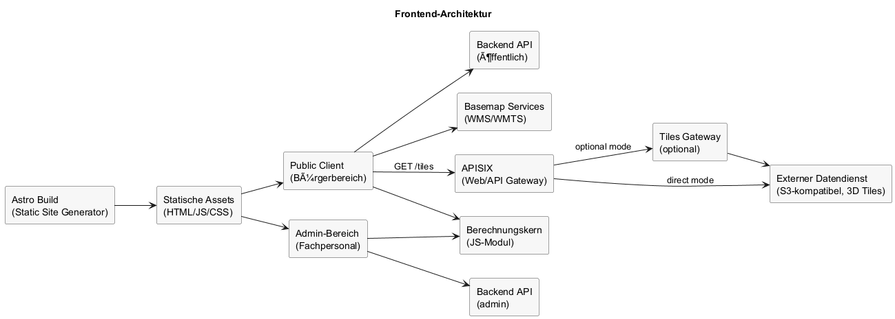

# Architektur - Frontend

## Inhaltsverzeichnis

1. [Ziel dieser Sicht](#ziel-dieser-sicht)
2. [Umfang und Abgrenzung](#umfang-und-abgrenzung)
3. [Verantwortlichkeiten](#verantwortlichkeiten)
4. [Schnittstellen](#schnittstellen)
5. [Diagramm](#diagramm)
6. [Datenhaltung und Privacy](#datenhaltung-und-privacy)
7. [MVP-Klärungsbedarf (erneuerbare Maßnahmen)](#mvp-klaerungsbedarf-erneuerbare-massnahmen)
8. [Build und Auslieferung](#build-und-auslieferung)
9. [Konventionen API-Client (Frontend-Repo)](#konventionen-api-client-frontend-repo)

## Ziel dieser Sicht

Dieses Kapitel beschreibt Aufbau, Verantwortlichkeiten und Schnittstellen des Frontends des Digitaler Energie Zwilling (DEZ). Fokus ist die statische Auslieferung und die Laufzeit im Browser.

---

## Umfang und Abgrenzung

- Umfasst Public Client und Admin-Bereich.
- Beschreibt nicht die Offline-Datenpipeline oder die Backend-Implementierung.

---

## Verantwortlichkeiten

- Darstellung des 3D-Stadtmodells und Auswahl einzelner Gebäude.
- Visualisierung von Solarpotenzialen (PV) und Geothermiepotenzialen aus 3D Tiles.
- Verbindliche Gebäudeeinfärbung im 3D-Client auf Basis von Effizienzklassen/Ergebnisattributen (Cesium Tileset Styles).
- Abbildung von zwei PV-Darstellungen in der UI:
  - PV + Speicher für Wärmepumpenbetrieb (energetische und finanzielle Effekte)
  - maximale Ausnutzung geeigneter PV-Flächen (Potenzialkommunikation für Haushaltsstrom/KFZ-Ladung)
- Auswahl von Solarthermie als zusätzliche Sanierungsmaßnahme zur Warmwasser-Unterstützung.
- Nutzung der Solarpotenzial-Textur (z.B. Dachausrichtung) für visuelle Hinweise.
- Darstellung von Vegetationsobjekten (Bäume) zur besseren räumlichen Orientierung.
- Durchführung der Simulation im Browser über den Simulationskern.
- Darstellung der Ergebnisse und Hinweise für Bürger (Eigentümer/Vermieter).
- Administrative Funktionen für Stadtverwaltung / Fachpersonal (Konfiguration, Triage).
- Einfacher/erweiterter Modus für Eingaben sowie Feedback-Formular nach Berechnung.
- Barrierefreiheit und responsives Layout (BITV 2.0).
- Live-Ergebnisse nach Eingabeänderungen (ohne expliziten „Berechnen“-Button).

---

## Schnittstellen

- 3D Tiles über APISIX:
  - direkter Zugriff auf den externen Datendienst oder
  - Zugriff über ein optionales Tiles Gateway.
- Konfigurations-Snapshots (versionierte JSON) vom Backend.
- Öffentliche und administrative Backend-APIs.
- Generierter, typsicherer API-Client aus OpenAPI 3.0 mit `@hey-api/openapi-ts` und React-Query-Erweiterung.
- Basemap-Dienste (WMS/WMTS) für Kartenhintergründe.

---

## Diagramm

Quelle: `raw/frontend-architecture.puml`

---

## Datenhaltung und Privacy

- Der Bearbeitungszustand wird im Public Client über einen notwendigen Cookie für Wiederbesuche persistiert.
- Nutzereingaben bleiben lokal, sofern keine explizite Übermittlung erfolgt; bei expliziter Speicherung kann der Zustand vom Server wiederhergestellt werden.
- Exporte erzeugen Dateien nur auf ausdrücklichen Nutzerwunsch.

---

## MVP-Klärungsbedarf (erneuerbare Maßnahmen)

- Solarthermie ist vorgesehen, hat aber derzeit geringere Umsetzungspriorität; finaler MVP-Umfang offen.
- Die genaue Darstellungstiefe der beiden PV-Modi (insbesondere Ergebniskennzahlen) wird in der MVP-Phase finalisiert.
- Die Geothermie-Bewertung hängt von der Verfügbarkeit des Datensatzes ab und bleibt im MVP bis zur Datenlieferung in Klärung.

---

## Build und Auslieferung

- Statische Webanwendung; Build erfolgt zur Projekt-Build-Zeit.
- Build basiert auf Astro mit zwei Islands: Public Client und Admin Dashboard.
- API-Client und Hooks werden aus der OpenAPI-3.0-Spezifikation generiert (`@hey-api/openapi-ts` + React-Query-Erweiterung).
- Admin-HTML wird erst nach erfolgreicher Authentifizierung ausgeliefert.
- Statische Assets sind cachefähig, dynamische Daten kommen über APIs.

Begriff: **Island-Architektur** bezeichnet in Astro die Kombination aus statischem HTML und gezielt eingebundenen interaktiven Islands.

---

## Konventionen API-Client (Frontend-Repo)

- Konfigurationsdatei: `openapi-ts.config.ts` im Root des Frontend-Repositories.
- OpenAPI-Eingabe: `openapi/openapi.json` (aus Backend-Artefakt/Export).
- Generierter Code: `src/shared/api/generated/`.
- Generierungsskript: `pnpm openapi:generate`.
- Konsistenzprüfung in CI: `pnpm openapi:check` (Build schlägt fehl bei ungeprüftem Diff).
- Nutzung in der UI: API-Zugriffe über generierte React-Query-Hooks statt ad-hoc-HTTP-Calls.
