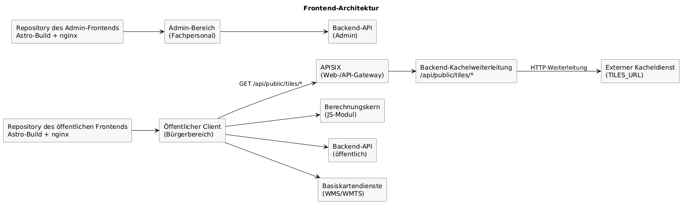

# Architektur - Frontend

## Inhaltsverzeichnis

1. [Ziel dieser Sicht](#ziel-dieser-sicht)
2. [Umfang und Abgrenzung](#umfang-und-abgrenzung)
3. [Verantwortlichkeiten](#verantwortlichkeiten)
4. [Schnittstellen](#schnittstellen)
5. [Diagramm](#diagramm)
6. [Datenhaltung und Privacy](#datenhaltung-und-privacy)
7. [Consent und Matomo-Tracking](#consent-und-matomo-tracking)
8. [MVP-Klärungsbedarf (erneuerbare Maßnahmen)](#mvp-klaerungsbedarf-erneuerbare-massnahmen)
9. [Build und Auslieferung](#build-und-auslieferung)
10. [Konventionen API-Client (Frontend-Repo)](#konventionen-api-client-frontend-repo)

## Ziel dieser Sicht

Dieses Kapitel beschreibt Aufbau, Verantwortlichkeiten und Schnittstellen des Frontends des Digitaler Energie Zwilling (DEZ). Fokus ist die statische Auslieferung und die Laufzeit im Browser.

---

## Umfang und Abgrenzung

- Umfasst Public Frontend und Admin Frontend als getrennte Anwendungen, Repositories, Builds und Deployments.
- Beschreibt nicht die Offline-Datenpipeline oder die Backend-Implementierung.

---

## Verantwortlichkeiten

- Darstellung des 3D-Stadtmodells und Auswahl einzelner Gebäude.
- Übernahme der freigegebenen LOD2- und Anreicherungsattribute als
  Berechnungsvorbelegung gemäß
  [LOD2-zu-Frontend-Eingabefeld-Mapping](17-lod2-frontend-input-mapping.md).
- Die Vorrangregeln zwischen Nutzereingaben, LOD2-/Anreicherungsdaten und Defaults sind in der
  [Testdokumentation der energetischen Berechnung](18-energy-calculation-test-documentation.md)
  beschrieben und geprüft.
- Visualisierung von Solarpotenzialen (PV) nach Datenfreigabe und Geothermiepotenzialen aus den vom Auftraggeber bereitgestellten Daten.
- Gut sichtbare statische Hervorhebung des ausgewählten Gebäudes im 3D-Client; keine flächendeckende Einfärbung nach Energieeffizienzklassen.
- Abbildung von zwei PV-Darstellungen in der UI erst nach Datenfreigabe:
  - PV + Speicher für Wärmepumpenbetrieb (energetische und finanzielle Effekte)
  - maximale Ausnutzung geeigneter PV-Flächen (Potenzialkommunikation für Haushaltsstrom/KFZ-Ladung)
- Solarthermie ist aktuell nicht als auswählbare Maßnahme vorzusehen, da im Berechnungskern noch kein Rechenweg dafür besteht.
- Nutzung der Solarpotenzial-Textur (z.B. Dachausrichtung) für visuelle Hinweise erst nach Datenfreigabe durch den Auftraggeber.
- Darstellung von Vegetationsobjekten (Bäume) zur besseren räumlichen Orientierung.
- Durchführung der Berechnung im Browser über den Berechnungskern.
- Darstellung der Ergebnisse und Hinweise für Bürger (Eigentümer/Vermieter).
- Administrative Funktionen für Stadtverwaltung / Fachpersonal (Konfiguration, Triage).
- Einfacher/erweiterter Modus für Eingaben sowie Feedback-Formular nach Berechnung.
- Barrierefreiheit und responsives Layout (BITV 2.0).
- Live-Ergebnisse nach Eingabeänderungen (ohne expliziten „Berechnen“-Button).

---

## Schnittstellen

- 3D Tiles über `GET /api/public/tiles/*`; das Backend leitet per Redirect auf die über `TILES_URL` konfigurierte externe Tiles-URL weiter.
- Konfigurations-Snapshots (versionierte JSON) vom Backend.
- Öffentliche und administrative Backend-APIs.
- Generierter, typsicherer API-Client aus OpenAPI 3.0 oder höher mit Orval.
- Basemap-Dienste (WMS/WMTS) für Kartenhintergründe.

---

## Diagramm

Quelle: `raw/frontend-architecture.puml`

---

## Datenhaltung und Privacy

- Der Bearbeitungszustand wird im Public Client über Local Storage für Wiederbesuche persistiert.
- Nutzereingaben bleiben lokal, sofern keine explizite Übermittlung erfolgt; bei expliziter Speicherung kann der Zustand vom Server wiederhergestellt werden.
- Exporte erzeugen Dateien nur auf ausdrücklichen Nutzerwunsch.

---

## Consent und Matomo-Tracking

- Das Public-Frontend verwaltet den Consent-Status für Webanalyse unabhängig von technisch notwendiger lokaler Speicherung und der gesonderten Einwilligung zur Gebäudedatenspende.
- Matomo-Ressourcen und der zentrale Tracking-Adapter werden erst nach gültigem Opt-in aktiviert.
- Sämtliche UI-Komponenten melden ausschließlich fachliche Ereignisse an den Tracking-Adapter. Nur der Adapter kennt die Matomo-Site-ID, bildet Ereignisse auf den freigegebenen Eventkatalog ab und validiert Parameter gegen versionierte Allow-Lists.
- Der Tracking-Adapter erhält keine vollständigen Frontend-Zustände, Berechnungsobjekte oder Einreichungspayloads. Für Gebäudetypen, Sanierungsmaßnahmen und Funnel-Schritte werden ausschließlich freigegebene semantische Schlüssel übergeben.
- Seitenadressen und Referrer werden vor der Übermittlung von Queryparametern, URL-Fragmenten, Tokens und Objektkennungen bereinigt.
- Die freiwillige Gebäudedatenspende verwendet weiterhin den getrennten API-Datenstrom zum Backend. Matomo erfasst nur Beginn und erfolgreichen Abschluss dieses Prozesses ohne Einreichungsdaten oder Kennungen.
- Bei Widerruf deaktiviert das Frontend weitere Matomo-Aufrufe und entfernt lokal gespeicherte Matomo-Kennungen nach Maßgabe der freigegebenen Konfiguration.

Eventkatalog, Funnel-IDs, KPI-Definitionen und Abnahmekriterien sind im [Matomo-Trackingkonzept](../system/06-matomo-trackingkonzept.md) festgelegt.

---

## MVP-Klärungsbedarf (erneuerbare Maßnahmen)

- Solarthermie ist derzeit nicht Bestandteil des vorgesehenen Berechnungskern-Umfangs; eine spätere Erweiterung erfordert zuerst einen fachlich definierten Rechenweg.
- Für PV/Speicher liegt aktuell noch keine Datenfreigabe durch den Auftraggeber vor; aufgrund der unklaren Datenlage findet keine vorbereitende Implementierung statt.
- Für die Solar-Anreicherung liegt aktuell ebenfalls keine Datenfreigabe durch den Auftraggeber vor; daher findet keine vorbereitende Anreicherungs- oder Mapping-Implementierung statt.
- Die Geothermie-Daten wurden durch den Auftraggeber bereitgestellt und sollen verwendet werden; die Implementierung befindet sich in Arbeit. Herkunfts-, Lizenz-, Turnus- und Schemametadaten sind noch zu klären. Ein zusätzlicher Fallback nach dem Vorbild der LfU-/TUM-Studie wird nicht benötigt.

---

## Build und Auslieferung

- Public Frontend und Admin Frontend sind eigenständige statische Webanwendungen in getrennten Repositories.
- Jede Anwendung besitzt einen eigenen Astro-Build, ein eigenes Container-Image und ein separates nginx-Deployment.
- API-Client und Query-/Mutation-Anbindungen werden aus einer Spezifikation nach OpenAPI 3.0 oder höher mit Orval generiert.
- Administrative API-Aktionen werden durch APISIX und die Token-/Rollenprüfung des Backends geschützt; die statische Auslieferung des Admin Frontends enthält keine fachliche Autorisierungslogik.
- Statische Assets sind cachefähig, dynamische Daten kommen über APIs.
- Die Laufzeit-Auslieferung erfolgt über nginx; Logging wird über den nginx-Standard-Logger auf `stdout`/`stderr` ausgegeben.
- Requests auf statische Assets, die keine HTML-Dateien sind, werden in diesem Setup nicht geloggt.

Innerhalb beider Astro-Anwendungen können interaktive Islands eingesetzt werden; sie bilden jedoch keine gemeinsame Laufzeiteinheit und kein gemeinsames Deployment.

---

## Konventionen API-Client (Frontend-Repo)

- Konfigurationsdatei: zentrale Orval-Konfiguration im Frontend-Repository.
- OpenAPI-Eingabe: vom Backend bereitgestellte OpenAPI-Spezifikation.
- Eine zusätzliche Versionierung als `openapi/openapi.json` ist bewusst nicht vorgesehen.
- Generierter Code: `src/shared/api/generated/`.
- Generierungsskript: `pnpm openapi:generate`.
- Konsistenzprüfung in CI: `pnpm openapi:check` (Build schlägt fehl bei ungeprüftem Diff).
- Nutzung in der UI: API-Zugriffe über generierte React-Query-Hooks statt ad-hoc-HTTP-Calls.
