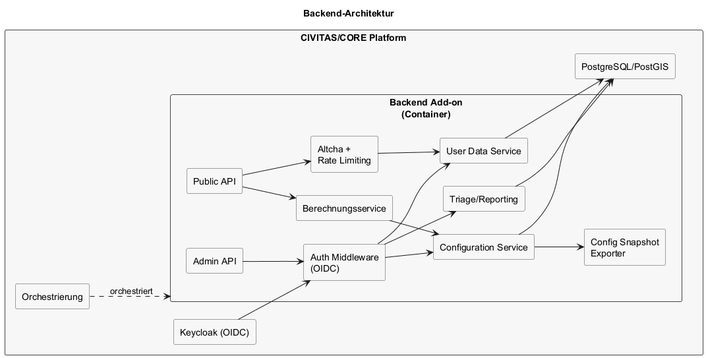

# Architektur - Backend

## Inhaltsverzeichnis

1. [Ziel dieser Sicht](#ziel-dieser-sicht)
2. [Verantwortlichkeiten](#verantwortlichkeiten)
3. [Schnittstellen](#schnittstellen)
4. [Diagramm](#diagramm)
5. [Datenhaltung](#datenhaltung)
6. [API-Vertrag](#api-vertrag)
7. [Sicherheits- und Betriebsprinzipien](#sicherheits-und-betriebsprinzipien)
8. [Kubernetes-Fähigkeit (Container)](#kubernetes-faehigkeit-container)
9. [Abgrenzung](#abgrenzung)

## Ziel dieser Sicht

Dieses Kapitel beschreibt Verantwortlichkeiten, Schnittstellen und Betriebsprinzipien des Backends des Digitaler Energie Zwilling (DEZ).

---

## Verantwortlichkeiten

- Authentifizierung und Autorisierung (OIDC für Stadtverwaltung / Fachpersonal).
- Verwaltung, Versionierung und Veröffentlichung von Simulationskonfigurationen.
- Persistenz von Nutzereingaben, Triage-Informationen und Katalogen.
- Öffentliche Schreibschnittstelle inklusive Validierung und Verifikation.
- Optionale serverseitige Simulation über den Simulationskern.

---

## Schnittstellen

- Öffentliche API (z.B. Konfiguration, optionale Speicherung von Ergebnissen) über APISIX.
- Administrative API (Konfiguration, Triage, Reporting) über APISIX.
- OpenAPI-3.0-Spezifikation als Vertragsquelle für Frontend-Client-Generierung.
- Identity Provider (Keycloak) für Admin-Login.
- Relationale Datenbank mit räumlicher Erweiterung.
- Simulationskern als eingebettetes Modul für Re-Berechnungen.
- Externer Datendienst (z.B. S3) und optionales Tiles Gateway für statische 3D Tiles (nur konsumiert, nicht erzeugt); externer Zugriff erfolgt über APISIX.

---

## Diagramm

Quelle: `raw/backend-architecture.puml`

---

## Datenhaltung

- Relationale Datenbank für dynamische und administrative Daten.
- Keine Speicherung statischer Potenzialdaten oder 3D Tiles.
- Konfigurations-Snapshots als exportierte Dateien.

---

## API-Vertrag

- OpenAPI 3.0 wird im Backend über Fastify-toab/Fastify-Swagger bereitgestellt.
- Diese Spezifikation ist die Source of Truth für die Generierung des Frontend-API-Clients.
- Für die Frontend-Generierung wird die Spezifikation als Artefakt im Pfad `openapi/openapi.json` bereitgestellt.
- Änderungen am API-Vertrag werden über OpenAPI-Diff im Review-/Release-Prozess nachvollzogen.

---

## Sicherheits- und Betriebsprinzipien

- Strikte Trennung von Public- und Admin-Endpunkten.
- Rate Limiting und Altcha-Challenges für öffentliche Schreibzugriffe.
- Statelesses Backend, containerisierbar, mit Observability (Logs, Metriken, Tracing).
- Als **CIVITAS/CORE-fähiges Add-on** ausgelegt: läuft als eigener Container und ist von außen orchestrierbar.
- Security by Design: Least Privilege, Secure Defaults, Defense in Depth.
- Secrets ausschließlich über Secrets-Management; keine Tokens im Code.
- TLS für alle externen Verbindungen.
- Auditierbare Security-Logs (z.B. Auth, Zugriff, Fehler).

---

## Kubernetes-Fähigkeit (Container)

- Konfiguration über Umgebungsvariablen und Configs, keine Hardcodierung.
- Logs ausschließlich über `stdout`/`stderr`, keine Pflicht-Logfiles.
- Nicht-root Benutzer und minimale Rechte (keine unnötigen Capabilities).
- Read-only Root-Filesystem, wenn möglich; schreibbare Pfade explizit definieren.
- Sauberes Signal-Handling (z.B. `SIGTERM`) für Graceful Shutdown.
- Health-Endpoints für Readiness und Liveness:
  - `GET /healthz/live` (Liveness)
  - `GET /healthz/ready` (Readiness)
- Ressourcenangaben für CPU/Memory (Requests/Limits) sind vorgesehen.
- Keine lokale Persistenz: Zustand liegt in externen Diensten.

---

## Abgrenzung

- Keine Auslieferung großer statischer Datenmengen (3D Tiles).
- Keine Laufzeit-Berechnung von Potenzialen.
- Keine Orchestrierung der Offline-Datenpipeline; diese läuft in CIVITAS/CORE über Airflow als separater Container.
