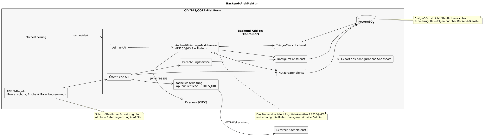

# Architektur - Backend

## Inhaltsverzeichnis

1. [Ziel dieser Sicht](#ziel-dieser-sicht)
2. [Verantwortlichkeiten](#verantwortlichkeiten)
3. [Schnittstellen](#schnittstellen)
4. [Diagramm](#diagramm)
5. [Datenhaltung](#datenhaltung)
6. [API-Vertrag](#api-vertrag)
7. [Routing- und Schutzmodell (APISIX und fastify-toab)](#routing-und-schutzmodell-apisix-und-fastify-toab)
8. [Sicherheits- und Betriebsprinzipien](#sicherheits-und-betriebsprinzipien)
9. [Kubernetes-Fähigkeit (Container)](#kubernetes-faehigkeit-container)
10. [Abgrenzung](#abgrenzung)

## Ziel dieser Sicht

Dieses Kapitel beschreibt Verantwortlichkeiten, Schnittstellen und Betriebsprinzipien des Backends des Digitaler Energie Zwilling (DEZ).

---

## Verantwortlichkeiten

- Produktive Validierung von Access Tokens per RS256/JWKS und fachliche Autorisierung anhand der Rollen `manager`, `maintainer` und `admin`.
- Verwaltung, Versionierung und Veröffentlichung von Berechnungskonfigurationen.
- Persistenz von Nutzereingaben, Triage-Informationen und Katalogen.
- Durchsetzung der Löschregeln in der Admin-Triage: gezielte Einzellöschung sowie atomare gebündelte Löschung nur bei ausschließlich abgelehnten Einreichungen zu einer Gebäude-ID.
- Öffentliche Schreibschnittstelle inklusive Validierung und Verifikation.
- Capability-geschützte öffentliche Status-, JSON-Download- und Löschschnittstellen für freiwillige Einreichungen; nur HTTP `DELETE` verändert Daten.
- Optionale serverseitige Berechnung über den Berechnungskern.

---

## Schnittstellen

- Öffentliche API (z.B. Konfiguration, optionale Speicherung von Ergebnissen sowie token-geschützte Status-, Download- und Löschoperationen) über APISIX.
- Administrative API (Konfiguration, Triage, Reporting) über APISIX.
- Spezifikation nach OpenAPI 3.0 oder höher als Vertragsquelle für die Frontend-Client-Generierung.
- Identity Provider (Keycloak) für Admin-Login.
- Keycloak (OIDC) wird für Benutzer-/Client-Authentifizierung gegenüber APISIX genutzt; nach erfolgreichem Login setzt Keycloak ein verschlüsseltes JWT-Token als Browser-Cookie.
- APISIX schützt die Routen und übernimmt die vorgelagerte OIDC-Prüfung. Das Backend vertraut dieser Prüfung nicht allein, sondern validiert das weitergeleitete Access Token unabhängig gegen die konfigurierte Keycloak-JWKS-Quelle und setzt Rollen und Berechtigungen selbst durch.
- PostgreSQL-Datenbank für dynamische und administrative Daten.
- Berechnungskern als eingebettetes Modul für Re-Berechnungen.
- Externer Tiles-Dienst für statische 3D Tiles. Das Backend leitet `GET /api/public/tiles/*` per Redirect an die über `TILES_URL` konfigurierte externe Ziel-URL weiter.

---

## Diagramm

Quelle: `raw/backend-architecture.puml`

---

## Datenhaltung

- PostgreSQL-Datenbank für dynamische und administrative Daten; Zugriff über ZenStack ORM mit PostgreSQL-Dialect.
- Keine Speicherung statischer Potenzialdaten oder 3D Tiles.
- Konfigurations-Snapshots als exportierte Dateien.

---

## API-Vertrag

- OpenAPI 3.0 oder höher wird im Backend über Fastify-toab/Fastify-Swagger bereitgestellt; die aktuelle Implementierung erzeugt OpenAPI 3.1.0.
- Diese Spezifikation ist die Source of Truth für die Generierung des Frontend-API-Clients.
- Das Frontend fragt die OpenAPI-Spezifikation ab und generiert daraus den API-Client mit Orval.
- Eine zusätzliche Versionierung als `openapi/openapi.json` wird bewusst ausgeklammert, da die Anzahl angebundener Clients gering bleibt.

---

## Routing- und Schutzmodell (APISIX und fastify-toab)

- Externe Zugriffe laufen ausschließlich über APISIX (Single Entry Point); direkte externe Zugriffe auf den Backend-Port sind unzulässig.
- Die Zuordnung `public` vs. `protected` wird in APISIX pro Route konfiguriert (lokales Dev-Setup: `.devcontainer/apisix/apisix.yaml`).
- Namespace-Konvention für Backend-Routen (fastify-toab Controller-`rootPath`):
  - `"/api/admin/*"`: per Default **protected**.
  - `"/api/public/*"`: per Default **public**.
- Für `"/api/admin/*"` gilt:
  - APISIX muss den externen Routenschutz und die vorgelagerte OIDC-Prüfung entsprechend der Deployment-Policy erzwingen.
  - Das Backend nimmt das Access Token aus `X-Access-Token` oder `Authorization: Bearer` entgegen.
  - In produktiven Umgebungen validiert die `authMiddleware` das Token unabhängig von der Gateway-Prüfung. Signatur und zeitliche Gültigkeit werden mit RS256 gegen `KEYCLOAK_JWKS_URI` geprüft.
  - Die Rollen werden anschließend aus `resource_access` für den über `AUTH_RESOURCE_ACCESS_CLIENT_ID` konfigurierten Client gelesen; verwendet werden `manager`, `maintainer` und `admin`.
  - Das Backend erzwingt die daraus abgeleiteten Berechtigungen selbst. Eine erfolgreiche APISIX-Prüfung ohne erfolgreiche Backend-Prüfung führt nicht zum Zugriff.
- Für `"/api/public/*"` gilt:
  - Keine Auth-Middleware als Default.
  - Schutz gegen Missbrauch erfolgt über die globale APISIX-Policy der externen Deployment-Plattform für Altcha und Rate Limiting; deren Bereitstellung und Betriebsnachweis liegen außerhalb der DEZ-Repositories.
  - Das Backend übernimmt danach Schema-/Fachvalidierung und Recompute-Verifikation.
- Diese Konvention stellt sicher, dass die Trennung aus APISIX-Routing und fastify-toab-Namespace konsistent und prüfbar bleibt.

---

## Sicherheits- und Betriebsprinzipien

- Strikte Trennung von Public- und Admin-Endpunkten.
- APISIX ist der verbindliche externe Enforcement-Point für Routenschutz und vorgelagerte OIDC-Prüfung; die unabhängige Token-, Claim- und Rollenprüfung im Backend bildet eine zweite, für administrative APIs zwingende Enforcement-Schicht.
- Von der externen Deployment-Plattform betriebene globale APISIX-Policy für Rate Limiting und Altcha-Challenges bei öffentlichen Schreibzugriffen; das Backend setzt diese vorgelagerte Schutzschicht voraus und ergänzt sie durch eigene Fachvalidierung und Recompute-Verifikation.
- Statelesses Backend, containerisierbar, mit Observability (Logs, Metriken, Tracing).
- Als **CIVITAS/CORE-fähiges Add-on** ausgelegt: läuft als eigener Container und ist von außen orchestrierbar.
- Security by Design: Least Privilege, Secure Defaults, Defense in Depth.
- Secrets ausschließlich über Secrets-Management; keine Tokens im Code.
- TLS für alle externen Verbindungen.
- Auditierbare Security-Logs (z.B. Auth, Zugriff, Fehler).

---

## Kubernetes-Fähigkeit (Container)

- Konfiguration über Umgebungsvariablen und Configs, keine Hardcodierung.
- Logs ausschließlich über `stdout`/`stderr`, keine Pflicht-Logfiles.
- Backend-Logging erfolgt über Pino als Standard-Logger von Fastify.
- Nicht-root Benutzer und minimale Rechte (keine unnötigen Capabilities).
- Read-only Root-Filesystem, wenn möglich; schreibbare Pfade explizit definieren.
- Sauberes Signal-Handling (z.B. `SIGTERM`) für Graceful Shutdown.
- Gemeinsamer Health-Endpunkt `GET /health`, bereitgestellt über Fastify Under Pressure. Die Deployment-Plattform verwendet ihn für Liveness- und Readiness-Prüfungen.
- Ressourcenangaben für CPU/Memory (Requests/Limits) sind vorgesehen.
- Keine lokale Persistenz: Zustand liegt in externen Diensten.
- Fällt der Container im Regelbetrieb aufgrund fehlgeschlagener Health-Checks aus, erfolgt der Neustart standardmäßig über Kubernetes.

---

## Abgrenzung

- Keine Übertragung großer statischer Datenmengen durch das Backend; für 3D Tiles wird nur der konfigurationsbasierte Redirect bereitgestellt.
- Keine Laufzeit-Berechnung von Potenzialen.
- Keine Orchestrierung der Offline-Datenpipeline; diese läuft in CIVITAS/CORE über Airflow als separater Container.
