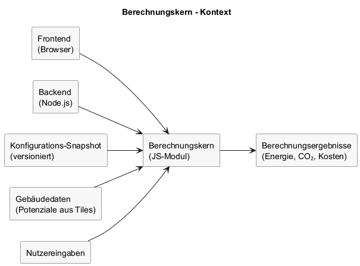

# Architektur - Berechnungskern

## Inhaltsverzeichnis

1. [Ziel dieser Sicht](#ziel-dieser-sicht)
2. [Hinweis zum Reifegrad](#hinweis-zum-reifegrad)
3. [Verantwortlichkeiten](#verantwortlichkeiten)
4. [Laufzeit und Einbettung](#laufzeit-und-einbettung)
5. [Eingaben und Ausgaben](#eingaben-und-ausgaben)
6. [Eingabetiefe (Spektrum)](#eingabetiefe-spektrum)
7. [Defaultannahmen (konfigurierbar)](#defaultannahmen-konfigurierbar)
8. [Lüftung (Parameterbeispiele)](#lueftung-parameterbeispiele)
9. [Anlagentechnik (Detailgrad)](#anlagentechnik-detailgrad)
10. [Wärmebrücken (Hinweis)](#waermebruecken-hinweis)
11. [Offene Modellierungsfragen aus dem Grobkonzept](#offene-modellierungsfragen-aus-dem-grobkonzept)
12. [Diagramm](#diagramm)
13. [Versionierung und Nachvollziehbarkeit](#versionierung-und-nachvollziehbarkeit)
14. [Abgrenzung](#abgrenzung)

## Ziel dieser Sicht

Dieses Kapitel beschreibt Aufbau und Verwendung des Berechnungskerns als gemeinsamen Rechenkern für Frontend und Backend.

---

## Hinweis zum Reifegrad

Der Berechnungskern befindet sich noch nicht in einem finalen Stand. Inhalte und Schnittstellen dieses Kapitels können sich im weiteren Projektverlauf ändern.

---

## Verantwortlichkeiten

- Berechnung von Energiebedarf, CO₂, Primärenergie, Kosten und Effizienzklassen.
- Umsetzung der Eingabelogik entlang eines kontinuierlichen Spektrums gemäß fachlichen Anforderungen.
- Deterministisches Verhalten bei identischer Konfiguration und Eingaben.

---

## Laufzeit und Einbettung

- Implementiert als eigenständiges JavaScript-Modul.
- Ausführbar im Browser und in Node.js.
- Keine Abhängigkeit von Infrastruktur oder Datenbank.

---

## Eingaben und Ausgaben

- Eingaben: Konfigurations-Snapshot (Version), Gebäudedaten/Potenziale, Nutzereingaben.
- Ausgaben: Ergebnisobjekte für Anzeige, Vergleich und Export.

---

## Eingabetiefe (Spektrum)

- Ohne Nutzereingabe erfolgt die Vorbelegung über LOD2, Baualtersklasse und Standardannahmen.
- Mit jeder zusätzlichen manuellen Eingabe steigt die inhaltliche Genauigkeit der Berechnung.
- Bauteil-, Anlagen- und Nutzungsangaben können sukzessive ergänzt oder überschrieben werden.
- Bei umfassender manueller Eingabe sind detaillierte Sanierungsszenarien (Einzelmaßnahmen/Kombinationen) mit Vorher/Nachher-Vergleich möglich.

### Zuordnung der Grobkonzept-Datenstufen

Quelle: `26-03-06_-Übersicht Berechnung Grobkonzept.xlsx`

Die aktualisierte Arbeitsmappe präzisiert die Logik des Berechnungskerns, ohne das Grundprinzip zu ändern:
Der Rechenkern bildet weiterhin ein **kontinuierliches Eingabetiefe-Spektrum** ab.

- **Datenstufe 1** beschreibt den Fall ohne Nutzereingabe. Alle für die Berechnung benötigten Kennwerte werden aus Basisdaten, Katalogwerten und Standardannahmen abgeleitet.
- **Datenstufe 2** beschreibt den Fall vollständiger Nutzereingabe innerhalb der fachlich freigegebenen Felder.
- Beide Enden werden durch denselben Rechenkern verarbeitet; der Unterschied liegt ausschließlich in den bereitgestellten bzw. überschriebenen Eingabewerten.

### Rolle der Arbeitsmappe 26-03-06

Die Arbeitsmappe dient fachlich als Referenz für vier Ebenen:

- `Grobkonzept`: fachliche Freigabe und Struktur der Eingaben entlang des Spektrums.
- `Berechnungen`: zentrale abgeleitete Zwischen- und Rechengrößen.
- Domänenblätter (`Dach-Fenster`, `OGD`, `AW-Fenster`, `UGD`, `Heizung`): bauteil- und anlagenspezifische Regeln.
- Katalogblätter (`Kat. 1 U-Wert`, `Kat. 2 Heizung`): normativ bzw. typologisch referenzierte Werte.

Die Arbeitsmappe ist damit Referenz für die fachliche Herleitung, nicht jedoch eine Vorgabe für eine 1:1-Abbildung in Datenbank-, API- oder UI-Strukturen.

### Berechnungsdomänen aus der Arbeitsmappe

- Hülle: `Dach-Fenster`, `OGD`, `AW-Fenster`, `UGD` mit HT-Teilbilanzen (`HT = F * U * A`).
- Wärmebrücken: pauschaler Zuschlag über `dUWB * Ages`.
- Lüftung: Luftdichtheit und Luftwechsel als referenzierte Katalogwerte, nicht als direkte Nutzereingabe.
- Heizung: Systemart, Erzeugerart, Zusatzheizung, Heizflächenart und optionale Zusatzparameter.
- Kataloge: `Kat. 1 U-Wert` (Baualtersklassen/U-Werte), `Kat. 2 Heizung` (Aufwandszahlen/Heizflächenzuschläge).
- Ergebnisgleichungen (Blatt `Formeln`): Transmissionswärmeverlust, Lüftungswärmeverlust, interne/solare Gewinne, Jahres-Heizwärmebedarf.

---

## Defaultannahmen (konfigurierbar)

- Fensteranteil am Fassadenbereich: Standardannahme (z.B. 40%), wenn nicht bekannt.
- Lüftungswärmeverlust (Bestand ohne Detailkenntnis): pauschaler Ansatz (z.B. 0,05 W/m²K).
- Wärmebrücken: pauschaler Zuschlag auf U-Werte, eingabeabhängig.

---

## Lüftung (Parameterbeispiele)

- Luftdichtheit wird als referenzierter Parameter aus Katalogwerten und Baualter modelliert (keine direkte Nutzereingabe).
- Für die Berechnung können interne Ausprägungen wie eher zugig / normal / sehr dicht verwendet werden.

---

## Anlagentechnik (Detailgrad)

- Ohne manuelle Eingaben arbeitet das System mit konfigurierten Standardannahmen.
- Mit manuellen Grundangaben (z.B. Baujahr, Energieträger) wird die Anlage grob vorbelegt.
- Mit weiterem Detaillierungsgrad können Erzeugerart, Heizflächenart und Zusatzheizung erfasst werden.
- Optional sind weitere berechnungsrelevante Anlagenparameter erfassbar.

---

## Wärmebrücken (Hinweis)

Typische Bereiche: Balkonanschlüsse, Deckenauflager auf Außenwänden, Fensteranschlüsse, Gebäudekanten/-ecken, Rollladenkästen, Attiken.

---

## Offene Modellierungsfragen aus dem Grobkonzept

- Kostenfelder sind in mehreren Hüllen-Blättern nur als Platzhalter vorhanden; ein konsistentes Kostenmodell fehlt.
- Korrekturfaktor `F` ist nicht für alle Bauteile in gleicher Tiefe fachlich definiert.
- Das Heizungsblatt enthält teilweise generische Empfehlungstexte statt deterministischer Entscheidungsregeln.
- Einzelne Katalogbezeichner sind uneinheitlich/formal fehlerhaft und müssen vor produktiver Nutzung bereinigt werden.

---

## Diagramm

Quelle: `raw/berechnung-core-architecture.puml`

---

## Versionierung und Nachvollziehbarkeit

- Ergebnisse referenzieren die verwendete Konfigurationsversion.
- Reproduzierbarkeit durch unveränderliche Snapshots.

---

## Abgrenzung

- Keine UI, keine Persistenz, keine Netzwerkanfragen.
- Potenzialdaten werden nicht berechnet, sondern als Eingabe genutzt.

