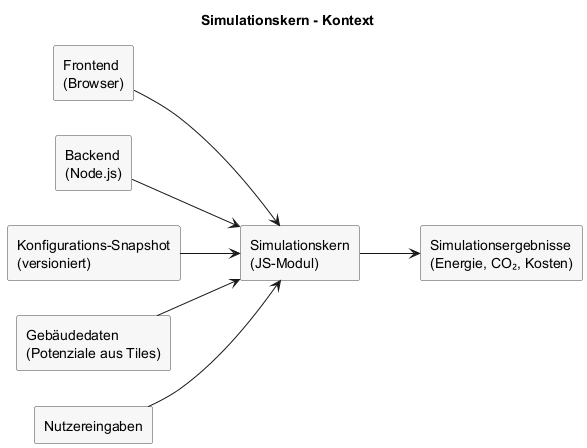

# Architektur - Simulationskern

## Ziel dieser Sicht

Dieses Kapitel beschreibt Aufbau und Verwendung des Simulationskerns als gemeinsamen Rechenkern für Frontend und Backend.

---

## Hinweis zum Reifegrad

Der Simulationskern befindet sich noch nicht in einem finalen Stand. Inhalte und Schnittstellen dieses Kapitels können sich im weiteren Projektverlauf ändern.

---

## Verantwortlichkeiten

- Berechnung von Energiebedarf, CO₂, Primärenergie, Kosten und Effizienzklassen.
- Umsetzung der Simulationsstufen und Eingabelogik gemäß fachlichen Anforderungen.
- Deterministisches Verhalten bei identischer Konfiguration und Eingaben.

---

## Laufzeit und Einbettung

- Implementiert als eigenständiges JavaScript-Modul.
- Ausführbar im Browser und in Node.js.
- Keine Abhängigkeit von Infrastruktur oder Datenbank.

---

## Eingaben und Ausgaben

- Eingaben: Konfigurations-Snapshot (Version), Gebäudedaten/Potenziale, Nutzereingaben.
- Ausgaben: Ergebnisobjekte für Anzeige, Vergleich und Export.

---

## Eingabetiefe (Spektrum)

- **Minimum**: keine Nutzereingaben, Vorbelegung ueber LOD2, Baualtersklasse, Standardannahmen.
- **Niedrig**: wenige Pflichtangaben (z.B. Baujahr), schnelle Erstwerte.
- **Mittel**: Bauteil- und Anlagenebene, einfache Qualitaetsstufen je Bauteil.
- **Hoch**: Ueberschreiben von Defaults (z.B. Daemmung, Fensterdetails, Sanierungsjahr).
- **Maximum**: Sanierungsszenarien (Einzelmassnahmen/Kombinationen) mit Vorher/Nachher-Vergleich.

---

## Defaultannahmen (konfigurierbar)

- Fensteranteil am Fassadenbereich: Standardannahme (z.B. 40%), wenn nicht bekannt.
- Lüftungswärmeverlust (Bestand ohne Detailkenntnis): pauschaler Ansatz (z.B. 0,05 W/m²K).
- Wärmebrücken: pauschaler Zuschlag auf U-Werte, stufenabhängig.

---

## Lüftung (Auswahlbeispiele)

- Fensterlüftung (kein Lüftungssystem)
- Lüftungsanlage ohne Wärmerückgewinnung
- Lüftungsanlage mit Wärmerückgewinnung
- „Weiß ich nicht“ → Standardannahme

Luftdichtheit (hoher Eingabegrad): eher zugig / normal / sehr dicht / „weiss ich nicht“.

---

## Anlagentechnik (Detailgrad)

- **Niedrig**: Baujahr + grundlegender Energietraeger, grobe Vorbelegung der Anlage.
- **Mittel**: Baujahr + Erzeugerart, Heizflaechenart, grundlegende Regelungsart.
- **Hoch**: optionale Detailparameter wie Vorlauftemperatur, Erzeugerleistung, Umwaelzpumpe, Regelprinzip, technische Ausfuehrung.

Regelungsarten (Auswahl): Raumtemperaturregelung, witterungsgeführte Regelung, Differenzregelung.  
Regelprinzip: stetig, 2‑Punkt/3‑Punkt.  
Technische Ausführung: hydraulisch, Smart‑Regelung.

---

## Wärmebrücken (Hinweis)

Typische Bereiche: Balkonanschlüsse, Deckenauflager auf Außenwänden, Fensteranschlüsse, Gebäudekanten/-ecken, Rollladenkästen, Attiken.

---

## Diagramm

Quelle: `raw/simulation-core-architecture.puml`

---

## Versionierung und Nachvollziehbarkeit

- Ergebnisse referenzieren die verwendete Konfigurationsversion.
- Reproduzierbarkeit durch unveränderliche Snapshots.

---

## Abgrenzung

- Keine UI, keine Persistenz, keine Netzwerkanfragen.
- Potenzialdaten werden nicht berechnet, sondern als Eingabe genutzt.
