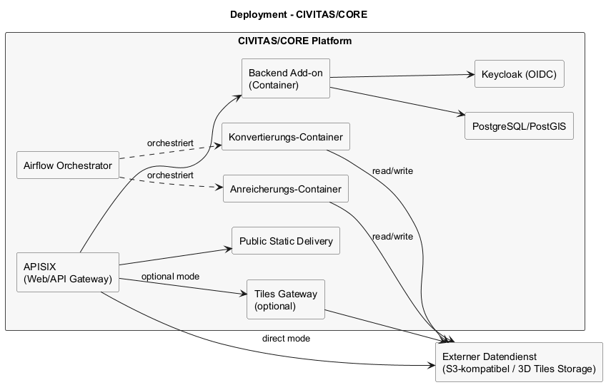

# Architektur – Deployment (CIVITAS/CORE)

## Inhaltsverzeichnis

1. [Ziel dieser Sicht](#ziel-dieser-sicht)
2. [Überblick](#ueberblick)
3. [Deployment-Diagramm](#deployment-diagramm)
4. [Annahmen](#annahmen)

## Ziel dieser Sicht

Dieses Kapitel beschreibt die **Deployment-Sicht** innerhalb von CIVITAS/CORE.
Es zeigt, welche Container beteiligt sind, wie sie zusammenspielen und welche externen Dienste
angebunden werden.

---

## Überblick

- CIVITAS/CORE orchestriert die Container (Backend Add-on, Airflow, Pipeline-Container).
- Der Web-Zugang erfolgt über APISIX als Web/API-Gateway.
- Statische Frontend-Assets und veröffentlichte Konfigurations-Snapshots werden getrennt ausgeliefert.
- 3D Tiles liegen im externen Datendienst (S3-kompatibel) und werden über APISIX bereitgestellt:
  - entweder direkt aus dem Datendienst
  - oder über ein optionales Tiles Gateway
- Datenbank und Identity Provider laufen innerhalb von CIVITAS/CORE.

---

## Deployment-Diagramm

Quelle: `raw/deployment-civitas-core.puml`

---

## Annahmen

- Der externe Datendienst entspricht dem 3D Tiles Storage.
- Airflow ist Teil von CIVITAS/CORE und orchestriert die Offline-Pipeline.
- Backend läuft als CIVITAS/CORE-fähiges Add-on in einem separaten Container.
- Ein Tiles Gateway ist optional und wird nur betrieben, wenn direkter HTTPS-Zugriff auf den Datendienst nicht ausreicht oder zusätzliche Proxy-Funktionen benötigt werden.
