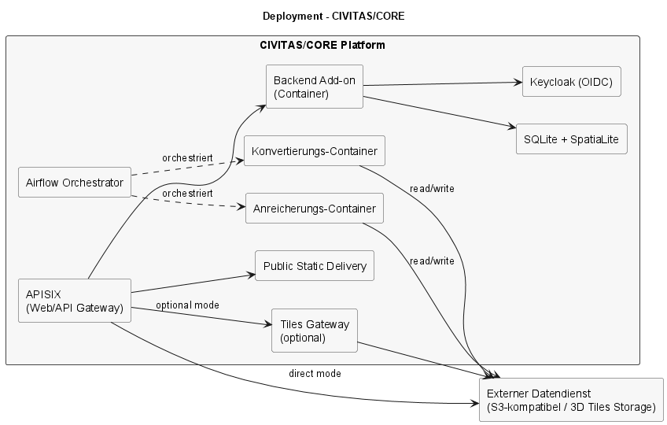

# Architektur – Deployment (CIVITAS/CORE)

## Inhaltsverzeichnis

1. [Ziel dieser Sicht](#ziel-dieser-sicht)
2. [Überblick](#ueberblick)
3. [Zugriffspfade auf den Datendienst](#zugriffspfade-auf-den-datendienst)
4. [Deployment-Diagramm](#deployment-diagramm)
5. [Annahmen](#annahmen)

## Ziel dieser Sicht

Dieses Kapitel beschreibt die **Deployment-Sicht** innerhalb von CIVITAS/CORE.
Es zeigt, welche Container beteiligt sind, wie sie zusammenspielen und welche externen Dienste
angebunden werden.

---

## Überblick

- CIVITAS/CORE orchestriert die Container (Backend Add-on, Airflow, Pipeline-Container).
- Der Web-Zugang erfolgt über APISIX als Web/API-Gateway.
- Statische Frontend-Assets und veröffentlichte Konfigurations-Snapshots werden getrennt ausgeliefert.
- Container sind für den Kubernetes-Regelbetrieb ausgelegt: Health-Checks steuern den automatischen Wiederanlauf, Logs gehen auf `stdout`/`stderr`.
- 3D Tiles liegen im externen Datendienst (S3-kompatibel) und werden über APISIX bereitgestellt:
  - entweder direkt aus dem Datendienst
  - oder über ein optionales Tiles Gateway
- Datenbank und Identity Provider laufen innerhalb von CIVITAS/CORE.

---

## Zugriffspfade auf den Datendienst

### Intern (innerhalb UDP/CIVITAS/CORE)

- Airflow-orchestrierte Pipeline-Container (Konvertierung/Anreicherung) greifen direkt auf den Datendienst zu.
- Der Zugriff erfolgt technisch über Service-Credentials aus dem Secrets-Management und mit minimalen Rechten pro Prefix/Bucket.
- Ein optionales Tiles Gateway greift ebenfalls intern auf den Datendienst zu, wenn dieser Betriebsmodus aktiviert ist.
- Datenquellen-Updates müssen als unabhängige Runs ausführbar sein (z.B. nur LOD2 oder nur Solar), ohne Pflicht zur gleichzeitigen Aktualisierung aller Basisdaten.

### Extern (außerhalb UDP/CIVITAS/CORE)

- Externe Zugriffe auf 3D Tiles laufen ausschließlich über APISIX.
- Direkter externer Zugriff auf den Datendienst ist nicht vorgesehen.
- Extern wird nur Read-Zugriff auf veröffentlichte Artefakte bereitgestellt; Write-Pfade bleiben intern.

### Rolle von Keycloak

- Keycloak wird für OIDC-basierte Authentifizierung von Benutzern/Clients gegenüber APISIX und Backend genutzt.
- Für direkte S3-Protokollzugriffe wird standardmäßig nicht direkt mit Keycloak-Token authentifiziert, sondern mit technischen Datendienst-Credentials.
- Optional kann Keycloak angebunden werden, wenn der Datendienst OIDC-Föderation/STS für kurzlebige Credentials unterstützt.

---

## Deployment-Diagramm

Quelle: `raw/deployment-civitas-core.puml`

---

## Annahmen

- Der externe Datendienst entspricht dem 3D Tiles Storage.
- Airflow ist Teil von CIVITAS/CORE und orchestriert die Offline-Pipeline.
- Backend läuft als CIVITAS/CORE-fähiges Add-on in einem separaten Container.
- Ein Tiles Gateway ist optional und wird nur betrieben, wenn direkter HTTPS-Zugriff auf den Datendienst nicht ausreicht oder zusätzliche Proxy-Funktionen benötigt werden.
- Externe Zugriffe auf den Datendienst erfolgen ausschließlich über APISIX; interne Direktzugriffe sind auf autorisierte Workloads beschränkt.
- Der LOD2-Datensatz wird im Regelfall alle 2 Jahre aktualisiert; andere Basisdaten können unabhängige Zyklen nutzen.
- Eine DEZ-Instanz bedient genau eine Kommune; weitere Kommunen werden über getrennte Deployments angebunden.
