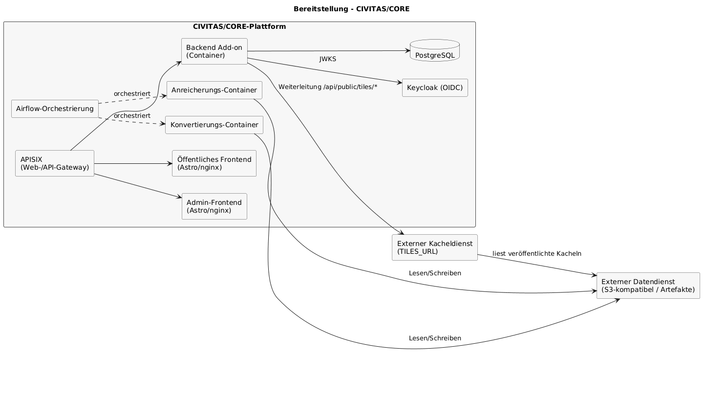

# Architektur – Deployment (CIVITAS/CORE)

## Inhaltsverzeichnis

1. [Ziel dieser Sicht](#ziel-dieser-sicht)
2. [Überblick](#ueberblick)
3. [Zugriffspfade auf den Datendienst](#zugriffspfade-auf-den-datendienst)
4. [Deployment-Diagramm](#deployment-diagramm)
5. [Annahmen](#annahmen)

## Ziel dieser Sicht

Dieses Kapitel beschreibt die **Deployment-Sicht** innerhalb von CIVITAS/CORE.
Es zeigt, welche Container beteiligt sind, wie sie zusammenspielen und welche externen Dienste
angebunden werden.

---

## Überblick

- CIVITAS/CORE orchestriert die Container (Backend Add-on, Airflow, Pipeline-Container).
- Der Web-Zugang erfolgt über APISIX als Web/API-Gateway.
- Public Frontend und Admin Frontend werden aus getrennten Repositories gebaut und als separate nginx-Container ausgeliefert; veröffentlichte Konfigurationsdaten werden davon getrennt bereitgestellt.
- Container sind für den Kubernetes-Regelbetrieb ausgelegt: Health-Checks steuern den automatischen Wiederanlauf, Logs gehen auf `stdout`/`stderr`. Das Backend stellt dafür `GET /health` bereit.
- 3D Tiles liegen hinter einem durch die Deployment-Plattform bereitgestellten externen Tiles-Dienst. Der Public Client ruft `/api/public/tiles/*` auf; das Backend leitet per Redirect auf die über `TILES_URL` konfigurierte Ziel-URL weiter.
- Stellio läuft als CIVITAS/CORE-Kontextdienst und nimmt NGSI-LD-Entities aus der Offline-Pipeline entgegen.
- Piveau wird als CIVITAS/CORE-Datenkatalog für die DCAT-AP.de-Metadaten der
  externen Basis- und Fachdaten aktiviert. Die Binärdaten verbleiben an der Quelle
  beziehungsweise im S3-kompatiblen Datendienst.
- PostgreSQL-Datenbank und Identity Provider werden als Plattformdienste innerhalb von CIVITAS/CORE angebunden.

---

## Zugriffspfade auf den Datendienst

### Intern (innerhalb UDP/CIVITAS/CORE)

- Airflow-orchestrierte Pipeline-Container (Konvertierung/Anreicherung) greifen direkt auf den Datendienst zu.
- Der Zugriff erfolgt technisch über Service-Credentials aus dem Secrets-Management und mit minimalen Rechten pro Prefix/Bucket.
- Der NGSI-LD-Exporter der Pipeline veröffentlicht intern gegen Stellio; Zugriff und Credentials werden ebenfalls über CIVITAS/CORE-Betriebsmechanismen verwaltet.
- Der externe Tiles-Dienst greift auf veröffentlichte Artefakte zu und wird nicht durch das `digital-energy-twin_addon` ausgerollt.
- Jeder Pipeline-Lauf verarbeitet einen aktualisierten LoD2-GML-Datensatz vollständig. Zusatzquellen werden konditional verarbeitet; ein `update_scope`, isolierte Teilupdates und die Wiederverwendung von Attributen aus früheren angereicherten Ergebnisdatensätzen sind nicht vorgesehen.

### Extern (außerhalb UDP/CIVITAS/CORE)

- Der Public Client startet Tile-Zugriffe ausschließlich über APISIX und die Backend-Route `/api/public/tiles/*`; dem HTTP-Redirect folgend lädt der Browser die Daten vom externen Tiles-Dienst.
- Extern wird nur Read-Zugriff auf veröffentlichte Artefakte bereitgestellt; Write-Pfade bleiben intern.

### Rolle von Keycloak

- Keycloak wird für die OIDC-basierte Authentifizierung genutzt. APISIX schützt die administrativen Routen und prüft OIDC vorgelagert. Das Backend vertraut dieser Prüfung nicht allein, sondern validiert das weitergeleitete Access Token produktiv und unabhängig per RS256 gegen die konfigurierte Keycloak-JWKS-Quelle und erzwingt Rollen und Berechtigungen selbst.
- Für direkte S3-Protokollzugriffe wird standardmäßig nicht direkt mit Keycloak-Token authentifiziert, sondern mit technischen Datendienst-Credentials.
- Optional kann Keycloak angebunden werden, wenn der Datendienst OIDC-Föderation/STS für kurzlebige Credentials unterstützt.

---

## Deployment-Diagramm

Das Diagramm zeigt die Kerncontainer und Zugriffspfade; Stellio als
NGSI-LD-Kontextdienst und Piveau als Metadatenkatalog sind ergänzend im Text
berücksichtigt.

Quelle: `raw/deployment-civitas-core.puml`

---

## Annahmen

- Der externe Datendienst entspricht dem 3D Tiles Storage.
- Airflow ist Teil von CIVITAS/CORE und orchestriert die Offline-Pipeline.
- Backend läuft als CIVITAS/CORE-fähiges Add-on in einem separaten Container.
- Stellio ist der NGSI-LD-Zieldienst innerhalb von CIVITAS/CORE; die Pipeline übergibt nur freigegebene statische Gebäude- und Potenzialattribute.
- Piveau speichert die DCAT-AP.de-Metadaten und verweist auf die
  Quelldistributionen. Stabile Katalog- und Dataset-IDs sind im
  [Datenquellenkatalog](16-data-sources-dcat-piveau.md) festgelegt.
- Die Deployment-Plattform stellt die in `TILES_URL` konfigurierte externe Tiles-URL bereit; das DEZ-Add-on enthält keinen eigenen Tiles-Gateway-Container.
- Schreibzugriffe auf den Datendienst sind auf autorisierte interne Workloads beschränkt.
- Die amtliche LoD2-Quelldistribution wird wöchentlich aktualisiert. Der
  Übernahmezyklus in den DEZ-Datendienst wird separat durch den Betreiber
  festgelegt; andere Basisdaten können unabhängige Zyklen nutzen.
- Eine DEZ-Instanz bedient genau eine Kommune; weitere Kommunen werden über getrennte Deployments angebunden.
