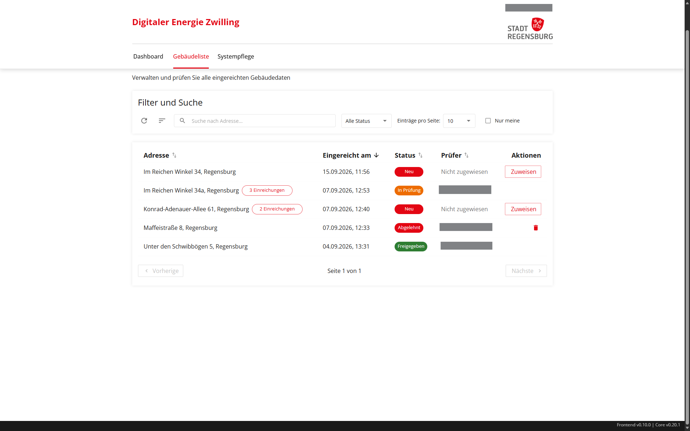
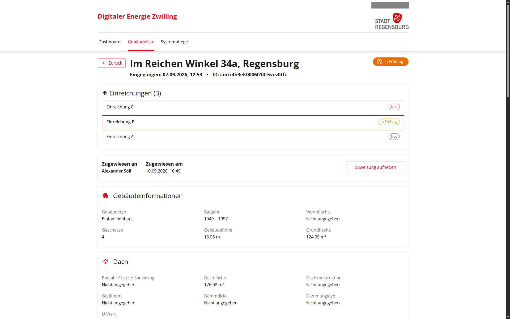
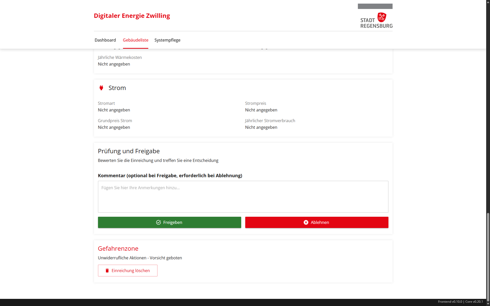
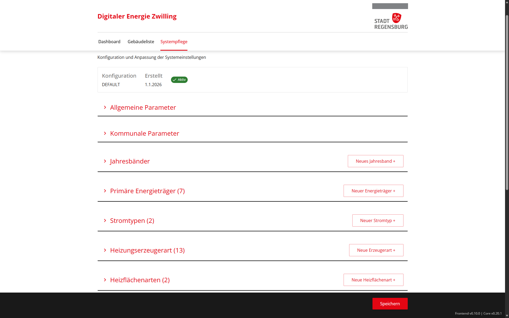
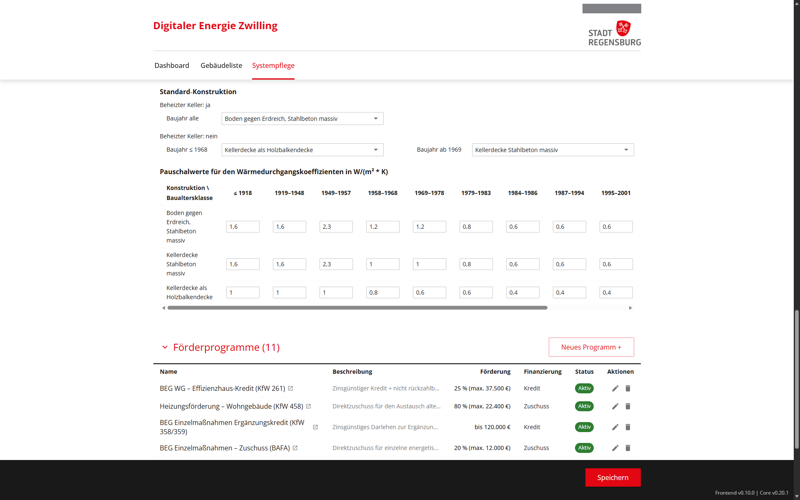
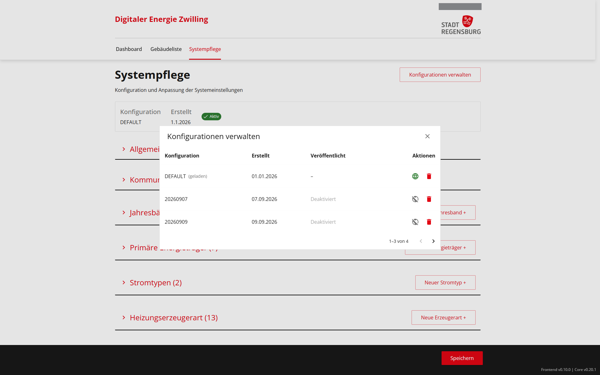

# Anwenderhandbuch für das Admin-Frontend

## 1. Zweck und Geltungsbereich

Dieses Handbuch richtet sich an die Nebenzielgruppe (Stadtverwaltung/Fachpersonal). Es beschreibt die fachliche Arbeit mit dem Admin-Frontend des Digitalen Energie Zwillings (DEZ).

Das Handbuch setzt eine betriebsbereite Plattform voraus. Installation, Deployment, Monitoring, Datensicherung und technische Fehleranalyse sind nicht Bestandteil dieses Handbuchs.

## 2. Voraussetzungen

Stellen Sie vor der Anmeldung sicher, dass:

- Sie die URL des Admin-Frontends erhalten haben,
- für Sie ein Benutzerkonto in der Regensburger CIVITAS/CORE-Keycloak-Instanz angelegt wurde,
- Ihrem Benutzerkonto mindestens eine DEZ-Client-Rolle zugewiesen wurde.

Wenden Sie sich an die technische Administration, wenn Ihnen die URL oder eine Rolle fehlt. Die technische Rollenzuweisung ist in [DEZ-Rollen in Keycloak zuweisen](02-admin-rollen-keycloak.md) beschrieben.

## 3. Rollen und Berechtigungen

Das Admin-Frontend verwendet drei Client-Rollen:

| Rolle | Bezeichnung | Sichtbare Bereiche | Aufgaben |
| --- | --- | --- | --- |
| `manager` | Verwalter | Dashboard, Gebäudeliste | Einreichungen zuweisen, prüfen, freigeben, ablehnen und löschen |
| `maintainer` | Systempfleger | Systempflege | Berechnungskonfigurationen bearbeiten, speichern, aktivieren und löschen |
| `admin` | Administrator | Dashboard, Gebäudeliste, Systempflege | Alle fachlichen und technischen Verwaltungsfunktionen des Admin-Frontends |

Weisen Sie einer Person nur die Rollen zu, die sie für ihre Aufgaben benötigt. Trennen Sie die fachliche Prüfung und die Systempflege organisatorisch, wenn unterschiedliche Personen dafür verantwortlich sind.

## 4. Anmelden und abmelden

### 4.1 Anmelden

1. Öffnen Sie die URL des Admin-Frontends.
2. Warten Sie, bis die Plattform Sie zur Anmeldeseite weiterleitet.
3. Geben Sie Ihren Benutzernamen und Ihr Passwort ein.
4. Klicken Sie auf **Anmelden**.
5. Prüfen Sie, ob die für Ihre Rolle vorgesehenen Bereiche angezeigt werden.

Wenden Sie sich an die technische Administration, wenn nach der Anmeldung kein Bereich angezeigt wird. In diesem Fall fehlt wahrscheinlich eine passende Client-Rolle.

### 4.2 Abmelden

1. Klicken Sie rechts oben auf Ihren Namen.
2. Klicken Sie im Dialog **Abmelden** auf **Abmelden**.
3. Schließen Sie den Browser, wenn Sie an einem gemeinsam genutzten Arbeitsplatz arbeiten.

Klicken Sie auf **Abbrechen**, um angemeldet zu bleiben.

## 5. Grundbereiche

Die Navigation zeigt nur Bereiche an, für die Sie berechtigt sind.

### 5.1 Dashboard

Das Dashboard zeigt eine Zusammenfassung der Einreichungen. Die Karte zeigt die Standorte der eingereichten Gebäudedaten.

Die Kennzahl **Alle Einreichungen** zählt Einreichungen und nicht Gebäude. Für ein Gebäude können mehrere Einreichungen vorliegen.

Klicken Sie auf eine Statuskarte, um die Gebäudeliste mit dem passenden Statusfilter zu öffnen. Klicken Sie auf einen Eintrag oder Kartenpunkt, um die Detailansicht zu öffnen.

### 5.2 Gebäudeliste

Die Gebäudeliste gruppiert Einreichungen nach Gebäude. Ein Hinweis wie **3 Einreichungen** zeigt an, dass mehrere Einreichungen zu derselben Gebäude-ID vorliegen.

### 5.3 Systempflege

Die Systempflege enthält die versionierten Berechnungskonfigurationen. Änderungen können die Berechnung im öffentlichen Sanierungstool beeinflussen. Prüfen Sie alle Werte fachlich, bevor Sie eine neue Konfiguration aktivieren.

## 6. Einreichungen verwalten

Dieser Bereich ist für `manager` und `admin` sichtbar. Verwenden Sie ihn, um Einreichungen zu suchen, zu prüfen und abschließend zu bearbeiten.

### 6.1 Status von Einreichungen

| Status | Bedeutung | Zulässige nächste Aktion |
| --- | --- | --- |
| **Neu** | Die Einreichung wurde noch nicht übernommen. | Weisen Sie die Einreichung einer Prüfperson zu. |
| **In Prüfung** | Eine Prüfperson bearbeitet die Einreichung. | Geben Sie die Einreichung frei, lehnen Sie sie ab oder heben Sie die Zuweisung auf. |
| **Freigegeben** | Die Einreichung ist die aktuell freigegebene Einreichung des Gebäudes. | Prüfen Sie das Audit-Protokoll. |
| **Abgelehnt** | Die Einreichung wurde fachlich verworfen. | Prüfen Sie das Audit-Protokoll oder löschen Sie die Einreichung. |
| **Ersetzt** | Eine neuere Einreichung desselben Gebäudes wurde freigegeben. | Öffnen Sie die aktuell freigegebene Einreichung oder prüfen Sie das Audit-Protokoll. |

Pro Gebäude besitzt höchstens eine Einreichung den Status **Freigegeben**. **Abgelehnt** und **Ersetzt** sind fachliche Endstatus. Eine physische Löschung ist kein Status.

### 6.2 Einreichungen finden und anzeigen

*Abbildung 1: Gebäudeliste mit Filter-, Such- und Zuweisungsfunktionen.*

#### 6.2.1 Nach einer Adresse suchen

1. Öffnen Sie **Gebäudeliste**.
2. Geben Sie einen Teil der Adresse in **Suche nach Adresse...** ein.
3. Wählen Sie bei Bedarf einen Status aus.
4. Aktivieren Sie **Nur meine**, um ausschließlich Ihre zugewiesenen Einreichungen anzuzeigen.

Klicken Sie auf das Aktualisierungssymbol, um die Daten erneut zu laden. Klicken Sie auf das Symbol **Sortierung zurücksetzen**, um zur Standardsortierung zurückzukehren.

#### 6.2.2 Sortieren und Anzahl der Einträge ändern

Klicken Sie auf die Spaltenüberschrift **Adresse**, **Eingereicht am**, **Status** oder **Prüfer**, um danach zu sortieren. Klicken Sie erneut auf dieselbe Überschrift, um die Sortierreihenfolge umzukehren.

Wählen Sie unter **Einträge pro Seite** die gewünschte Anzahl aus. Zur Auswahl stehen 5, 10, 15, 20, 25, 35, 50 und 100 Einträge.

#### 6.2.3 Einreichung öffnen

1. Klicken Sie auf die gewünschte Tabellenzeile.
2. Prüfen Sie Adresse, Eingangszeitpunkt, Status und Einreichungs-ID.
3. Prüfen Sie bei mehreren Einreichungen den Bereich **Einreichungen**.
4. Klicken Sie dort auf eine Einreichung, um zwischen den Einreichungen desselben Gebäudes zu wechseln.

*Abbildung 2: Detailansicht einer Gebäudegruppe mit drei Einreichungen.*

### 6.3 Einreichung übernehmen und zurückgeben

#### 6.3.1 Einreichung übernehmen

1. Öffnen Sie eine Einreichung mit dem Status **Neu**.
2. Klicken Sie auf **Mir zuweisen**.
3. Prüfen Sie die Bestätigung **Datensatz zugewiesen. Status: In Prüfung**.

Alternativ klicken Sie in der Gebäudeliste bei einer neuen Einreichung auf **Zuweisen**.

#### 6.3.2 Zuweisung aufheben

1. Öffnen Sie eine Ihnen zugewiesene Einreichung mit dem Status **In Prüfung**.
2. Klicken Sie auf **Zuweisung aufheben**.
3. Prüfen Sie die Bestätigung **Zuweisung aufgehoben**.

Das System setzt die Einreichung wieder auf **Neu**. Nicht gespeicherte Kommentare werden verworfen.

### 6.4 Einreichung fachlich prüfen

1. Übernehmen Sie die Einreichung.
2. Prüfen Sie die angezeigten Gebäude-, Bauteil-, Heizungs-, Verbrauchs- und Vorsanierungsdaten.
3. Wechseln Sie bei mehreren Einreichungen zwischen den Einträgen der Gebäudegruppe.
4. Geben Sie einen kurzen, nachvollziehbaren Prüfkommentar ein.
5. Entscheiden Sie, ob Sie die Einreichung freigeben oder ablehnen.

Der Prüfkommentar ist bei einer Freigabe optional und bei einer Ablehnung erforderlich. Das System speichert den Kommentar im Audit-Protokoll.

*Abbildung 3: Kommentarfeld und Aktionen zum Freigeben, Ablehnen und Löschen einer Einreichung.*

### 6.5 Einreichung freigeben

#### 6.5.1 Erste Einreichung eines Gebäudes freigeben

1. Öffnen Sie die Ihnen zugewiesene Einreichung mit dem Status **In Prüfung**.
2. Geben Sie bei Bedarf einen Prüfkommentar ein.
3. Klicken Sie auf **Freigeben**.
4. Prüfen Sie die Erfolgsmeldung.

Das System setzt weitere offene Einreichungen desselben Gebäudes automatisch auf **Abgelehnt**. Bereits abgelehnte oder ersetzte Einreichungen bleiben unverändert.

#### 6.5.2 Spätere Einreichung freigeben

Eine spätere Einreichung kann auch dann geprüft werden, wenn für das Gebäude bereits eine Freigabe besteht. Die bestehende Freigabe bleibt während der Prüfung gültig.

1. Öffnen Sie die spätere Einreichung mit dem Status **In Prüfung**.
2. Geben Sie bei Bedarf einen Prüfkommentar ein.
3. Klicken Sie auf **Freigeben**.
4. Lesen Sie den Dialog **Bestehende Freigabe ersetzen?**.
5. Klicken Sie auf **Aktuell freigegebene Einreichung öffnen**, um die bestehende Freigabe in einem neuen Browserfenster beziehungsweise Browser-Tab zu prüfen. Der Dialog bleibt geöffnet.
6. Kehren Sie zum Dialog zurück.
7. Klicken Sie auf **Abbrechen**, um keine Änderung vorzunehmen. Klicken Sie auf **Freigeben und ersetzen**, um den Statuswechsel zu bestätigen.

Nach der Bestätigung führt das System alle Änderungen gemeinsam aus:

- Die neue Einreichung erhält den Status **Freigegeben**.
- Die bisherige Freigabe erhält den Status **Ersetzt**.
- Weitere offene Einreichungen desselben Gebäudes erhalten den Status **Abgelehnt**.
- Das Audit-Protokoll dokumentiert alle Statuswechsel und die auslösende Einreichung.

Prüfen Sie die Meldung **Einreichung freigegeben. Die bisherige Freigabe wurde auf ‚Ersetzt‘ gesetzt.** Bei einem Fehler bestätigt das System keine Freigabe.

### 6.6 Einreichung ablehnen

1. Öffnen Sie die Ihnen zugewiesene Einreichung mit dem Status **In Prüfung**.
2. Geben Sie im Kommentarfeld den Ablehnungsgrund ein.
3. Klicken Sie auf **Ablehnen**.
4. Prüfen Sie die Bestätigung **Datensatz abgelehnt**.

Lehnen Sie eine spätere Einreichung ab, bleibt eine bereits vorhandene Freigabe unverändert.

### 6.7 Audit-Protokoll prüfen

Das Audit-Protokoll erscheint bei Einreichungen mit einem fachlichen Endstatus.

Prüfen Sie für jeden Eintrag:

- den vorherigen und den neuen Status,
- Datum und Uhrzeit,
- die verantwortliche Person,
- den Prüfkommentar und
- den Link zur auslösenden Einreichung bei einem automatischen Statuswechsel.

Klicken Sie auf **Zugehörige Einreichung öffnen**, um diese in einem neuen Browserfenster beziehungsweise Browser-Tab anzuzeigen.

### 6.8 Einreichungen löschen

Eine Ablehnung erhält die Einreichung und ihre Historie. Eine Löschung entfernt die Daten dauerhaft. Führen Sie Löschungen nur aus, wenn die fachlichen und organisatorischen Voraussetzungen erfüllt sind.

#### 6.8.1 Einzelne Einreichung löschen

1. Öffnen Sie die Einreichung.
2. Wechseln Sie zur **Gefahrenzone**.
3. Klicken Sie auf **Einreichung löschen**.
4. Prüfen Sie die angezeigte Einreichung.
5. Klicken Sie auf **Löschen**, um den Vorgang zu bestätigen. Klicken Sie auf **Abbrechen**, um die Einreichung zu behalten.

In der Gebäudeliste können Sie eine abgelehnte Einreichung auch über das Löschsymbol entfernen.

#### 6.8.2 Alle Einreichungen eines Gebäudes löschen

Die gebündelte Löschung ist nur verfügbar, wenn alle Einreichungen des Gebäudes den Status **Abgelehnt** besitzen. Eine ersetzte oder freigegebene Einreichung verhindert die gebündelte Löschung.

1. Öffnen Sie eine abgelehnte Einreichung der Gebäudegruppe.
2. Prüfen Sie, ob alle Einreichungen im Bereich **Einreichungen** den Status **Abgelehnt** besitzen.
3. Klicken Sie in der **Gefahrenzone** auf **Alle [Anzahl] Einreichungen dieses Gebäudes löschen**.
4. Klicken Sie auf **Löschen**, um alle Einreichungen dauerhaft zu entfernen.

Das Backend prüft die Status unmittelbar vor der Löschung erneut. Ändert sich zwischenzeitlich ein Status, bricht das System die gesamte Löschung ohne Teillöschung ab.

## 7. Berechnungskonfigurationen verwalten

Dieser Bereich ist für `maintainer` und `admin` sichtbar.

*Abbildung 4: Übersicht der Systempflege und der bearbeitbaren Parameterbereiche.*

### 7.1 Konfiguration bearbeiten und speichern

1. Öffnen Sie **Systempflege**.
2. Prüfen Sie den Namen und den Status der geladenen Konfiguration.
3. Öffnen Sie den gewünschten Abschnitt.
4. Bearbeiten Sie ausschließlich fachlich abgestimmte Werte.
5. Beheben Sie alle angezeigten Validierungsfehler.
6. Klicken Sie auf **Speichern**.
7. Geben Sie unter **Dateiname** einen eindeutigen Versionsnamen ein.
8. Aktivieren Sie **Nach dem Speichern automatisch aktivieren**, wenn die neue Version sofort verwendet werden soll.
9. Klicken Sie auf **Speichern**, um den Vorgang zu bestätigen.

Die Systempflege enthält unter anderem allgemeine Parameter, kommunale Parameter, Baualtersklassen, Primärenergieträger, Stromarten, Heizungsarten, Wärmeabgabesysteme, Energieeffizienzklassen, Bauteilparameter und Förderprogramme.

*Abbildung 5: Bearbeitung von Konfigurationswerten und Förderprogrammen.*

Das Speichern erzeugt eine versionierte Konfiguration. Ohne die Auswahl **Nach dem Speichern automatisch aktivieren** bleibt die bisher aktive Version gültig.

### 7.2 Konfiguration laden

*Abbildung 6: Dialog zum Laden, Aktivieren und Löschen vorhandener Konfigurationen.*

1. Klicken Sie auf **Konfigurationen verwalten**.
2. Suchen Sie die gewünschte Version.
3. Klicken Sie auf die Version, um sie zur Bearbeitung zu laden.
4. Schließen Sie den Dialog.

### 7.3 Konfiguration aktivieren

1. Klicken Sie auf **Konfigurationen verwalten**.
2. Prüfen Sie Versionsname und Veröffentlichungsdatum.
3. Klicken Sie bei der gewünschten Version auf **Aktivieren**.
4. Prüfen Sie, ob die Version anschließend als **Aktiv** gekennzeichnet ist.

Aktivieren Sie eine Konfiguration erst nach der fachlichen Prüfung. Das öffentliche Sanierungstool verwendet die aktive Version für neue Berechnungen.

### 7.4 Konfiguration löschen

1. Klicken Sie auf **Konfigurationen verwalten**.
2. Klicken Sie bei der nicht mehr benötigten Version auf **Löschen**.
3. Bestätigen Sie die Löschung.

Die aktive Konfiguration kann nicht gelöscht werden. Aktivieren Sie zuerst eine andere Version. Die systemseitige Standardkonfiguration kann ebenfalls nicht gelöscht werden.

## 8. Meldungen und Reaktionen

| Meldung oder Situation | Reaktion |
| --- | --- |
| Anmeldung bricht wiederholt ab | Prüfen Sie, ob Ihr Browser die für die Anmeldung erforderlichen Sitzungscookies blockiert. Wenden Sie sich an die technische Administration, wenn das Problem weiterhin besteht. |
| **Zuweisung fehlgeschlagen** | Laden Sie die Seite neu. Prüfen Sie, ob eine andere Person die Einreichung bereits übernommen hat. |
| **Ein Kommentar ist bei Ablehnung erforderlich** | Geben Sie einen nachvollziehbaren Ablehnungsgrund ein und klicken Sie erneut auf **Ablehnen**. |
| **Freigabe fehlgeschlagen** | Laden Sie die Einreichung neu. Prüfen Sie deren Status und versuchen Sie den Vorgang erneut. |
| **Löschen fehlgeschlagen** | Prüfen Sie Ihre Rolle und den aktuellen Status. Versuchen Sie keine gebündelte Löschung, solange nicht alle Einreichungen abgelehnt sind. |
| Daten können nicht geladen werden | Laden Sie die Seite neu. Melden Sie eine weiterhin bestehende Störung an den technischen Betrieb. |
| Erwarteter Bereich fehlt | Lassen Sie die zugewiesene DEZ-Client-Rolle durch die technische Administration prüfen. |
