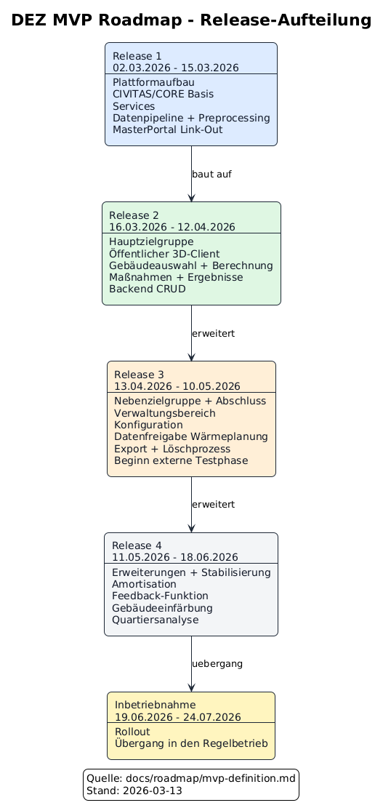

# MVP-Definition und Release-Aufteilung

Dieses Dokument definiert den geplanten MVP-Umfang, dessen Aufteilung in vier Releases sowie die anschließende Inbetriebnahmephase.

---

## Inhaltsverzeichnis

1. [Zielbild MVP](#zielbild-mvp)
2. [Roadmap-Diagramm (PlantUML)](#roadmap-diagramm-plantuml)
3. [Roadmap-Pflege und Änderungsverlauf](#roadmap-pflege-und-aenderungsverlauf)
4. [Release 1 - Plattformaufbau](#release-1-plattformaufbau)
5. [Release 2 - Hauptzielgruppe (Bürger/Eigentümer/Vermieter): Öffentlicher Client + Backend-CRUD](#release-2)
6. [Release 3 - Nebenzielgruppe (Stadtverwaltung/Fachpersonal): Verwaltungsbereich + Datenfreigabe und Wärmeplanung + Beginn externe Testphase](#release-3)
7. [Release 4 - Erweiterungen und Stabilisierung](#release-4)
8. [Inbetriebnahme](#inbetriebnahme)

## Zielbild MVP

Der MVP wird in vier aufeinander aufbauenden Releases umgesetzt und durch eine anschließende Inbetriebnahmephase abgeschlossen:

1. **Release 1 (02.03.2026 bis 15.03.2026):** Plattformaufbau (CIVITAS/CORE + Services + Datenpipeline)
2. **Release 2 (16.03.2026 bis 12.04.2026):** Öffentlicher Client + Bürgerfunktionen + Backend-CRUD
3. **Release 3 (13.04.2026 bis 10.05.2026):** Verwaltungsbereich + Datenfreigabe/Wärmeplanung + Beginn der Testphase mit externen Testern
4. **Release 4 (11.05.2026 bis 18.06.2026):** Erweiterungen und Stabilisierung
5. **Inbetriebnahme (19.06.2026 bis 24.07.2026):** Rollout- und Übergangsphase in den Regelbetrieb

---

## Roadmap-Diagramm (PlantUML)

Quelle: `raw/mvp-roadmap.puml`

---

## Roadmap-Pflege und Änderungsverlauf

- Bei jedem Sprintwechsel wird die Roadmap geprüft.
- Eine Anpassung der Roadmap erfolgt bei Bedarf (optional), wenn sich Prioritäten, Abhängigkeiten oder Umsetzungsrisiken geändert haben.
- Jede Änderung wird als Verlaufseintrag dokumentiert, damit Entscheidungen und Planänderungen nachvollziehbar bleiben.

---

## Release 1 - Plattformaufbau

**Entwicklungszeitraum:** 02.03.2026 bis 15.03.2026

Ziel: Technische Basis in CIVITAS/CORE bereitstellen und Datenverfügbarkeit für den weiteren Ausbau schaffen.

Umfang:

- Anbindung und Aufbau aller für den Betrieb notwendigen Komponenten in der CIVITAS/CORE-Plattform.
- Aufbau der benötigten Services für den Plattformbetrieb.
- Umsetzung der Datenpipeline zur Anreicherung der 3D-Tiles.
- Vorgelagertes Verschneiden/Preprocessing, damit ein vollständiger Datensatz offline verfügbar ist.
- Verortung des MasterPortal-Link-Outs auf die DEZ-Plattform.

Ergebnis:

- Betriebsfähige Plattformgrundlage für die folgenden Releases.
- Angereicherter, offline verfügbarer 3D-Tile-Datensatz als Datenbasis.

---

## Release 2 - Hauptzielgruppe (Bürger/Eigentümer/Vermieter): Öffentlicher Client + Backend-CRUD

**Entwicklungszeitraum:** 16.03.2026 bis 12.04.2026

Ziel: Primärfunktionen für die Hauptzielgruppe bereitstellen und den ersten nutzbaren End-to-End-Flow ermöglichen.

Umfang öffentlicher Client:

- 3D-Kartenansicht.
- Auswahl eines Gebäudes über 3D-Ansicht und/oder Adresseingabe.
- Darstellung des Ist-Zustands inklusive Berechnung und Plausibilitätscheck.
- Basisimplementierung der Sanierungsempfehlung, inklusive Auswahl von Maßnahmen.
- Ergebnisanzeige inklusive Vergleich innerhalb der Stadt Regensburg.
- Erste Implementierung von Fördermöglichkeiten.
- Footer-Bereich: Impressum, Datenschutz, Cookie-Consent.

Umfang Backend:

- Backend-Implementierung inklusive CRUD-Funktionalitäten für die MVP-relevanten Datenflüsse.

Ergebnis:

- Erstes nutzbares Bürgerangebot.

---

## Release 3 - Nebenzielgruppe (Stadtverwaltung/Fachpersonal): Verwaltungsbereich + Datenfreigabe und Wärmeplanung + Beginn externe Testphase

**Entwicklungszeitraum:** 13.04.2026 bis 10.05.2026

Ziel: Primärfunktionen für die Nebenzielgruppe bereitstellen; zusätzlich die für Datenfreigabe und Wärmeplanung sowie Abschluss des MVP erforderlichen Querschnittsfunktionen umsetzen.

Umfang:

- Technische Bereitstellung des Exports als PDF/JSON für den öffentlichen Client (Bürgerbereich).
- Datenfreigabe durch Nutzer und Bereitstellung der freigegebenen Eingabedaten für die Wärmeplanung über die CIVITAS/CORE-Plattform.
- Löschprozess über Export-Referenz (z. B. Link/QR) inklusive Zwei-Faktor-Verfahren.
- Umsetzung des Verwaltungsbereichs.
- Konfiguration der Berechnungsparameter.
- Konfiguration der Sanierungsmaßnahmen.
- Dedizierte Abfrage- und Darstellungslogik für Wärmeplanungsdaten.
- Prüfung und Freigabe von Eingabedaten durch Stadtverwaltung / Fachpersonal.
- Beginn der Testphase mit externen Testern.

Ergebnis:

- Administrierbarer MVP mit steuerbarer Berechnungslogik, bereitgestellten Abschlussfunktionen für den Bürgerbereich (Export und Löschung) sowie umgesetzter Datenfreigabe und Wärmeplanung.

---

## Release 4 - Erweiterungen und Stabilisierung

**Entwicklungszeitraum:** 11.05.2026 bis 18.06.2026

Folgende Themen werden in der verbleibenden Entwicklungsdauer umgesetzt:

- Darstellung der Amortisation.
- Implementierung der Feedback-Funktion.
- Einfärben von Gebäuden in der 3D-Ansicht.
- Quartiersanalyse (Vergleich mit Gebiet/Stadt).

---

## Inbetriebnahme

**Zeitraum:** 19.06.2026 bis 24.07.2026

In dieser Phase erfolgt die Inbetriebnahme einschließlich Rollout und Übergang in den Regelbetrieb.
