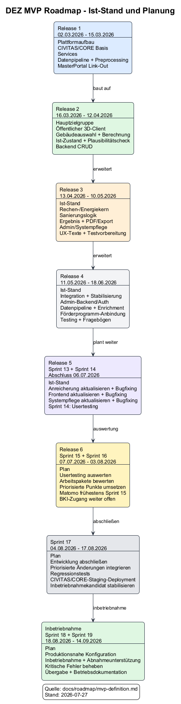

# MVP-Definition und Release-Aufteilung

Dieses Dokument beschreibt den tatsächlichen Umsetzungsstand des MVP und dient als Planungsdokument für die ohne Unterbrechung fortgeführte Entwicklung, das Bugfixing und die Inbetriebnahme bis voraussichtlich 21. September 2026.

Letzte Änderung: **2026-09-02** (siehe [Roadmap-Pflege und Änderungsverlauf](#roadmap-pflege-und-aenderungsverlauf))

---

## Inhaltsverzeichnis

1. [Zielbild MVP](#zielbild-mvp)
2. [Roadmap-Diagramm (PlantUML)](#roadmap-diagramm-plantuml)
3. [Roadmap-Pflege und Änderungsverlauf](#roadmap-pflege-und-aenderungsverlauf)
4. [Zentrales Register optionaler Komponenten](#zentrales-register-optionaler-komponenten)
5. [Release 1 - Plattformaufbau](#release-1-plattformaufbau)
6. [Release 2 - Hauptzielgruppe (Bürger/Eigentümer/Vermieter): Öffentlicher Client + Backend-CRUD](#release-2)
7. [Release 3 - Umsetzung Bürger-Abschlussfunktionen, Rechenkern und Verwaltungsbereich](#release-3)
8. [Release 4 - Integration, Stabilisierung, Datenpipeline und Testvorbereitung](#release-4)
9. [Release 5 - Aktualisierung, Bugfixing und Usertesting](#release-5)
10. [Release 6 - Fortführung der Entwicklung und Stabilisierung](#release-6)
11. [Release 7 - Usertesting-Auswertung, Arbeitspaketbearbeitung und Staging-Deployment](#release-7)
12. [Entwicklung, Bugfixing und Inbetriebnahme - Sprint 18 und Sprint 19](#inbetriebnahme)

## Zielbild MVP

Der MVP wird in aufeinander aufbauenden Releases umgesetzt. Bis einschließlich Release 6 bilden jeweils zwei aufeinanderfolgende Entwicklungssprints semantisch einen Release. Release 7 besteht als Ausnahme aus Sprint 17. Entgegen der ursprünglichen Planung wird die Entwicklung in Sprint 18 fortgeführt; Sprint 19 dient dem Bugfixing und der aufgrund laufender Plattform-Updates zeitlich verdichteten Inbetriebnahme. Sprint 19 wird tendenziell um eine Woche bis voraussichtlich 21. September 2026 verlängert. Diese zeitliche Verlängerung erweitert den geplanten Inhalt nicht.

1. **Release 1 (02.03.2026 bis 15.03.2026):** Plattformaufbau (CIVITAS/CORE + Services + Datenpipeline)
2. **Release 2 (16.03.2026 bis 12.04.2026):** Öffentlicher Client + Bürgerfunktionen + Backend-CRUD
3. **Release 3 (13.04.2026 bis 10.05.2026):** Bürger-Abschlussfunktionen, Rechenkern, Sanierungslogik, Export, Verwaltungsbereich und Testvorbereitung
4. **Release 4 (11.05.2026 bis 18.06.2026):** Integration, Stabilisierung, Backend-/Admin-Anbindung, Datenpipeline, Förderprogramm-Anbindung und Testvorbereitung
5. **Release 5 (Sprint 13 und Sprint 14, Abschluss am 06.07.2026):** Aktualisierung und Bugfixing der Anreicherung, des Bürger-Frontends und der Systempflege; Schwerpunkt von Sprint 14 war zusätzlich die Durchführung des Usertestings
6. **Release 6 (Sprint 15 und Sprint 16, 07.07.2026 bis 03.08.2026):** Fortführung der Entwicklung, Stabilisierung und Vorbereitung des abschließenden Entwicklungsrelease; Matomo wurde wegen fehlender Kundeninstanz und niedriger Priorität nicht umgesetzt
7. **Release 7 (Sprint 17, 04.08.2026 bis 17.08.2026):** Auswertung des Usertestings, fachliche und technische Bewertung sowie Bearbeitung der daraus abgeleiteten Arbeitspakete, Stabilisierung und Deployment einer Version in der CIVITAS/CORE-Staging-Umgebung der Stadt Regensburg
8. **Sprint 18 und Sprint 19 (18.08.2026 bis voraussichtlich 21.09.2026):** Fortführung der Entwicklung in Sprint 18, Bugfixing in Sprint 19 sowie die aufgrund laufender Plattform-Updates in Sprint 19 verdichtete Inbetriebnahme einschließlich Abnahmeunterstützung und Übergabe; die tendenzielle Verlängerung von Sprint 19 um eine Woche ist rein zeitlich und erweitert den Inhalt nicht

Die Kalenderdaten ab Sprint 15 sind Planungsdaten. Die Priorisierung der aus dem Usertesting abgeleiteten Arbeitspakete liegt mit Stand 12.08.2026 vor. Der tatsächlich umsetzbare Umfang hängt weiterhin vom geklärten Status der einzelnen Pakete, von erforderlichen Daten, Inhalten und fachlichen Freigaben sowie von der verfügbaren Sprintkapazität ab.

---

## Roadmap-Diagramm (PlantUML)

Quelle: `raw/mvp-roadmap.puml`

---

## Roadmap-Pflege und Änderungsverlauf

- Bei jedem Sprintwechsel wird die Roadmap geprüft.
- Eine Anpassung der Roadmap erfolgt bei Bedarf (optional), wenn sich Prioritäten, Abhängigkeiten oder Umsetzungsrisiken geändert haben.
- Jede Änderung wird als Verlaufseintrag dokumentiert, damit Entscheidungen und Planänderungen nachvollziehbar bleiben.

### Dokumentationsregel

- Jede Änderung wird mit Datum dokumentiert.
- Der bisherige und der neue Stand müssen je Änderung explizit gegenübergestellt werden.
- Für die aktuelle Terminplanung ist der hier dokumentierte Roadmap-Stand maßgeblich.
- Wenn eine Änderung mehrere Einzelanforderungen oder Teilfunktionen betrifft, ist die inhaltliche Release-Beschreibung dieser Roadmap für den aktuellen Planungsstand maßgeblich.

### Änderungsverlauf

| Datum | Betroffener Umfang | Bisheriger Stand | Neuer Stand |
| --- | --- | --- | --- |
| 2026-09-02 | Sprint 18/19 und Inbetriebnahme | Sprint 18 und Sprint 19 waren vollständig für Inbetriebnahme, Abnahmeunterstützung und kritische Korrekturen bis 14.09.2026 vorgesehen | Sprint 18 wird noch für Entwicklung und Sprint 19 für Bugfixing genutzt. Aufgrund der laufenden Plattform-Updates verdichtet sich die Inbetriebnahme auf Sprint 19. Sprint 19 wird tendenziell bis 21.09.2026 verlängert; die zusätzliche Woche erweitert nur den Zeitraum, nicht den geplanten Inhalt |
| 2026-09-01 | TA-74/TA-75 - Rechenmethoden und Nachweise | Die verwendeten Formeln, externen Katalogwerte und Fundstellen waren nicht in einem einheitlichen, versionsgebundenen Nachweis zusammengeführt | Der implementierte Rechenumfang ist mit Core v0.19.0, konkreten Formeln, Codepfaden, Seiten-, Tabellen- und Zeilenbezügen dokumentiert; TA-75 und TA-74 sind insoweit abgeschlossen. Nur der nicht implementierte Teilumfang Sanierungsinvestitionen/Amortisation bleibt wegen des fehlenden BKI-Datenzugangs blockiert |
| 2026-08-27 | AP-20 – PDF-Bericht und Web/PDF-Konsistenz | Der abgestimmte PDF-Umfang war umgesetzt; die finale Synchronisation und Prüfung der Inhalte zwischen Webanwendung und PDF-Bericht war noch offen | Die Web-/PDF-Synchronisation und abschließende Prüfung sind abgeschlossen; AP-20 ist vollständig erledigt und der Restaufwand beträgt 0 Tage |
| 2026-08-27 | AP-12 – Bedienung und Darstellung der Maßnahmen | Ausgewählte Maßnahmen auf der Ergebnisseite waren noch umzusetzen; fixierte Tabellenüberschriften waren wegen der technischen Kollision mit dem Sticky der Live-Ergebnisse abgegrenzt | Die Ergebnisdarstellung ist umgesetzt und AP-12 vollständig erledigt. Nach ausdrücklicher Abstimmung mit dem Auftraggeber werden die Tabellenüberschriften nicht sichtbar gehalten beziehungsweise sticky gesetzt; dies ist eine bestätigte Scope-Entscheidung. Der Restaufwand beträgt 0 Tage |
| 2026-08-27 | AP-18 – Ergebnisabschluss, Bericht und Energieberatung | Als einziger offener Punkt war die über AP-12 umzusetzende Maßnahmenzusammenfassung auf der Ergebnisseite ausgewiesen | Mit dem Abschluss von AP-12 ist auch dieser abhängige Punkt umgesetzt; AP-18 ist vollständig erledigt und der Restaufwand beträgt 0 Tage |
| 2026-08-27 | AP-11 – Empfehlungs- und Maßnahmenlogik | Die Empfehlungslogik war umgesetzt; die finale Validierung der Maßnahmeneffekte und Effizienzsprünge anhand der Referenzfälle war noch offen | Die finale Validierung ist abgeschlossen; AP-11 ist vollständig erledigt und der Restaufwand beträgt 0 Tage |
| 2026-08-27 | AP-10 – Energiepreise, Einheiten und Preisannahmen | Alternative Einheiten und Zeiträume, interne Normalisierung, Preis-Metadaten und aktualisierte Defaultpreise waren als offener Umfang geführt | Offen bleiben die Festlegung und Ausweisung von Quelle und Stichtag der Energiepreise sowie der Wechsel von Einheiten und Zeiträumen; der Restaufwand bleibt unverändert bei 1,5 Tagen |
| 2026-08-27 | AP-08 – Bauteil- und Anlagenvisualisierungen | Die Umsetzung war begonnen; für Asset-Erstellung und Frontend-Integration waren noch 1,5 Tage angesetzt | Die abgestimmten Grafiken sind erstellt. Offen bleibt die Finalisierung der zugehörigen Kurztexte; der Restaufwand beträgt 0,5 Tage |
| 2026-08-27 | AP-05 – Prozessnavigation und Walkthrough | Prozess- und Abschnittsnavigation sowie durchgängige Hinweisvorlagen waren umgesetzt; kurze Beschriftungen und die Bestätigung der globalen Hinweisseite als Ersatz für einen separaten Walkthrough waren noch offen | Die kurzen Beschriftungen sind abgeschlossen und die globale Hinweisseite ersetzt den separaten Walkthrough; AP-05 ist vollständig erledigt und der Restaufwand beträgt 0 Tage |
| 2026-08-27 | AP-02 – Landingpage und Einstieg | Bearbeitungsdauer und wechselnde Einstiegsfragen waren umgesetzt; die abgestimmten Textanpassungen der Landingpage waren noch offen | Die Textanpassungen sind umgesetzt; AP-02 ist vollständig erledigt und der Restaufwand beträgt 0 Tage |
| 2026-08-27 | AP-01 – Datenquellen, Annahmen und Modellgrenzen | Die globale Hinweisseite war umgesetzt; die Verlinkung aus dem generierten PDF-Report sowie die Finalisierung und Freigabe der Platzhaltertexte waren offen | Die Hinweisseite ist aus dem generierten PDF-Report verlinkt. Offen bleiben die Finalisierung und Freigabe der ausdrücklich markierten Platzhaltertexte sowie die abschließende Prüfung; der Restaufwand beträgt 0,5 Tage |
| 2026-08-17 | AP-09 – Bauteil-, Fenster- und Anlagenkataloge | Die Vermeidung unwirtschaftlicher Sanierungsempfehlungen für bereits gute Bestandsfenster sowie die Klärung von Defaultwerten und Lüftungsart waren offen | Der aktuelle Code-Stand deckt die überarbeiteten Empfehlungen für Bestandsfenster ab; zur Lüftungsart besteht kein Klärungsbedarf. Offen bleibt ausschließlich die fachliche Rückmeldung zu den Defaultwerten, beispielsweise von REWAG; für deren anschließende Anpassung beträgt der Restaufwand nahezu 0 Tage |
| 2026-08-17 | AP-03 – Energetische Ersteinschätzung | Der Hinweis, dass die Baujahreinordnung nur ohne zwischenzeitliche umfangreiche Sanierung gilt, war noch offen | Der Hinweis ist ergänzt; AP-03 ist vollständig erledigt und der Restaufwand beträgt 0 Tage |
| 2026-08-14 | Matomo | Es wurde von einer vorhandenen, zugänglichen Kundeninstanz und einer möglichen Umsetzung ab Sprint 15 ausgegangen | Eine eigene Instanz muss aufgesetzt und betrieblich abgestimmt werden; Matomo ist niedrig priorisiert und für Sprint 18/19 nicht verbindlich eingeplant |
| 2026-08-14 | White-Labeling und Open Source | Anforderungen waren früheren Releases zugeordnet | Umsetzung in Sprint 18 vorgesehen; TA-90 ist auf `LGPL-3.0-or-later` festgelegt |
| 2026-08-14 | Datenpipeline | Geothermieintegration lief; Solar und produktive NGSI-LD-Übergabe waren teilweise als verfügbar beschrieben | Geothermie wurde nach Datenfreigabe in Sprint 17 technisch integriert. Für Solar liegt die Datenfreigabe vor, der Detailgrad ist aber offen; die ursprüngliche LB-Tiefe wurde von AG/AN als zu hoch bewertet und der reduzierte AN-Vorschlag vom AG nicht angenommen. NGSI-LD ist vorbereitet, die Kundenschnittstelle aber ungeklärt |
| 2026-08-14 | Feedback, Tiles, API-Clients und Rechenkernabnahme | Zielsysteme, Zugriffspfad, Clientkonventionen und Abnahmetermin waren nicht einheitlich dokumentiert | Feedback-Zielsystem und API-Client-Konventionen bleiben in Klärung; Tiles laufen produktiv über `/api/public/tiles/*`; Rechenkernabnahme ist für Sprint 19 terminiert |
| 2026-08-14 | Datenspende, Export und Löschung | Einreichung wurde teilweise als anonym bezeichnet; PDF und JSON waren inhaltlich nicht klar abgegrenzt; zusätzliches Lösch-Abgleichsmerkmal war offen | Notwendige Gebäudeadresse und Koordinaten werden transparent benannt; JSON ist bewusst auf den Einreichungsumfang reduziert; Löschung erfolgt über zufälligen PDF-Link und Bestätigungsdialog ohne Adressabgleich |
| 2026-08-13 | Release-Zuordnung der Usertesting-Arbeitspakete | Auswertung, Bewertung und Bearbeitung der Arbeitspakete waren Release 6 beziehungsweise teilweise nur Sprint 17 zugeordnet | Auswertung, Bewertung und Bearbeitung der Arbeitspakete werden vollständig Release 7 zugeordnet; Release 7 besteht aus Sprint 17 |
| 2026-08-13 | AP-20 – PDF-Bericht und Web/PDF-Konsistenz | PDF-Inhalte, Links, Einheiten, Layouttests und Web-/PDF-Abgleich waren gemeinsam mit 1 Tag Aufwand geführt | Der abgestimmte PDF-Umfang ist umgesetzt; offen bleibt ausschließlich die finale Synchronisation der Inhalte zwischen Web und PDF mit 0,5 Tagen Restaufwand |
| 2026-08-13 | AP-19 – Datenspende und Einwilligung | Transparenz des Payloads, Trennung vom Bericht, technische Abhängigkeiten und Anonymisierungsbehauptung waren gemeinsam mit 1 Tag Aufwand geführt | Die Datenspende ist als separater Schritt mit technischer Abhängigkeit zum PDF-Download gekennzeichnet; die dargestellte JSON-Struktur entspricht der tatsächlichen Einreichung. Für Dokumentation und Korrektur der Anonymisierungsbehauptung verbleiben 0,5 Tage |
| 2026-08-13 | AP-18 – Ergebnisabschluss, Bericht und Energieberatung | Ablauf, Gewichtung, Erläuterungen und Maßnahmenzusammenfassung waren gemeinsam mit 1,5 Tagen Aufwand geführt | Bis auf die Maßnahmenzusammenfassung auf der Ergebnisseite ist AP-18 umgesetzt. Dieser offene Punkt ist identisch mit AP-12 und wird dort einmalig mit 0,5 Tagen geführt; für AP-18 entsteht kein zusätzlicher Restaufwand |
| 2026-08-13 | AP-17 – Förderprogramme | Reale Förderdaten, Link-/Detaildarstellung, Hinweise, Klassifikation und kompakte Web-/PDF-Darstellung waren mit 2 Tagen Aufwand geführt | Der abgestimmte kurzfristige Umfang ist vollständig umgesetzt; weitergehende Förderautomatisierungen bleiben bewusst zurückgestellt, der Restaufwand beträgt 0 Tage |
| 2026-08-13 | AP-16 – PV, Speicher, E-Mobilität und Geothermie | Das Gesamtpaket war als daten- und fachkonzeptabhängige Erweiterung beziehungsweise zurückgestellter Umfang geführt | Der Detailgrad der Umsetzung befindet sich in Klärung. Teilfunktionen, Systemgrenzen und fachlicher Umfang müssen vor einer belastbaren Schätzung festgelegt werden; die separat laufende Geothermie-Datenintegration ist nicht mit der vollständigen AP-16-Umsetzung gleichzusetzen |
| 2026-08-13 | AP-15 – Gesetzliche und lokale Hinweise | Gebietsdaten, Rechtstexte, lokale Regeln und Pflegeverantwortung waren gemeinsam als externe Blocker geführt | Die Gebietshinweise sind umgesetzt; für den verbleibenden Umfang fehlen freigegebene Rechtstexte beziehungsweise ein fachlich aufbereitetes Regelwerk. AP-15 bleibt insoweit extern blockiert und der Restaufwand ist nicht einschätzbar |
| 2026-08-13 | AP-14 – Fernwärme und kommunale Wärmeplanung | Texte, Geodaten und fachliche Regeln waren als offene externe Voraussetzungen geführt | Die Rückmeldung von Stadt Regensburg beziehungsweise REWAG steht weiterhin aus; AP-14 bleibt extern blockiert und der Restaufwand ist ohne diese Grundlage nicht einschätzbar |
| 2026-08-13 | AP-13 – Investitionskosten, Amortisation, Budget und Maßnahmenbündel | Umsetzung und Schätzung waren von Kostendaten, Lizenz und Berechnungsmodell abhängig | Die BKI-Freigabe liegt weiterhin nicht vor; AP-13 bleibt extern blockiert und der Restaufwand ist ohne Datenzugang und geklärte Nutzungsbedingungen nicht einschätzbar |
| 2026-08-13 | AP-12 – Bedienung und Darstellung der Maßnahmen | Darstellungs-, Sortier-, Bestands- und Zusammenfassungsfunktionen sowie fixierte Tabellenüberschriften waren gemeinsam mit 1,5 Tagen Aufwand geführt | Bis auf ausgewählte Maßnahmen auf der Ergebnisseite ist der Umfang umgesetzt. Fixierte Tabellenüberschriften werden wegen der technischen Kollision mit dem Sticky der Live-Ergebnisse abgegrenzt; für die Ergebnisdarstellung verbleiben 0,5 Tage |
| 2026-08-13 | AP-11 – Empfehlungs- und Maßnahmenlogik | Empfehlungsregeln, Filterung und fachliche Referenzfallprüfung waren noch gemeinsam mit 1 Tag Restaufwand geführt | Die Logik ist umgesetzt; offen bleibt ausschließlich die finale Validierung der Maßnahmeneffekte und Effizienzsprünge anhand der Referenzfälle mit 0,5 Tagen Restaufwand |
| 2026-08-13 | AP-10 – Energiepreise, Einheiten und Preisannahmen | Trennung der Preisbestandteile, Strom-Grundpreiseinheit, sichtbare Zeiteinheiten, alternative Eingabeeinheiten, Normalisierung und Preis-Metadaten waren gemeinsam als offener Umfang geführt | Grund- und Arbeitspreis bleiben korrekt getrennt, die Strom-Grundpreiseinheit ist korrigiert und `Jahr` wird durchgängig ausgeschrieben; für alternative Einheiten und Zeiträume, Normalisierung, Preis-Metadaten und aktualisierte Defaultpreise verbleiben 1,5 Tage |
| 2026-08-13 | AP-09 – Bauteil-, Fenster- und Anlagenkataloge | Fachliche Entscheidungen der Energieberatung waren als externer Blocker geführt | Die fachliche Rückmeldung vom 20.07.2026 liegt vor. Begriffe und Implementierungen ohne empfohlenen Änderungsbedarf sind fachlich geprüft und bereits korrekt. Offen bleiben die Vermeidung unwirtschaftlicher Sanierungsempfehlungen für bereits gute Bestandsfenster sowie nicht behandelte Default- und Lüftungsthemen; der Restaufwand ist noch zu bestätigen |
| 2026-08-13 | AP-08 – Bauteil- und Anlagenvisualisierungen | Darstellungsumfang, Varianten und Assets waren noch als technisch zu klärender Umfang mit einer Aufwandsschätzung von 2 Tagen geführt | Die Umsetzung befindet sich in Arbeit; für Asset-Erstellung und Frontend-Integration verbleiben 1,5 Tage |
| 2026-08-13 | AP-07 – Eingabevalidierung, Gebäudekontext und Standardwerte | Jahres-, Zahlen- und Flächenvalidierungen, abhängige Felder sowie Default- und Reset-Zustände waren noch mit 1,5 Tagen Restaufwand geführt | Der abgestimmte Umfang ist vollständig umgesetzt; gestrichene und zurückgestellte Sonderfälle bleiben abgegrenzt, der Restaufwand beträgt 0 Tage |
| 2026-08-13 | AP-06 – Adresse, Karte und Gebäudeauswahl | Enter-Verhalten, Trefferlimit, Top-down-Perspektive, Gebäudehervorhebung und Gebäudefilter waren noch offen; die ursprüngliche Aufwandsschätzung betrug 1 Tag | Der abgestimmte Umfang ist vollständig umgesetzt; Luft-/Satellitenbilder bleiben als separate Erweiterung abgegrenzt, der Restaufwand beträgt 0 Tage |
| 2026-08-13 | AP-05 – Prozessnavigation und Walkthrough | Prozessnavigation, Abschnittsnavigation, kurze Beschriftungen und ein separater Walkthrough waren als offener Umfang geführt; die ursprüngliche Aufwandsschätzung betrug 2 Tage | Prozess- und Abschnittsnavigation sind umgesetzt, kurze Beschriftungen sind in Arbeit; die globale Hinweisseite deckt nach aktuellem Vorschlag die Walkthrough-Inhalte ab, der Restaufwand ist nahezu 0 Tage |
| 2026-08-13 | AP-04 – Responsivität und visuelle Hierarchie | Viewport-Tests, Schaltflächenzustände, Hinweisgestaltung und Tabellenhierarchie waren noch als offener Prüf- und Revisionsumfang geführt; die ursprüngliche Aufwandsschätzung betrug 2 Tage | Die Tests decken die festgelegten Auflösungen ab, Schaltflächenzustände und Tabellenhierarchie sind korrigiert und durchgängige Hinweisvorlagen sind eingearbeitet; AP-04 ist erledigt und wird als Standard in zukünftigen Tests berücksichtigt |
| 2026-08-13 | AP-03 – Energetische Ersteinschätzung | Anzeige, Schwellen, Umschaltpunkt und fachliche Bezeichnung waren noch als technisch zu klärender Umfang geführt; die ursprüngliche Aufwandsschätzung betrug 3 Tage | Alle Punkte sind bis auf den Hinweis zu einer möglichen zwischenzeitlichen umfangreichen Sanierung umgesetzt; der Restaufwand ist nahezu 0 Tage |
| 2026-08-13 | AP-02 – Landingpage und Einstieg | Bearbeitungsdauer, wechselnde Einstiegsfragen und Textanpassungen waren als gemeinsamer offener Umfang geführt | Bearbeitungsdauer und wechselnde Einstiegsfragen sind umgesetzt; die Textanpassungen bleiben bei einem unveränderten Restaufwand von 0,5 Tagen offen |
| 2026-08-13 | AP-01 – Datenquellen, Annahmen und Modellgrenzen | Eine dauerhaft erreichbare globale Hinweisseite und die Web-/PDF-Verknüpfung waren noch offen; die ursprüngliche Aufwandsschätzung betrug 2 Tage | Die globale Hinweisseite ist implementiert und kombiniert Nutzungshinweise mit Informationen zur Datenherkunft; für die Finalisierung und Freigabe der Platzhaltertexte, die Verlinkung aus dem generierten PDF-Report und die abschließende Prüfung verbleibt 1 Tag Aufwand |
| 2026-08-13 | Usertesting-Arbeitspakete und Auftraggeberpriorisierung | Die Arbeitsgrundlage vom 17.07.2026 bündelte die Rückmeldungen in AP-01 bis AP-20; die Priorisierung durch den Auftraggeber stand noch aus | Die Priorisierung der Stadt Regensburg vom 12.08.2026 ist mit den Stufen `hoch`, `mittel` und `niedrig` aufgenommen; sie beschreibt den fachlichen Stellenwert, ersetzt aber weder Statusklärung noch Machbarkeitsbewertung, Backlog-Zuordnung oder Sprintplanung |
| 2026-08-03 | Usertesting-Hervorhebung und Geothermie | Flächendeckende Effizienzklassen-Einfärbung war gefordert; Geothermie blieb von Datenbereitstellung abhängig | Ausgewähltes Gebäude wird statisch hervorgehoben; Geothermiedaten wurden durch den Auftraggeber bereitgestellt und werden integriert, Metadaten sind noch zu klären |
| 2026-07-27 | Sprint 17 | Abschluss der Entwicklung und Stabilisierung eines Inbetriebnahmekandidaten | Zusätzlich Deployment einer Version in der CIVITAS/CORE-Staging-Umgebung der Stadt Regensburg |
| 2026-07-24 | Laufzeit und Sprintmodell | Inbetriebnahme vor einer Sommerpause, danach 3 bis 4 Nachlauf-Sprints | Durchgehende zweiwöchige Sprints bis voraussichtlich 14.09.2026; insgesamt 17 Entwicklungssprints und zwei Inbetriebnahme-Sprints |
| 2026-07-24 | Release-Takt | Release-Zuordnung ab Sprint 15 war von Enddatum und Ansprechpartnerverfügbarkeit abhängig | Bis einschließlich Release 6 bilden jeweils zwei Entwicklungssprints einen Release; Release 7 besteht als abschließende Ausnahme aus Sprint 17, Sprint 18 und Sprint 19 dienen der Inbetriebnahme |
| 2026-07-24 | Usertesting | Laufende Testphase ohne konkrete Zuordnung des Schwerpunkts und der Auswertung | Schwerpunkt von Sprint 14 war das Usertesting; Auswertung, Bündelung und Bearbeitung der daraus abgeleiteten Arbeitspakete erfolgen in Release 7 (Sprint 17) |
| 2026-07-24 | Matomo | Fachlich festgelegt, technische Integration zeitlich noch nicht zugeordnet | Technische Umsetzung frühestens ab Sprint 15, weiterhin abhängig von Consent-Management, Betriebsparametern und Priorisierung |
| 2026-07-24 | Kostendaten | Alternativer Kostenkatalog anstelle der ursprünglich vorgesehenen BKI-Daten | Umsetzung wieder auf BKI-Basis vorgesehen; Stand 24.07.2026 fehlen weiterhin Zugang zu BKI-Daten und ein abgesicherter Zeitplan für deren Verfügbarkeit |
| 2026-06-18 | Roadmap-Charakter | Planungsstand für vier Releases und anschließende Inbetriebnahmephase | Kombinierter Ist-Stand und Planungsstand: Release 3/4 werden als bearbeitet/umgesetzt gekennzeichnet; Release 5/6 und Nachlauf nach der Sommerpause werden ergänzt |
| 2026-06-18 | Release 4 Erweiterungen | Amortisation, Kostenschätzung/Förderung, Feedback-Funktion, Potenzial-Farbvisualisierung, Fehlermeldungen, Whitelabel-Doku und Quartiersanalyse in Release 4 | Release 4 wird als bearbeitete Integrations-, Stabilisierungs-, Datenpipeline-, Förderprogramm- und Testvorbereitungsphase dokumentiert |
| 2026-06-18 | Verschobene fachliche Erweiterungen | Sanierungskosten, Amortisation, Quartiersanalyse sowie Solar/PV/Geothermie waren im Release-4-Kontext bzw. als optionale Bausteine eingeordnet | Diese Themen werden auf den Nachlauf nach der Sommerpause verschoben |
| 2026-06-18 | Testphase | Beginn externe Testphase in Release 3 bzw. Inbetriebnahmephase nach Release 4 | Testphase mit Expert:innen und Bürger:innen ist Teil der laufenden Entwicklung in den aktuellen Releases |
| 2026-04-15 | Vergleichswert in der Ergebnisanzeige für Bürger | Vergleich mit dem Regensburger Gebäudebestand | Bundesweiter statistischer Vergleichswert |
| 2026-04-15 | Kostenschätzung und davon abhängige Fördermöglichkeiten für Bürger | Release 2 | Release 3 (Klärung und Neubewertung als Voraussetzung für die weitere Umsetzung im Projektverlauf) |
| 2026-04-15 | Umsetzung von Kostenschätzung und davon abhängiger Förderung | Nicht explizit in der Release-Beschreibung ausgewiesen | Release 4 (abhängig von der Klärung in Release 3) |
| 2026-04-14 | Darstellung und Auswahl von Sanierungsmaßnahmen für Bürger | Release 2 | Release 3 |
| 2026-04-14 | Darstellung und Export der Berechnungsergebnisse für Bürger | Release 2 | Release 3 |
| 2026-04-14 | Farbliche Visualisierung von Energiepotenzialen | Release 2 | Release 4 |
| 2026-04-14 | Sprechende Fehlermeldungen und Meldungsmanagement | Release 2 | Release 4 |
| 2026-04-14 | Integration von Datenpersistenz in die Navigation (Dialog Wiederaufnahme aus Local Storage; Dialog Fortfahren oder Neustarten bei Klick auf Logo/Landingpage) | Release 2 | Release 3 |
| 2026-04-14 | Dokumentation Whitelabeling | Release 2 | Release 4 |
| 2026-04-14 | Definition der Anzeigetexte | Release 2 | Release 3 |

## Zentrales Register optionaler Komponenten

Optionale oder bewusst offen gehaltene Komponenten werden zentral in der [Übersicht optionaler Komponenten](./optional-components-overview.md) gepflegt.

Die Übersicht ergänzt die Release-Planung um:

- Sichtbarkeit optionaler Bausteine über den gesamten Projektverlauf
- eine initiale Einschätzung der Umsetzbarkeit
- einen klaren Status je Komponente (`Offen`, `Beobachten`, `Geplant`, `Zurückgestellt`, `Entscheiden vor Umsetzung`)

Wenn sich Scope, Datenlage oder Betriebsannahmen ändern, müssen Roadmap und Komponentenübersicht gemeinsam aktualisiert werden.

---

## Release 1 - Plattformaufbau

**Entwicklungszeitraum:** 02.03.2026 bis 15.03.2026

Ziel: Technische Basis in CIVITAS/CORE bereitstellen und Datenverfügbarkeit für den weiteren Ausbau schaffen.

Umfang:

- Anbindung und Aufbau aller für den Betrieb notwendigen Komponenten in der CIVITAS/CORE-Plattform.
- Aufbau der benötigten Services für den Plattformbetrieb.
- Umsetzung der Datenpipeline zur Anreicherung der 3D-Tiles.
- Vorgelagertes Verschneiden/Preprocessing, damit ein vollständiger Datensatz offline verfügbar ist.
- Verortung des MasterPortal-Link-Outs auf die DEZ-Plattform.

Ergebnis:

- Betriebsfähige Plattformgrundlage für die folgenden Releases.
- Angereicherter, offline verfügbarer 3D-Tile-Datensatz als Datenbasis.

Zugeordnete Anforderungen:

> **Aktuelle Abweichung von der historischen Release-Zuordnung:** Pipeline-Sollumfang (TA-17/TA-53), Open-Source-Veröffentlichung (TA-87 bis TA-94) und API-Client-Generierung (TA-108 bis TA-115) sind nicht als in Release 1 abgeschlossen zu verstehen. Maßgeblich sind die aktualisierten Zuordnungen und Statushinweise in den Anforderungsdokumenten.

- Fachliche Anforderungen: [FA-70](../requirements/02-functional-requirements.md#fa-70)
- Technische Anforderungen: [TA-01](../requirements/03-technical-requirements.md#ta-01), [TA-02](../requirements/03-technical-requirements.md#ta-02), [TA-03](../requirements/03-technical-requirements.md#ta-03), [TA-04](../requirements/03-technical-requirements.md#ta-04), [TA-05](../requirements/03-technical-requirements.md#ta-05), [TA-06](../requirements/03-technical-requirements.md#ta-06), [TA-07](../requirements/03-technical-requirements.md#ta-07), [TA-08](../requirements/03-technical-requirements.md#ta-08), [TA-09](../requirements/03-technical-requirements.md#ta-09), [TA-10](../requirements/03-technical-requirements.md#ta-10), [TA-11](../requirements/03-technical-requirements.md#ta-11), [TA-14](../requirements/03-technical-requirements.md#ta-14), [TA-16](../requirements/03-technical-requirements.md#ta-16), [TA-17](../requirements/03-technical-requirements.md#ta-17), [TA-18](../requirements/03-technical-requirements.md#ta-18), [TA-19](../requirements/03-technical-requirements.md#ta-19), [TA-20](../requirements/03-technical-requirements.md#ta-20), [TA-21](../requirements/03-technical-requirements.md#ta-21), [TA-22](../requirements/03-technical-requirements.md#ta-22), [TA-23](../requirements/03-technical-requirements.md#ta-23), [TA-24](../requirements/03-technical-requirements.md#ta-24), [TA-25](../requirements/03-technical-requirements.md#ta-25), [TA-26](../requirements/03-technical-requirements.md#ta-26), [TA-27](../requirements/03-technical-requirements.md#ta-27), [TA-28](../requirements/03-technical-requirements.md#ta-28), [TA-29](../requirements/03-technical-requirements.md#ta-29), [TA-30](../requirements/03-technical-requirements.md#ta-30), [TA-31](../requirements/03-technical-requirements.md#ta-31), [TA-35](../requirements/03-technical-requirements.md#ta-35), [TA-37](../requirements/03-technical-requirements.md#ta-37), [TA-38](../requirements/03-technical-requirements.md#ta-38), [TA-40](../requirements/03-technical-requirements.md#ta-40), [TA-41](../requirements/03-technical-requirements.md#ta-41), [TA-42](../requirements/03-technical-requirements.md#ta-42), [TA-45](../requirements/03-technical-requirements.md#ta-45), [TA-52](../requirements/03-technical-requirements.md#ta-52), [TA-53](../requirements/03-technical-requirements.md#ta-53), [TA-54](../requirements/03-technical-requirements.md#ta-54), [TA-55](../requirements/03-technical-requirements.md#ta-55), [TA-56](../requirements/03-technical-requirements.md#ta-56), [TA-57](../requirements/03-technical-requirements.md#ta-57), [TA-58](../requirements/03-technical-requirements.md#ta-58), [TA-59](../requirements/03-technical-requirements.md#ta-59), [TA-60](../requirements/03-technical-requirements.md#ta-60), [TA-61](../requirements/03-technical-requirements.md#ta-61), [TA-63](../requirements/03-technical-requirements.md#ta-63), [TA-64](../requirements/03-technical-requirements.md#ta-64), [TA-72](../requirements/03-technical-requirements.md#ta-72), [TA-73](../requirements/03-technical-requirements.md#ta-73), [TA-87](../requirements/03-technical-requirements.md#ta-87), [TA-88](../requirements/03-technical-requirements.md#ta-88), [TA-89](../requirements/03-technical-requirements.md#ta-89), [TA-90](../requirements/03-technical-requirements.md#ta-90), [TA-91](../requirements/03-technical-requirements.md#ta-91), [TA-92](../requirements/03-technical-requirements.md#ta-92), [TA-93](../requirements/03-technical-requirements.md#ta-93), [TA-94](../requirements/03-technical-requirements.md#ta-94), [TA-95](../requirements/03-technical-requirements.md#ta-95), [TA-96](../requirements/03-technical-requirements.md#ta-96), [TA-102](../requirements/03-technical-requirements.md#ta-102), [TA-103](../requirements/03-technical-requirements.md#ta-103), [TA-104](../requirements/03-technical-requirements.md#ta-104), [TA-105](../requirements/03-technical-requirements.md#ta-105), [TA-108](../requirements/03-technical-requirements.md#ta-108), [TA-109](../requirements/03-technical-requirements.md#ta-109), [TA-110](../requirements/03-technical-requirements.md#ta-110), [TA-111](../requirements/03-technical-requirements.md#ta-111), [TA-112](../requirements/03-technical-requirements.md#ta-112), [TA-113](../requirements/03-technical-requirements.md#ta-113), [TA-114](../requirements/03-technical-requirements.md#ta-114), [TA-115](../requirements/03-technical-requirements.md#ta-115)
---

## Release 2 - Hauptzielgruppe (Bürger/Eigentümer/Vermieter): Öffentlicher Client + Backend-CRUD

**Entwicklungszeitraum:** 16.03.2026 bis 12.04.2026

Ziel: Primärfunktionen für die Hauptzielgruppe bereitstellen und einen ersten nutzbaren End-to-End-Flow bis zur Bewertung des Ist-Zustands ermöglichen.

Änderung gegenüber Stand 2026-03-13:

- Bisheriger Stand: Release 2 enthielt zusätzlich die Darstellung und Auswahl von Sanierungsmaßnahmen für Bürger, die Darstellung der Berechnungsergebnisse inklusive Vergleichswert, den Export der Berechnungsergebnisse, die Klärung der Umsetzung von Kostenschätzung und davon abhängigen Fördermöglichkeiten, die farbliche Visualisierung von Energiepotenzialen, sprechende Fehlermeldungen, die Integration der Datenpersistenz in die Navigation, die Dokumentation Whitelabeling sowie die Definition der Anzeigetexte.
- Neuer Stand: Diese Inhalte wurden aus Release 2 herausgelöst und in Release 3 bzw. Release 4 verschoben.

Umfang öffentlicher Client:

- 3D-Kartenansicht.
- Auswahl eines Gebäudes über 3D-Ansicht und/oder Adresseingabe.
- Darstellung des Ist-Zustands inklusive Berechnung und Plausibilitätscheck.
- Footer-Bereich: Impressum, Datenschutz, Einwilligungsverwaltung.

Umfang Backend:

- Backend-Implementierung inklusive CRUD-Funktionalitäten für die MVP-relevanten Datenflüsse.

Ergebnis:

- Erstes nutzbares Bürgerangebot für Gebäudeauswahl, Ist-Zustand, Berechnung und Grundbewertung.

Zugeordnete Anforderungen:

> **Aktuelle Abweichung von der historischen Release-Zuordnung:** FA-84 und FA-95 sind wegen fehlender BKI-Daten keinem Sprint zugeordnet. White-Labeling (FA-106 bis FA-114, TA-121 bis TA-128) ist für Sprint 18 vorgesehen. Matomo (FA-115 bis FA-117, TA-129 bis TA-132) ist niedrig priorisiert und aktuell keinem verbindlichen Sprint zugeordnet.

- Fachliche Anforderungen: [FA-01](../requirements/02-functional-requirements.md#fa-01), [FA-02](../requirements/02-functional-requirements.md#fa-02), [FA-03](../requirements/02-functional-requirements.md#fa-03), [FA-07](../requirements/02-functional-requirements.md#fa-07), [FA-08](../requirements/02-functional-requirements.md#fa-08), [FA-09](../requirements/02-functional-requirements.md#fa-09), [FA-10](../requirements/02-functional-requirements.md#fa-10), [FA-11](../requirements/02-functional-requirements.md#fa-11), [FA-12](../requirements/02-functional-requirements.md#fa-12), [FA-13](../requirements/02-functional-requirements.md#fa-13), [FA-14](../requirements/02-functional-requirements.md#fa-14), [FA-15](../requirements/02-functional-requirements.md#fa-15), [FA-16](../requirements/02-functional-requirements.md#fa-16), [FA-17](../requirements/02-functional-requirements.md#fa-17), [FA-18](../requirements/02-functional-requirements.md#fa-18), [FA-19](../requirements/02-functional-requirements.md#fa-19), [FA-20](../requirements/02-functional-requirements.md#fa-20), [FA-21](../requirements/02-functional-requirements.md#fa-21), [FA-22](../requirements/02-functional-requirements.md#fa-22), [FA-23](../requirements/02-functional-requirements.md#fa-23), [FA-24](../requirements/02-functional-requirements.md#fa-24), [FA-25](../requirements/02-functional-requirements.md#fa-25), [FA-26](../requirements/02-functional-requirements.md#fa-26), [FA-27](../requirements/02-functional-requirements.md#fa-27), [FA-28](../requirements/02-functional-requirements.md#fa-28), [FA-29](../requirements/02-functional-requirements.md#fa-29), [FA-30](../requirements/02-functional-requirements.md#fa-30), [FA-39](../requirements/02-functional-requirements.md#fa-39), [FA-40](../requirements/02-functional-requirements.md#fa-40), [FA-41](../requirements/02-functional-requirements.md#fa-41), [FA-65](../requirements/02-functional-requirements.md#fa-65), [FA-66](../requirements/02-functional-requirements.md#fa-66), [FA-67](../requirements/02-functional-requirements.md#fa-67), [FA-73](../requirements/02-functional-requirements.md#fa-73), [FA-78](../requirements/02-functional-requirements.md#fa-78), [FA-79](../requirements/02-functional-requirements.md#fa-79), [FA-80](../requirements/02-functional-requirements.md#fa-80), [FA-81](../requirements/02-functional-requirements.md#fa-81), [FA-83](../requirements/02-functional-requirements.md#fa-83), [FA-84](../requirements/02-functional-requirements.md#fa-84), [FA-91](../requirements/02-functional-requirements.md#fa-91), [FA-92](../requirements/02-functional-requirements.md#fa-92), [FA-93](../requirements/02-functional-requirements.md#fa-93), [FA-94](../requirements/02-functional-requirements.md#fa-94), [FA-95](../requirements/02-functional-requirements.md#fa-95), [FA-96](../requirements/02-functional-requirements.md#fa-96), [FA-97](../requirements/02-functional-requirements.md#fa-97), [FA-98](../requirements/02-functional-requirements.md#fa-98), [FA-99](../requirements/02-functional-requirements.md#fa-99), [FA-105](../requirements/02-functional-requirements.md#fa-105), [FA-106](../requirements/02-functional-requirements.md#fa-106), [FA-107](../requirements/02-functional-requirements.md#fa-107), [FA-108](../requirements/02-functional-requirements.md#fa-108), [FA-109](../requirements/02-functional-requirements.md#fa-109), [FA-110](../requirements/02-functional-requirements.md#fa-110), [FA-111](../requirements/02-functional-requirements.md#fa-111), [FA-112](../requirements/02-functional-requirements.md#fa-112), [FA-113](../requirements/02-functional-requirements.md#fa-113), [FA-114](../requirements/02-functional-requirements.md#fa-114), [FA-115](../requirements/02-functional-requirements.md#fa-115), [FA-116](../requirements/02-functional-requirements.md#fa-116), [FA-117](../requirements/02-functional-requirements.md#fa-117)
- Technische Anforderungen: [TA-65](../requirements/03-technical-requirements.md#ta-65), [TA-66](../requirements/03-technical-requirements.md#ta-66), [TA-67](../requirements/03-technical-requirements.md#ta-67), [TA-68](../requirements/03-technical-requirements.md#ta-68), [TA-69](../requirements/03-technical-requirements.md#ta-69), [TA-70](../requirements/03-technical-requirements.md#ta-70), [TA-74](../requirements/03-technical-requirements.md#ta-74), [TA-75](../requirements/03-technical-requirements.md#ta-75), [TA-84](../requirements/03-technical-requirements.md#ta-84), [TA-86](../requirements/03-technical-requirements.md#ta-86), [TA-106](../requirements/03-technical-requirements.md#ta-106), [TA-107](../requirements/03-technical-requirements.md#ta-107), [TA-121](../requirements/03-technical-requirements.md#ta-121), [TA-122](../requirements/03-technical-requirements.md#ta-122), [TA-123](../requirements/03-technical-requirements.md#ta-123), [TA-124](../requirements/03-technical-requirements.md#ta-124), [TA-125](../requirements/03-technical-requirements.md#ta-125), [TA-126](../requirements/03-technical-requirements.md#ta-126), [TA-127](../requirements/03-technical-requirements.md#ta-127), [TA-128](../requirements/03-technical-requirements.md#ta-128), [TA-129](../requirements/03-technical-requirements.md#ta-129), [TA-130](../requirements/03-technical-requirements.md#ta-130), [TA-131](../requirements/03-technical-requirements.md#ta-131), [TA-132](../requirements/03-technical-requirements.md#ta-132)
---

## Release 3 - Umsetzung Bürger-Abschlussfunktionen, Rechenkern und Verwaltungsbereich

**Entwicklungszeitraum:** 13.04.2026 bis 10.05.2026

Ziel: Die gegenüber dem Stand 2026-03-13 verschobenen Bürger-Abschlussfunktionen, Rechenkern-Erweiterungen, Sanierungslogik, Exportfunktionen und den Verwaltungsbereich in einen nutzbaren Entwicklungsstand bringen.

Änderung gegenüber Stand 2026-03-13:

- Bisheriger Stand: Release 3 fokussierte Verwaltungsbereich, Datenfreigabe/Wärmeplanung, Triage- und Löschprozess sowie den Beginn der externen Testphase.
- Neuer Stand: Release 3 umfasst zusätzlich die Darstellung und Auswahl von Sanierungsmaßnahmen für Bürger, die Darstellung der Berechnungsergebnisse inklusive bundesweitem statistischem Vergleichswert, den Export der Berechnungsergebnisse, die Integration der Datenpersistenz in die Navigation sowie die Definition der Anzeigetexte; zusätzlich werden Kostenschätzung und davon abhängige Fördermöglichkeiten in Release 3 geklärt und neu bewertet, um eine weitere Umsetzung im Projektverlauf abzusichern.

Bearbeitet / umgesetzt:

- Rechenkern, Energiekern und Kalkulationskern erweitert, validiert und fachlich abgestimmt.
- Sanierungslogik vorbereitet und im Bürger-Frontend angebunden.
- Ergebnisdarstellung, Session-Wiederaufnahme und PDF-/Export-Funktion vorbereitet bzw. umgesetzt.
- Admin-/Systempflege, Konfigurationspflege, Gebäudeliste, Dashboard und Triage im Verwaltungsbereich ausgebaut.
- Anzeigetexte, Hinweise, UX-Abstimmungen und Testunterlagen vorbereitet.
- Infrastruktur- und Integrationsvorbereitung begonnen, insbesondere Frontend-Deployments sowie Keycloak-/APISIX-/CIVITAS/CORE-Themen.

Hinweis:

- Sanierungskosten und davon abhängige Amortisation wurden fachlich vorbereitet, konnten wegen fehlender Kostendaten jedoch nicht umgesetzt werden. Für die weitere Umsetzung ist wieder eine BKI-basierte Datengrundlage vorgesehen; Stand 24.07.2026 fehlen sowohl der Zugang zu den BKI-Daten als auch ein abgesicherter Zeitplan für deren Verfügbarkeit.
- Für den Vergleichswert wird ein bundesweiter statistischer Referenzwert herangezogen, da der Regensburger Datensatz keinen fachlich belastbaren Vergleich ermöglicht.

Ergebnis:

- Rechenkern, Bürger-Abschlussfunktionen und Verwaltungsbereich wurden gegenüber Release 2 deutlich erweitert. Release 3 bildet damit den Übergang vom ersten nutzbaren Bürgerangebot zu einem administrierbaren MVP-Stand mit Ergebnisdarstellung, Sanierungslogik, Exportvorbereitung und Testvorbereitung.

Zugeordnete Anforderungen:

- Fachliche Anforderungen: [FA-31](../requirements/02-functional-requirements.md#fa-31), [FA-32](../requirements/02-functional-requirements.md#fa-32), [FA-33](../requirements/02-functional-requirements.md#fa-33), [FA-34](../requirements/02-functional-requirements.md#fa-34), [FA-37](../requirements/02-functional-requirements.md#fa-37), [FA-38](../requirements/02-functional-requirements.md#fa-38), [FA-42](../requirements/02-functional-requirements.md#fa-42), [FA-43](../requirements/02-functional-requirements.md#fa-43), [FA-44](../requirements/02-functional-requirements.md#fa-44), [FA-45](../requirements/02-functional-requirements.md#fa-45), [FA-46](../requirements/02-functional-requirements.md#fa-46), [FA-47](../requirements/02-functional-requirements.md#fa-47), [FA-48](../requirements/02-functional-requirements.md#fa-48), [FA-49](../requirements/02-functional-requirements.md#fa-49), [FA-50](../requirements/02-functional-requirements.md#fa-50), [FA-51](../requirements/02-functional-requirements.md#fa-51), [FA-52](../requirements/02-functional-requirements.md#fa-52), [FA-53](../requirements/02-functional-requirements.md#fa-53), [FA-54](../requirements/02-functional-requirements.md#fa-54), [FA-55](../requirements/02-functional-requirements.md#fa-55), [FA-57](../requirements/02-functional-requirements.md#fa-57), [FA-68](../requirements/02-functional-requirements.md#fa-68), [FA-69](../requirements/02-functional-requirements.md#fa-69), [FA-74](../requirements/02-functional-requirements.md#fa-74), [FA-82](../requirements/02-functional-requirements.md#fa-82), [FA-86](../requirements/02-functional-requirements.md#fa-86), [FA-87](../requirements/02-functional-requirements.md#fa-87), [FA-88](../requirements/02-functional-requirements.md#fa-88), [FA-90](../requirements/02-functional-requirements.md#fa-90)
- Technische Anforderungen: [TA-32](../requirements/03-technical-requirements.md#ta-32), [TA-33](../requirements/03-technical-requirements.md#ta-33), [TA-34](../requirements/03-technical-requirements.md#ta-34), [TA-36](../requirements/03-technical-requirements.md#ta-36), [TA-39](../requirements/03-technical-requirements.md#ta-39), [TA-43](../requirements/03-technical-requirements.md#ta-43), [TA-44](../requirements/03-technical-requirements.md#ta-44), [TA-46](../requirements/03-technical-requirements.md#ta-46), [TA-47](../requirements/03-technical-requirements.md#ta-47), [TA-48](../requirements/03-technical-requirements.md#ta-48), [TA-49](../requirements/03-technical-requirements.md#ta-49), [TA-50](../requirements/03-technical-requirements.md#ta-50), [TA-51](../requirements/03-technical-requirements.md#ta-51), [TA-62](../requirements/03-technical-requirements.md#ta-62), [TA-76](../requirements/03-technical-requirements.md#ta-76), [TA-77](../requirements/03-technical-requirements.md#ta-77), [TA-78](../requirements/03-technical-requirements.md#ta-78), [TA-79](../requirements/03-technical-requirements.md#ta-79), [TA-80](../requirements/03-technical-requirements.md#ta-80), [TA-81](../requirements/03-technical-requirements.md#ta-81), [TA-83](../requirements/03-technical-requirements.md#ta-83), [TA-85](../requirements/03-technical-requirements.md#ta-85)
---

## Release 4 - Integration, Stabilisierung, Datenpipeline und Testvorbereitung

**Entwicklungszeitraum:** 11.05.2026 bis 18.06.2026

Änderung gegenüber Stand 2026-03-13:

- Bisheriger Stand: Release 4 enthielt Amortisation, Feedback-Funktion, Gebäudeeinfärbung und Quartiersanalyse.
- Neuer Stand: Release 4 wurde tatsächlich vor allem für Integration, Stabilisierung, Backend-/Admin-Anbindung, Datenpipeline, Testvorbereitung und Förderprogramm-Anbindung genutzt. Sanierungskosten, Amortisation, Quartiersanalyse sowie Solar/PV/Geothermie konnten in diesem Release nicht umgesetzt werden und bleiben von Datenverfügbarkeit, fachlicher Klärung und Priorisierung abhängig.

Bearbeitet / umgesetzt:

- Admin-Backend, Admin-Authentifizierung, Backend-/Admin-Frontend-Anbindung und Build-/Deployment-Pipelines umgesetzt bzw. stabilisiert.
- Bürger-Frontend weiterentwickelt, insbesondere UI-Korrekturen, Labels, Tooltips/Dialoge, i18n, mobile Prüfung und Adresssuche/Geocoder.
- Offline-Enrichment und Datenpipeline erweitert, insbesondere angrenzende Gebäude, Gebäudealtersklassen, Adressdatenbank und Pipeline-Debugging.
- Förderprogramm-Anbindung über Nanostores vorbereitet und mit Backend, Datenbank, Admin-Frontend und Bürger-Frontend angebunden.
- CIVITAS/CORE-, Staging-, RustFS-/S3- und Deployment-Themen bearbeitet.
- Fragebögen, Testing mit Expert:innen und Bürger:innen sowie Auswertung erster Rückmeldungen vorbereitet und begleitet.
- Matomo als fachliches Ziel für Analytics festgelegt; Event- und KPI-Umfang einschließlich aggregierter Gebäudetypen und Sanierungsmaßnahmen mit den zuständigen ISB-/DSB-Kollegen ohne geäußerte Bedenken besprochen. Eine ursprünglich angenommene Kundeninstanz steht nicht zur Verfügung. Eine eigene Instanz, Consent-Management und Betriebsparameter müssen abgestimmt werden; die Umsetzung ist niedrig priorisiert und für Sprint 18/19 nicht verbindlich geplant.

Hinweis:

- Kostendaten sollen wieder auf BKI-Basis umgesetzt werden. Stand 24.07.2026 bestehen jedoch weder ein Zugang zu den BKI-Daten noch ein abgesicherter Zeitplan für deren Verfügbarkeit; eine belastbare Sprint-Zuordnung ist daher derzeit nicht möglich.
- Quartiersanalyse sowie Solar/PV/Geothermie bleiben von Datenlage, fachlicher Freigabe und Priorisierung durch den Auftraggeber abhängig.
- Die Testphase ist kein separater Release-Block, sondern Teil der laufenden Entwicklung und Stabilisierung.

Zugeordnete Anforderungen:

- Fachliche Anforderungen: [FA-04](../requirements/02-functional-requirements.md#fa-04), [FA-05](../requirements/02-functional-requirements.md#fa-05), [FA-06](../requirements/02-functional-requirements.md#fa-06), [FA-35](../requirements/02-functional-requirements.md#fa-35), [FA-36](../requirements/02-functional-requirements.md#fa-36), [FA-56](../requirements/02-functional-requirements.md#fa-56), [FA-59](../requirements/02-functional-requirements.md#fa-59), [FA-60](../requirements/02-functional-requirements.md#fa-60), [FA-61](../requirements/02-functional-requirements.md#fa-61), [FA-62](../requirements/02-functional-requirements.md#fa-62), [FA-63](../requirements/02-functional-requirements.md#fa-63), [FA-64](../requirements/02-functional-requirements.md#fa-64), [FA-71](../requirements/02-functional-requirements.md#fa-71), [FA-72](../requirements/02-functional-requirements.md#fa-72), [FA-75](../requirements/02-functional-requirements.md#fa-75), [FA-76](../requirements/02-functional-requirements.md#fa-76), [FA-77](../requirements/02-functional-requirements.md#fa-77), [FA-85](../requirements/02-functional-requirements.md#fa-85), [FA-100](../requirements/02-functional-requirements.md#fa-100), [FA-101](../requirements/02-functional-requirements.md#fa-101), [FA-102](../requirements/02-functional-requirements.md#fa-102), [FA-103](../requirements/02-functional-requirements.md#fa-103), [FA-104](../requirements/02-functional-requirements.md#fa-104)
- Technische Anforderungen: [TA-12](../requirements/03-technical-requirements.md#ta-12), [TA-13](../requirements/03-technical-requirements.md#ta-13), [TA-71](../requirements/03-technical-requirements.md#ta-71), [TA-97](../requirements/03-technical-requirements.md#ta-97), [TA-98](../requirements/03-technical-requirements.md#ta-98), [TA-99](../requirements/03-technical-requirements.md#ta-99), [TA-100](../requirements/03-technical-requirements.md#ta-100), [TA-101](../requirements/03-technical-requirements.md#ta-101)

---

## Release 5 - Aktualisierung, Bugfixing und Usertesting

**Planungszeitraum:** Sprint 13 und Sprint 14, Abschluss am 06.07.2026

Ziel: Anreicherung, Bürger-Frontend und Systempflege aktualisieren und durch gezieltes Bugfixing stabilisieren. Zusätzlich wurde das Usertesting vorbereitet und mit Schwerpunkt in Sprint 14 durchgeführt.

Bearbeitet / umgesetzt:

- Aktualisierung und Bugfixing der Anreicherung und der zugehörigen Datenverarbeitung.
- Aktualisierung und Bugfixing des Bürger-Frontends, insbesondere an Nutzerführung, Ergebnisdarstellung, Texten, Hinweisen und Fehlerbehandlung.
- Aktualisierung und Bugfixing der Systempflege einschließlich der angebundenen Konfigurations- und Verwaltungsfunktionen.
- Systemübergreifende Stabilisierung der betroffenen Frontend-, Backend-, Administrations- und Datenpipeline-Schnittstellen.
- Vorbereitung und Durchführung des Usertestings mit Bürger:innen, Expert:innen und weiteren Beteiligten, insbesondere in Sprint 14.
- Erfassung und Konsolidierung der Rückmeldungen.
- Vorbereitung einer fachlich und technisch zusammenhängenden Auswertung der Rückmeldungen für die Folgeplanung.

Hinweis:

- Die Auswertung der Rückmeldungen und ihre Überführung in belastbare Arbeitspakete erfolgten in Release 7 (Sprint 17).
- Einzelne Rückmeldungen entsprechen nicht automatisch einzelnen Entwicklungstasks. Mehrere Rückmeldungen können durch eine gemeinsame Änderung erledigt werden; andere Punkte sind bereits umgesetzt, nur zu verifizieren, fachlich zu klären oder durch fehlende Daten und Entscheidungen blockiert.

Ergebnis:

- Aktualisierter und stabilisierter Stand von Anreicherung, Bürger-Frontend und Systempflege sowie eine konsolidierte Testbasis mit dokumentierten Rückmeldungen für Machbarkeitsbewertung, Aufwandsschätzung und Priorisierung in den folgenden Sprints.

---

## Release 6 - Fortführung der Entwicklung und Stabilisierung

**Planungszeitraum:** Sprint 15 und Sprint 16, 07.07.2026 bis 03.08.2026

Ziel: Den Entwicklungsstand fortführen und stabilisieren sowie die technischen und organisatorischen Grundlagen für den abschließenden Entwicklungsrelease schaffen.

Geplanter Umfang:

- Fortführung der Entwicklung und systemübergreifenden Stabilisierung von Webanwendung, Berechnungskern, Backend, Administration und PDF-Bericht.
- Regressionstests und Konsistenzprüfungen der bestehenden Funktionen und Datenflüsse.
- Matomo bleibt fachliches Ziel, wurde aber nicht umgesetzt: Eine eigene Instanz, Consent-Management und Betriebsparameter müssen erst abgestimmt werden; wegen niedriger Priorität besteht keine verbindliche Zuordnung zu Sprint 18 oder 19.
- Vorbereitung der BKI-basierten Kostenumsetzung ausschließlich soweit ohne Datenzugang möglich; eine belastbare Implementierung oder Aufwandsschätzung setzt Einsicht in die BKI-Daten und geklärte Nutzungsbedingungen voraus.

Ergebnis:

- Fortgeführter und stabilisierter Entwicklungsstand als Grundlage für Release 7 und die anschließende Inbetriebnahme.

---

## Release 7 - Usertesting-Auswertung, Arbeitspaketbearbeitung und Staging-Deployment

**Planungszeitraum:** Sprint 17, 04.08.2026 bis 17.08.2026

Ziel: Die Rückmeldungen aus dem Usertesting fachlich und technisch bewerten, zu zusammenhängenden Arbeitspaketen bündeln, die priorisierten Punkte bearbeiten und die Staging-Bereitstellung durchführen.

Bearbeiteter und verbleibender Umfang:

- Auswertung der konsolidierten Usertesting-Rückmeldungen und Bündelung in fachlich und technisch zusammenhängende Arbeitspakete.
- Trennung direkt umsetzbarer Punkte von technisch zu klärenden, extern blockierten, bereits erledigten, nur zu verifizierenden und zurückgestellten Themen.
- Machbarkeitsbewertung und Aufwandsschätzung der ausreichend geklärten Arbeitspakete.
- Ableitung umsetzbarer Tasks erst nach fachlicher Bestätigung und Priorisierung.
- Umsetzung der durch den Auftraggeber priorisierten Punkte, soweit Voraussetzungen und Sprintkapazität dies zulassen.
- Fortführung von Stabilisierung, Regressionstests und Konsistenzprüfungen zwischen Webanwendung, Berechnungskern, Backend, Administration und PDF-Bericht.
- Stabilisierung und Vorbereitung eines Kandidaten für die weitere Entwicklung und anschließende Inbetriebnahme.

Die Usertesting-Auswertung umfasst insbesondere Transparenz und Einstieg, Nutzerführung und Responsivität, Gebäudeauswahl und Eingabevalidierung, Maßnahmen- und Empfehlungslogik, Kosten und Amortisation, Fernwärme und lokale Hinweise, PV/Geothermie, Förderung, Ergebnisabschluss, Datenspende und PDF-Konsistenz.

Planungsstand 13.08.2026:

- Die Arbeitsgrundlage vom 17.07.2026 bündelt die Rückmeldungen in 20 fachlich und technisch zusammenhängende Arbeitspakete (AP-01 bis AP-20) und trennt schätzbare, technisch zu klärende, extern blockierte, zu verifizierende und zurückgestellte Themen.
- Die Priorisierung der Stadt Regensburg vom 12.08.2026 ordnet allen 20 Arbeitspaketen einen fachlichen Stellenwert zu:
  - **hoch:** AP-01, AP-02, AP-03, AP-06, AP-07, AP-11 und AP-18;
  - **mittel:** AP-04, AP-05, AP-08, AP-09, AP-10, AP-12, AP-13, AP-14, AP-17, AP-19 und AP-20;
  - **niedrig:** AP-15 und AP-16.
- Die Prioritätsstufe ist keine Aussage über Bearbeitungs- oder Umsetzungsstatus, Machbarkeit, Schätzreife oder bereits bestehende Tasks. Sie bewirkt auch keine automatische Backlog-, Release- oder Sprint-Zuordnung.
- Der aktuelle Status, der verbleibende Umfang und die nächsten Schritte werden deshalb für jedes Arbeitspaket einzeln geklärt und anschließend in Roadmap und Arbeitsgrundlage nachgeführt.
- Für BKI-Daten bestehen nach dem zuletzt dokumentierten Stand weiterhin weder ein Zugang noch ein abgesicherter Zeitplan; AP-13 ist trotz mittlerer Priorität nicht ohne Daten- und Lizenzklärung belastbar planbar.

### Fortlaufend geklärter Paketstatus

Statussymbole analog zum Compliance-Runbook: **✅** erledigt, **⚠️** teilweise umgesetzt, in Arbeit oder noch zu klären, **❌** extern blockiert.

| Paket | Priorität | Status | Umgesetzt | Offen | Restaufwand |
| --- | --- | --- | --- | --- | --- |
| AP-01 – Datenquellen, Annahmen und Modellgrenzen | hoch | ⚠️ Teilweise umgesetzt | Globale Hinweisseite mit kombinierten Hinweisen zur Nutzung des Tools und zur Herkunft der Daten; Verlinkung der Hinweisseite aus dem generierten PDF-Report | Ausdrücklich markierte Platzhaltertexte finalisieren und freigeben; anschließend abschließend prüfen | 0,5 Tage |
| AP-02 – Landingpage und Einstieg | hoch | ✅ Erledigt | Bearbeitungsdauer, wechselnde Einstiegsfragen und abgestimmte Textanpassungen der Landingpage | Kein Umsetzungsrest | 0 Tage |
| AP-03 – Energetische Ersteinschätzung | hoch | ✅ Erledigt | Qualitative frühe Einordnung, späterer Wechsel auf numerische Ergebnisse, angemessene Rundung, statische Gebäudehervorhebung und Hinweis zur Gültigkeit der Baujahreinordnung ohne zwischenzeitliche umfangreiche Sanierung | Kein Umsetzungsrest | 0 Tage |
| AP-04 – Responsivität und visuelle Hierarchie | mittel | ✅ Erledigt | Erweiterte Auflösungstests, korrigierte Schaltflächenzustände, durchgängige Hinweisvorlagen und korrigierte Tabellenhierarchie | Kein Umsetzungsrest; Festlegungen in zukünftigen Regressionstests und Änderungen berücksichtigen | 0 Tage |
| AP-05 – Prozessnavigation und Walkthrough | mittel | ✅ Erledigt | Prozessnavigation, Abschnittsnavigation, kurze Beschriftungen und durchgängige Hinweisvorlagen; die globale Hinweisseite ersetzt den separaten Walkthrough | Kein Umsetzungsrest | 0 Tage |
| AP-06 – Adresse, Karte und Gebäudeauswahl | hoch | ✅ Erledigt | Enter-Verhalten, erhöhtes Trefferlimit, Top-down-Perspektive, Gebäudehervorhebung und Behandlung ungeeigneter Gebäude | Kein Umsetzungsrest; Luft-/Satellitenbilder bleiben separate Erweiterung | 0 Tage |
| AP-07 – Eingabevalidierung, Gebäudekontext und Standardwerte | hoch | ✅ Erledigt | Jahres-, Zahlen- und Flächenvalidierungen, abhängige Bauteilfelder sowie erkennbare Default-, Eingabe- und Reset-Zustände | Kein Umsetzungsrest; gestrichene und zurückgestellte Sonderfälle bleiben außerhalb des Pakets | 0 Tage |
| AP-08 – Bauteil- und Anlagenvisualisierungen | mittel | ⚠️ Weitgehend umgesetzt | Abgestimmte Grafiken erstellt | Zugehörige Kurztexte finalisieren | 0,5 Tage |
| AP-09 – Bauteil-, Fenster- und Anlagenkataloge | mittel | ⚠️ Weitgehend umgesetzt | Bestehende Begriffe, Verzicht auf zusätzliche Verglasungsarten, Heizungsaufstellort und seltene Heizsysteme sowie der Effizienzklassensprung bei Wärmepumpen sind geprüft und korrekt; die überarbeiteten Empfehlungen vermeiden unwirtschaftliche Sanierungsempfehlungen für bereits gute Bestandsfenster | Fachliche Rückmeldung zu den Defaultwerten, beispielsweise von REWAG, abwarten und die Defaultwerte anschließend gegebenenfalls anpassen; zur Lüftungsart besteht kein Klärungsbedarf | nahezu 0 Tage |
| AP-10 – Energiepreise, Einheiten und Preisannahmen | mittel | ⚠️ Teilweise umgesetzt | Getrennte Erfassung von Grund- und Arbeitspreis, korrigierte Strom-Grundpreiseinheit und durchgängig ausgeschriebenes `Jahr` | Quelle und Stichtag der Energiepreise festlegen und ausweisen; Wechsel von Einheiten und Zeiträumen umsetzen | 1,5 Tage (unverändert) |
| AP-11 – Empfehlungs- und Maßnahmenlogik | hoch | ✅ Erledigt | Bereinigte und widerspruchsfreie Empfehlungslogik einschließlich Filterung identischer, doppelter, unpassender und nicht positiv wirkender Maßnahmen; Maßnahmeneffekte und Effizienzsprünge anhand der Referenzfälle final validiert | Kein Umsetzungsrest | 0 Tage |
| AP-12 – Bedienung und Darstellung der Maßnahmen | mittel | ✅ Erledigt | Handlungsaufforderung, Auswahl- und Empfehlungsdarstellung, `kWh/Jahr`, Bestandsanzeige, Erklärungen, Sortierung, ausgewählte Maßnahmen auf der Ergebnisseite und weitere Bedienfunktionen | Kein Umsetzungsrest; nach bestätigter Abstimmung mit dem Auftraggeber werden die Tabellenüberschriften nicht sichtbar gehalten beziehungsweise sticky gesetzt | 0 Tage |
| AP-13 – Investitionskosten, Amortisation, Budget und Maßnahmenbündel | mittel | ❌ Extern blockiert | Keine Umsetzung ohne freigegebene Kostendaten | BKI-Freigabe, Datenzugang und Nutzungsbedingungen klären; anschließend Modell und Umfang bestimmen | nicht einschätzbar |
| AP-14 – Fernwärme und kommunale Wärmeplanung | mittel | ❌ Extern blockiert | Fernwärme als Energieträger und Maßnahme vorhanden | Rückmeldung von Stadt Regensburg/REWAG zu Texten, Verfügbarkeit, Wärmeplanung und Daten-/Gebietsregeln | nicht einschätzbar |
| AP-15 – Gesetzliche und lokale Hinweise | niedrig | ❌ Teilweise umgesetzt; extern blockiert | Gebietshinweise | Freigegebene Rechtstexte oder fachlich aufbereitetes Regelwerk bereitstellen; darauf aufbauend gesetzliche und lokale Hinweise ergänzen | nicht einschätzbar |
| AP-16 – PV, Speicher, E-Mobilität und Geothermie | niedrig | ⚠️ Teilweise umgesetzt; Umfang in Klärung | Geothermie-Datenintegration nach Freigabe in Sprint 17 technisch umgesetzt; keine vollständige Umsetzung des Arbeitspakets | Detailgrad der Solar-, PV-, Speicher- und E-Mobilitätsfunktionen sowie Systemgrenzen festlegen; Umsetzung in Sprint 18/19 fraglich | nicht einschätzbar; bisher grob etwa 10 Tage |
| AP-17 – Förderprogramme | mittel | ✅ Erledigt | Reale Förderdaten, Link-/Detaildarstellung, abgestimmte Hinweise, Klassifikationsbewertung und kompakte Web-/PDF-Darstellung | Kein Umsetzungsrest; weitergehende Förderautomatisierungen bleiben zurückgestellt | 0 Tage |
| AP-18 – Ergebnisabschluss, Bericht und Energieberatung | hoch | ✅ Erledigt | Gemeinsamer Abschlussablauf für Bericht, optionale Dateneinreichung und Energieberatung einschließlich Gewichtung und Erläuterungen; Maßnahmenzusammenfassung auf der Ergebnisseite über AP-12 umgesetzt | Kein Umsetzungsrest | 0 Tage |
| AP-19 – Datenspende und Einwilligung | mittel | ✅ Erledigt | Technisch notwendiger Payload einschließlich vollständiger Adresse und Koordinaten transparent benannt; Anonymisierungsbehauptung entfernt; JSON auf den Einreichungsumfang reduziert | Kein Umsetzungsrest | 0 Tage |
| AP-20 – PDF-Bericht und Web/PDF-Konsistenz | mittel | ✅ Erledigt | PDF-Inhalte, Kennzahlen, Einheiten, Links, Förderhinweise, Layout und Tests; Inhalte zwischen Webanwendung und PDF-Bericht final synchronisiert und geprüft; bürgerbezogene Zusatzinformationen bleiben bewusst im PDF, JSON enthält nur den Einreichungsumfang | Kein Umsetzungsrest | 0 Tage |

Ergebnis:

- Priorisierte und technisch bewertete Arbeitspakete, umgesetzte freigegebene Verbesserungen sowie ein aktualisierter Restumfang für die Inbetriebnahme.

---

### Abschluss, Stabilisierung und Staging-Deployment

Ziel: Priorisierte Änderungen integrieren, einen stabilen Kandidaten für die weitere Entwicklung und Inbetriebnahme bereitstellen und eine Version in der CIVITAS/CORE-Staging-Umgebung der Stadt Regensburg deployen.

Geplanter Umfang:

- Abschluss der für Sprint 17 priorisierten und ausreichend geklärten Usertesting-Arbeitspakete.
- Integration und Regressionstest über Bürger-Frontend, Berechnungskern, Backend, Admin-Bereich und PDF.
- Stabilisierung der Betriebs- und Deploymentkonfiguration.
- Deployment einer Version in der CIVITAS/CORE-Staging-Umgebung der Stadt Regensburg.
- Prüfung der dort bereitgestellten Version und Dokumentation umgebungsbezogener Fehler oder Einschränkungen.
- Bereinigung kritischer Inkonsistenzen in Nutzerführung, Texten, Datenflüssen und Ergebnisdarstellung.
- Dokumentation des umgesetzten Umfangs, verbleibender Einschränkungen und offener Abhängigkeiten.
- BKI-basierte Kostenfunktionen nur, wenn Datenzugang, Nutzungsbedingungen, fachliches Modell und zeitliche Einplanung rechtzeitig abgesichert sind.

Hinweis:

- Release 7 besteht als Ausnahme aus dem einzelnen Sprint 17. Die ursprünglich für danach vorgesehene ausschließliche Inbetriebnahme wurde zugunsten weiterer Entwicklung in Sprint 18 und Bugfixing in Sprint 19 angepasst.
- Ein Prioritätslabel allein begründet keine Aufnahme in Sprint 17. Maßgeblich sind zusätzlich der geklärte Bearbeitungsstand, ein ausreichend bestimmter Restumfang, erfüllte Voraussetzungen und verfügbare Kapazität.
- Nicht für Sprint 17 bestätigte oder weiterhin extern blockierte Usertesting-Punkte werden nicht stillschweigend aufgenommen.
- Quartiersanalyse bleibt von fachlicher Klärung und Freigabe abhängig. Für Solar/PV liegt die Datenfreigabe vor; Detailgrad und Umsetzung sind offen, weil die ursprüngliche LB-Tiefe von AG und AN als deutlich zu hoch bewertet und der reduzierte AN-Vorschlag vom AG nicht angenommen wurde. Die Geothermieintegration wurde nach der Datenfreigabe in Sprint 17 technisch umgesetzt; Herkunfts-, Lizenz-, Turnus- und Schemametadaten sind noch zu klären. Der NGSI-LD-Pfad ist vorbereitet, die konkrete Schnittstelle der Kundeninstanz jedoch nicht geklärt.

Ergebnis:

- In der CIVITAS/CORE-Staging-Umgebung der Stadt Regensburg bereitgestellter und geprüfter Kandidat für die weitere Entwicklung und Inbetriebnahme mit dokumentiertem Funktionsumfang und abgegrenzten offenen Punkten.

---

## Entwicklung, Bugfixing und Inbetriebnahme - Sprint 18 und Sprint 19

**Planungszeitraum:** 18.08.2026 bis voraussichtlich 21.09.2026; Sprint 19 wird tendenziell um eine Woche verlängert

Ziel: Den Entwicklungsstand in Sprint 18 fortführen, in Sprint 19 verbleibende Fehler beheben und den abgestimmten Stand produktionsnah konfigurieren, in Betrieb nehmen und in einen nutzbaren Betriebszustand überführen.

Geplanter Umfang:

- Fortführung der Entwicklung in Sprint 18.
- Bugfixing in Sprint 19.
- Finales Deployment und produktionsnahe Konfiguration in der in Sprint 19 verdichteten Inbetriebnahme.
- White-Labeling und Open-Source-/Open-Code-Veröffentlichung sind für Sprint 18 vorgesehen (FA-106 bis FA-114, TA-87 bis TA-94 und TA-121 bis TA-128).
- Der im Entwicklungsstand fest codierte S3-Tile-Endpunkt muss vor dem Deployment durch den einheitlichen APISIX-Zugriffspfad `/api/public/tiles/*` ersetzt beziehungsweise konfiguriert werden.
- Zielsystem und Übertragungsweg der Feedback-Funktion (FA-71) sowie die produktive NGSI-LD-Schnittstelle zur Kundeninstanz sind zu klären.
- Die fachliche Abnahme des Rechenkerns mit dem Energieberater ist für Sprint 19 terminiert (FA-118/TA-142).
- Stabilisierung der Betriebsumgebung und relevanter Schnittstellen.
- Abstimmung und Durchführung eines realistischen Lasttests als Final-Release-Nachweis. Das produktive Betriebsmonitoring und die bedarfsgerechte Skalierung erfolgen anschließend über die CIVITAS/CORE-Plattform.
- Prüfung der Kernprozesse für Bürger-Frontend, Verwaltungsbereich, Datenpipeline und Export-/Datenübermittlungswege.
- Abnahmeunterstützung und Behebung kritischer Fehler aus Inbetriebnahmeprüfung und Regressionstests.
- Abstimmung mit den Ansprechpartnern beim Auftraggeber.
- Dokumentation des in Betrieb genommenen Umfangs, bekannter Einschränkungen, Betriebsparameter und offener Punkte.
- Übergabe und Vorbereitung des weiteren Betriebs.

Planungsannahmen:

- Die Entwicklung läuft ohne Sommerpause bis einschließlich Sprint 18 weiter; Sprint 19 dient dem Bugfixing und der Inbetriebnahme.
- Aufgrund der laufenden Plattform-Updates verdichtet sich die Inbetriebnahme auf Sprint 19.
- Sprint 19 wird tendenziell um eine Woche bis voraussichtlich 21.09.2026 verlängert. Die Verlängerung dient einer geordneten Inbetriebnahme und erweitert den geplanten Inhalt nicht.
- Über die für Sprint 18 bereits vorgesehenen White-Labeling- und Open-Source-Arbeiten hinaus werden neue fachliche Erweiterungen nur aufgenommen, wenn sie für einen sicheren oder funktionsfähigen Betrieb zwingend erforderlich sind.
- Matomo ist niedrig priorisiert und wegen der noch aufzubauenden eigenen Instanz keinem verbindlichen Sprint 18/19 zugeordnet. Auch die Solarumsetzung ist wegen des offenen Detailgrads nicht belastbar eingeplant.

Ergebnis:

- In Betrieb genommener MVP mit dokumentiertem Umfang, dokumentierten offenen Punkten und vorbereitetem Betrieb bis voraussichtlich 21.09.2026.
